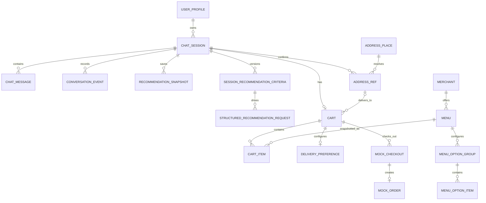
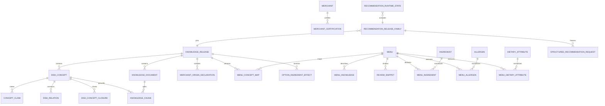

# YOBI MVP 현재 구현 아키텍처 분석

> 기준일: 2026-08-14 (Asia/Seoul)
>
> 기준 경로: `/Users/kimjunggil/Documents/YOBI/mvp`
>
> 분석 원칙: 현재 체크아웃의 코드·설정·SQL·스키마를 우선했고, 로컬 실행은 저장소 밖의 임시 SQLite DB만 사용했다. 운영 DB 쓰기, 설정 변경, 배포는 수행하지 않았다.

## 1. 전체 구조 요약

YOBI는 외국인 사용자가 한국 배달 음식을 선택하고, 합성 메뉴를 장바구니에 담아 모의 결제·주문까지 진행하는 데모 애플리케이션이다. 현재 구현은 다음 네 층으로 나뉜다.

1. `frontend/`: React 단일 페이지 애플리케이션(SPA). 프로필·주소·추천 조건·메뉴 선택·장바구니·결제·주문 화면을 제공한다.
2. `backend/`: FastAPI 애플리케이션. API 라우팅, 대화/추천/주소/장바구니 도메인 로직, SQLite·Oracle 저장소 구현을 포함한다.
3. `database/`, `backend/app/db/`, `backend/app/knowledge/`: Oracle 마이그레이션·시드와 SQLite 인프로세스 스키마/시드, 지식 릴리스·검색 데이터를 관리한다.
4. `deploy/`: OCI VM 위 Nginx + systemd + Uvicorn 배포, Oracle Autonomous Database(ADB) 마이그레이션·시드·릴리스 전환을 담당한다.

핵심 연결은 `frontend/src/lib/api.ts`의 `fetch` 호출 → `backend/app/main.py`의 FastAPI 경로 함수 → `backend/app/services/*` 또는 `backend/app/db/repository.py`의 저장소 인터페이스 → `SQLiteYobiRepository`/`OracleYobiRepository` 순서다. 저장소 선택은 `backend/app/dependencies.py:get_repository()`가 `DEMO_DB_BACKEND` 값으로 결정한다.

추천은 두 경로가 공존한다.

- 현재 화면의 주 경로: 버튼으로 확정한 `RecommendationCriteriaV2` → `StructuredRecommendationService` → 지식 근거 풀 → 생성기 1회 또는 결정론적 검색 폴백 → `structured_recommendation_request`와 `recommendation_snapshot` 저장.
- 레거시 호환 경로: 자유 텍스트 `UserMessage` → `ChatService`/`DialogueEngine` → 도구 호출형 에이전트 또는 결정론적 폴백 → 메시지와 스냅샷 저장. 현재 프론트엔드는 이 메시지 전송 경로를 직접 사용하지 않는다.

데이터 경계는 명시적으로 데모다. 메뉴·리뷰·주문·결제 데이터는 합성이며 실제 요기요 주문/결제 API 연동은 없다. 생성형 AI는 설정된 경우 OCI Generative AI의 OpenAI Responses 호환 엔드포인트를 사용하고, 미설정/실패 시 결정론적 폴백으로 동작한다.

### 이번 분석에서 직접 검증한 실행 상태

- 로컬: Ruff 통과, 백엔드 Pytest `392 passed`(경고 1개), 프론트 ESLint 통과, Vitest `19 passed`.
- 저장소 밖 임시 SQLite DB로 프로필 → 세션 → 조건 확정 → 추천 → 선택 → 옵션 → 장바구니 → 주소 → 배송 → 장바구니 확정 → 체크아웃 → 모의 성공 → 주문 조회를 통과했다.
- 같은 실행에서 레거시 메시지 POST와 SSE도 동작했지만, 메시지 목록 GET은 응답 모델 불일치로 500을 재현했다. 상세는 10절에 기록했다.
- 공개 환경: `/`, `/healthz`, `/readyz`, `/demo/qr`는 200, 인증 없는 `/api/v1/demo/status`는 403이었다. `/readyz`는 Oracle 26ai, 활성 지식 릴리스, 1536차원 결정론적 임베딩, 설정된 OCI 생성형 AI를 보고했다.
- OCI 읽기 전용 확인: `HACK-TEAM-05` 구획 ACTIVE, `yobi-app-01` VM RUNNING, `yobi-adb` 26ai AVAILABLE, NSG TCP 80 규칙 1개·TCP 22 규칙 0개.
- 이번 분석에서 프론트 프로덕션 빌드와 Playwright E2E는 다시 실행하지 않았다. 레포 문서의 릴리스 ID도 SSH로 독립 검증하지 못했다.

## 2. 기술 스택 표

| 구분 | 기술 | 실제 역할 | 근거 |
|---|---|---|---|
| 프론트 언어/런타임 | TypeScript, React 19 | SPA 컴포넌트와 상태/타입 | `frontend/package.json`, `frontend/src/main.tsx` |
| 프론트 빌드 | Vite 7, pnpm | 개발 서버, 번들 빌드, `/api` 프록시 | `frontend/package.json`, `frontend/vite.config.ts`, `frontend/pnpm-lock.yaml` |
| 화면 라우팅 | React Router DOM 7 | 8개 화면 경로와 wildcard 리다이렉트 | `frontend/src/App.tsx` |
| 서버 상태 기반 | TanStack React Query 5 | `QueryClientProvider`만 설치. 현재 `frontend/src`에는 `useQuery`/`useMutation` 사용이 없고 실제 비동기 상태는 컴포넌트/custom hook이 관리 | `frontend/src/main.tsx`, `frontend/src/lib/usePreferenceCatalog.ts` |
| 클라이언트 상태 | Zustand 5 persist | 프로필·세션·주소·선택 상태를 `sessionStorage`에 보존 | `frontend/src/stores/session.ts` |
| UI | Lucide, qrcode | 아이콘과 데모 QR | `frontend/src/routes/*`, `frontend/src/components/*` |
| 선언됐지만 앱 코드에서 미사용 | Zod, `@hookform/resolvers`, react-hook-form, Radix Dialog | 의존성에는 있으나 `frontend/src` import/사용 없음 | `frontend/package.json`; `frontend/src` 검색 결과 없음 |
| 프론트 테스트 | Vitest, Testing Library, Playwright, ESLint | 단위/컴포넌트/E2E/정적 검사 | `frontend/vitest.config.ts`, `frontend/playwright.config.ts`, `frontend/eslint.config.js`, `frontend/tests/` |
| 백엔드 언어/런타임 | Python ≥3.9 | API와 도메인/DB 코드 | `backend/pyproject.toml` |
| API | FastAPI 0.116+, Uvicorn | HTTP/SSE API와 ASGI 실행 | `backend/app/main.py`, `backend/pyproject.toml` |
| 검증/설정 | Pydantic 2, pydantic-settings | 요청·응답 모델과 환경 설정 | `backend/app/domain/models.py`, `backend/app/core/config.py` |
| HTTP/AI SDK | httpx, OpenAI Python SDK | 헬스/스모크 및 OCI OpenAI 호환 Responses 호출 | `backend/app/genai/client.py`, `backend/app/genai/providers.py`, `scripts/*smoke*.py` |
| 이미지/OCR | Pillow, `python-multipart`, Tesseract subprocess | 업로드 검증, 이미지 해독, OCR | `backend/app/main.py`, `backend/app/services/address_ocr.py` |
| 로컬 DB | SQLite (`sqlite3`) | 개발·테스트용 49개 애플리케이션 테이블 | `backend/app/db/schema_sqlite.py`, `backend/app/db/sqlite_repository.py` |
| 운영 DB | Oracle Autonomous Database 26ai, `python-oracledb` thin | 운영 저장소, JSON/CLOB, `VECTOR(1536,FLOAT32)` 검색 | `backend/app/db/oracle_pool.py`, `backend/app/db/oracle_repository.py`, `database/migrations/` |
| 검색/임베딩 | 결정론적 해시 임베딩 또는 OCI Cohere Embed, RRF 계열 혼합 검색 | 메뉴·지식 청크 후보 검색 | `backend/app/rag/embeddings.py`, `backend/app/rag/providers.py`, 두 저장소의 검색 구현 |
| 생성형 AI | OCI Generative AI OpenAI 호환 API | 구조화 추천 설명/레거시 대화 생성 | `backend/app/core/config.py`, `backend/app/genai/*` |
| 기본 모델 설정 | `xai.grok-4.3`, 폴백 `openai.gpt-oss-120b` | 온디맨드 생성 모델 식별자 | `.env.example`, `backend/app/core/config.py` |
| 백엔드 테스트 | Pytest, pytest-asyncio, Ruff, MyPy | 테스트·린트·타입 검사 | `backend/pyproject.toml`, `backend/tests/` |
| 웹 서버 | Nginx | 정적 `frontend/dist`, SPA fallback, API 프록시 | `deploy/nginx/yobi.conf` |
| 프로세스 관리 | systemd | Uvicorn 1 worker를 127.0.0.1:8000에서 실행 | `deploy/systemd/yobi-api.service` |
| 클라우드/배포 | OCI CLI, OCI VM, ADB, shell/Python 배포 스크립트 | 릴리스 패키징·전송·마이그레이션·시드·전환·롤백 | `deploy/deploy.sh`, `deploy/secure_bootstrap.py`, `deploy/release_state.py` |

### 주요 환경 변수와 연결 방식

| 범주 | 변수 | 의미 |
|---|---|---|
| DB 선택 | `DEMO_DB_BACKEND=sqlite|oracle` | 저장소 구현 선택 |
| SQLite | `SQLITE_PATH` | 기본 상대 경로 DB 파일. 실행 cwd에 따라 다른 파일이 생길 수 있음 |
| Oracle | `ADB_DSN`, `DB_USERNAME`, `DB_PASSWORD` | thin pool 연결. pool은 코드에 min 1/max 3/increment 1로 고정. 앱 설정은 `ADMIN` 사용자를 거부하고 `YOBI_APP`을 전제로 함 |
| 생성형 AI | `OCI_GENAI_API_KEY`, `OCI_GENAI_BASE_URL`, `OCI_GENAI_MODEL`, `OCI_GENAI_FALLBACK_MODEL`, `OCI_COMPARTMENT_ID` | OCI OpenAI 호환 호출과 readiness 판정 |
| 임베딩 | `EMBEDDING_PROVIDER`, `OCI_EMBED_MODEL`, `OCI_EMBED_DIMENSION`, `OCI_EMBED_AUTH`, `OCI_COMPARTMENT_ID` | 로컬 SQLite 픽스처는 결정론적 hash를 사용하고, 운영 Oracle은 OCI native `embedText`의 `cohere.embed-v4.0` 1536차원만 허용한다. 저장 provider/model/version/dimension이 런타임과 다르면 semantic channel을 비활성화한다. |
| 주소 | `ADDRESS_OCR_PROVIDER`, `DEMO_CONTROL_TOKEN` | `fixture`/`tesseract`; production 주소 후보 HMAC 키는 demo control token을 재사용 |
| HTTP | `CORS_ORIGINS`, `MAX_UPLOAD_MB` | 허용 origin과 업로드 크기 제한 |
| 데모 제어 | `DEMO_CONTROL_TOKEN`, `APP_ENV` | production에서 `/api/v1/demo/*` 토큰 필수 |

현재 로컬 셸에는 `.env`가 없고 Oracle DSN/암호·OCI 키/구획 ID·데모 토큰이 설정되지 않았다. 따라서 로컬 기본 실행은 SQLite + fixture OCR + 결정론적 추천 폴백이다.

### 빌드·실행 구조

| 명령/환경 | 실제 동작 |
|---|---|
| `make setup` | 루트 `.venv`를 만들고 `backend[dev]` editable 설치, `frontend` pnpm install |
| `make dev` | `scripts/run_local_demo.sh`: 절대 `SQLITE_PATH=backend/data/yobi_demo.db`, fixture OCR, OCI key 없음으로 Uvicorn과 Vite를 함께 실행. backend 8000~8010, frontend 5173~5183 중 빈 포트를 고르고 `.local-demo/`에 PID/log 저장 |
| `make test` | Ruff → MyPy → backend Pytest → frontend ESLint/Vitest |
| `make build` | `frontend`에서 `pnpm build`, 결과는 `frontend/dist` |
| `make e2e` | `frontend` Playwright E2E |
| production | Nginx가 `/opt/yobi/current/frontend/dist`를 제공하고 API/health를 loopback Uvicorn에 proxy. systemd는 `/etc/yobi/yobi.env`, `--workers 1`, `User=yobi`, 보호 옵션을 사용 |

로컬 Vite proxy와 운영 Nginx가 같은 상대 URL을 유지하므로 `frontend/src/lib/api.ts`에는 별도 API host가 없다.

## 3. 전체 폴더·파일 구조

```text
mvp/
├── backend/                    FastAPI 애플리케이션, 도메인/서비스/DB, 테스트
│   ├── app/
│   │   ├── main.py             모든 HTTP 경로와 미들웨어
│   │   ├── dependencies.py     설정·저장소·서비스 DI 선택
│   │   ├── core/               환경 설정과 로깅
│   │   ├── domain/             Pydantic/도메인 모델, 상태, 조건 카탈로그
│   │   ├── services/           대화, 구조화 추천, 주소 OCR, 데모 제어
│   │   ├── genai/              모델 호출, 프롬프트, 도구, 검증, 제한
│   │   ├── rag/                임베딩 공급자와 벡터 생성
│   │   ├── knowledge/          지식 작성/시드/저장/해결 규칙
│   │   └── db/                 저장소 프로토콜, SQLite/Oracle 구현과 스키마
│   ├── data/                   기본 로컬 SQLite DB 위치(버전 관리 제외)
│   ├── tests/                  API·서비스·DB·생성형 AI 테스트
│   └── pyproject.toml          Python 의존성과 도구 설정
├── frontend/                   React/Vite SPA
│   ├── src/
│   │   ├── main.tsx            QueryClient + BrowserRouter 진입점
│   │   ├── App.tsx             화면 라우트 정의
│   │   ├── routes/              화면 단위 컴포넌트
│   │   ├── components/          추천 조건/결과/주문 흐름 UI
│   │   ├── lib/api.ts           백엔드 fetch 어댑터와 오류 매핑
│   │   ├── stores/              Zustand 세션 상태
│   │   ├── lib/                 API, i18n, 카탈로그 조회 훅
│   │   └── types.ts             프론트 API/도메인 타입
│   ├── tests/e2e/              Playwright 시나리오
│   ├── public/                 정적 자산
│   ├── package.json            스크립트·의존성
│   └── vite.config.ts          빌드와 개발 프록시
├── database/
│   ├── migrations/             Oracle 순차 DDL 001~010
│   ├── verify/                 수동 무결성 조회 SQL
│   └── README.md               Oracle 초기화/검증 명령
├── deploy/
│   ├── deploy.sh               릴리스 패키징·원격 설치·검증·전환
│   ├── secure_bootstrap.py     OCI Vault/ADB/런타임 환경 초기 설정
│   ├── release_state.py        current/previous 릴리스 포인터 관리
│   ├── rollback.sh             이전 릴리스 복구
│   ├── nginx/                  정적 파일/API 프록시 설정
│   └── systemd/                Uvicorn 서비스 단위
├── scripts/                    로컬 실행, DB 마이그레이션/시드, 릴리스 포인터, 스모크
├── knowledge/dishes/           102개 음식별 Markdown 지식 원문과 front matter
├── docs/                       아키텍처·API·운영·테스트·보안·UI 방향 문서
├── references/                 기획 원고와 Oracle/제품/요기요 참조 PDF
├── Makefile                    개발·검증 명령 집합
├── .env.example               환경 변수 계약
└── README.md                   실행과 배포 개요
```

### 실제 동작 중심 핵심 파일

| 파일/폴더 | 코드에서 확인한 역할 |
|---|---|
| `backend/app/main.py` | 39개 명시적 HTTP operation, 요청 ID/로깅/CORS, 업로드 검증, 예외→HTTP 매핑. 별도 `APIRouter`는 사용하지 않음 |
| `backend/app/dependencies.py` | `Settings` 캐시, DB backend 선택, 저장소 `initialize()`, `ChatService`/`StructuredRecommendationService` 조립 |
| `backend/app/domain/models.py` | 프로필·세션·메뉴·주소·장바구니·체크아웃·주문 API 모델 |
| `backend/app/domain/structured_recommendation.py` | 추천 조건·요청·상태·결과·릴리스 레코드 |
| `backend/app/domain/preference_catalog.py` | 버전 있는 버튼 선택 카탈로그와 한국/미국 5단계 맵기 기준 |
| `backend/app/services/structured_recommendation.py` | 조건 커밋, 멱등 요청 예약, 검색, 생성 1회, 결과 검증/폴백, 스냅샷 저장 |
| `backend/app/services/chat_service.py` | 레거시 자유 대화, 도구 호출, 상태 전이, 카드/메시지/스냅샷 조립 |
| `backend/app/services/dialogue_engine.py` | 자유 텍스트 선호 추출, 프로필과 상태 병합, 추천 준비도 판정 |
| `backend/app/services/address_ocr.py` | fixture/Tesseract OCR 추상화와 HMAC 주소 후보 토큰 |
| `backend/app/genai/recommendation_generator.py` | 구조화 추천용 단일 생성 요청과 출력 파싱 |
| `backend/app/genai/agent_loop.py` | 레거시 도구 호출 에이전트 루프 |
| `backend/app/genai/grounding.py` | 응답의 메뉴·근거·주장 참조 검증 |
| `backend/app/db/repository.py` | 두 DB 구현이 맞춰야 하는 저장소 Protocol |
| `backend/app/db/sqlite_repository.py` | SQLite 트랜잭션·쿼리·자동 스키마/시드·전체 도메인 저장 |
| `backend/app/db/oracle_repository.py` | Oracle `MERGE`, `FOR UPDATE`, JSON/CLOB, 벡터 SQL 기반 저장 |
| `backend/app/db/schema_sqlite.py` | 새 SQLite DB의 49개 테이블과 인덱스 DDL |
| `backend/app/db/seed_data.py` | 합성 상점/메뉴/리뷰/옵션/주소/지식 기본 데이터 생성 |
| `knowledge/dishes/**/*.md` | concept ID·상속·claim·출처를 담은 102개 음식 지식 원문. authoring/catalog seed가 검증·컴파일 |
| `frontend/src/routes/OnboardingPage.tsx` | 프로필·세션 생성/수정, 주소 입력·업로드·확정 |
| `frontend/src/routes/ChatPage.tsx` | 세션 복구, 조건 확정, 추천 요청/폴링, 선택 이벤트, 주문 패널 연결 |
| `frontend/src/components/OrderFlowPanel.tsx` | 옵션·추가 메뉴·장바구니·배송·확정·체크아웃 전체 흐름 |
| `frontend/src/routes/PaymentPage.tsx` | 체크아웃 조회와 모의 성공/실패 |
| `frontend/src/routes/OrderPage.tsx` | 합성 주문 조회/표시 |
| `frontend/src/lib/api.ts` | 모든 프론트 API 호출, `X-Request-ID`, 안정 오류 코드 매핑 |

`__pycache__`, `.pytest_cache`, `.mypy_cache`, `.ruff_cache`, `frontend/node_modules`, `frontend/dist`, `backend/*.egg-info`, SQLite DB는 생성물 또는 런타임 산출물로 보고 구조 설명에서 제외했다. `backend/app/api/__init__.py`는 패키지 표식뿐이며 실제 라우터를 담지 않는다.

## 4. 컴포넌트·모듈 구성

| 기능 경계 | 책임 | 입력 | 출력/저장 | 주요 의존 |
|---|---|---|---|---|
| SPA 셸 | 라우트·쿼리 클라이언트·전역 상태 시작 | URL, sessionStorage | 화면 트리 | `main.tsx`, `App.tsx`, `stores/session.ts` |
| 온보딩 | 프로필/세션/주소 수집 | 폼, 이미지 또는 주소 텍스트 | `user_profile`, `chat_session`, `address_ref` | `OnboardingPage`, API, OCR 서비스/저장소 |
| 조건 선택 | 카탈로그를 버튼으로 수집하고 동일 범주 OR·범주 간 AND 조건 구성 | locale, 사용자 선택 | `session_recommendation_criteria` | `PreferenceSelector`, `SpiceReferenceScale`, preference catalog |
| 구조화 추천 | 조건 버전·상태 버전 검증, 후보/근거 검색, 생성/폴백, 결과 고정 | `RecommendationRequestInput` | request ledger, snapshot, chat message, session state | `StructuredRecommendationService`, generator, repository |
| 레거시 대화 | 자연어 선호 추출과 도구 호출 기반 응답 | `UserMessage` | message/state/snapshot/event | `ChatService`, `DialogueEngine`, `AgentLoop` |
| 지식/안전 | 위키 청크·주장·재료/알레르기/식이 신호 해석 | 메뉴, 프로필/조건, 릴리스 | 근거 풀, 경고 코드 | `knowledge/*`, DB 관계 테이블 |
| 메뉴/옵션 | 선택 메뉴 옵션·같은 상점 추가 메뉴 조회 | menu/session/merchant ID | 조회 응답 | repository |
| 장바구니 | 메뉴 스냅샷, 옵션 효과, 가격, 최소 주문, 확인 fingerprint | item/delivery 요청, idempotency key | `cart`, `cart_item`, `delivery_preference` | `OrderFlowPanel`, repository |
| 주소 | 파일 검증/OCR 또는 텍스트 매칭, 서명 후보, 최종 주소 저장 | multipart 이미지/텍스트/token | `address_ref`와 서비스 지역 | `main.py`, `address_ocr.py`, repository |
| 체크아웃/주문 | 장바구니 버전·확정 fingerprint 검사, 모의 상태 전이 | checkout 입력/상태 액션 | `mock_checkout`, `mock_order` | repository, Payment/Order pages |
| 데모 제어 | 장애 모드와 세션 데이터 초기화 | token, mode/session ID | 인메모리 모드, 세션 데이터 삭제 | `demo_control.py`, repository |
| DB 추상화 | 동일 도메인 계약을 SQLite와 Oracle로 제공 | 도메인 모델 | DB row/도메인 모델 | `repository.py`, 두 repository |
| 배포 | 정적 빌드, 백엔드 릴리스, DB 준비, 헬스, 포인터 전환 | 환경/OCI 권한/릴리스 | `/opt/yobi/releases/*`, 서비스 | `deploy/*`, `scripts/migrate.py`, `seed_demo.py` |

### 프론트엔드와 백엔드 연결 지점

`frontend/src/lib/api.ts`가 유일한 중앙 HTTP 어댑터다. 개발 시 Vite가 `/api`, `/healthz`, `/readyz`를 백엔드로 프록시하고, 운영 시 Nginx가 같은 경로를 127.0.0.1:8000으로 전달한다. 프론트 타입은 응답을 런타임 검증하지 않고 TypeScript 타입으로 단언한다. 서버 계약이 달라지면 컴파일 단계가 아니라 실행 중 UI에서 드러난다.

### 결합이 강하거나 역할이 섞인 곳과 자연스러운 분리 경계

- `backend/app/main.py`(1,097행)는 라우팅뿐 아니라 파일 형식 검사, 주소 토큰 흐름, 오류 변환, 인증 검사까지 가진다. `profiles`, `sessions`, `recommendations`, `address`, `cart`, `checkout`, `demo` APIRouter로 나누고 공통 오류 매퍼를 별도화하는 경계가 자연스럽다.
- `ChatService`(3,307행)는 상태 해석, 생성형 AI, 도구 실행, 응답 카드, 저장 원자성까지 담당한다. `dialogue orchestration`, `tool execution`, `response projection`, `turn persistence`로 분리할 수 있다.
- `SQLiteYobiRepository`(5,903행)와 `OracleYobiRepository`(5,482행)는 사용자·추천·카탈로그·주문·릴리스 조회를 모두 포함한다. `Profile/SessionRepository`, `RecommendationRepository`, `CatalogRepository`, `Cart/OrderRepository`, `ReleaseRepository`가 자연스러운 포트다.
- `ChatPage`와 `OrderFlowPanel`은 비동기 상태 전이와 UI 렌더링을 함께 가진다. 서버 상태 머신 훅과 표시 컴포넌트를 분리하면 재시도/복구 테스트 범위가 선명해진다.
- 구조화 추천과 레거시 대화는 같은 세션/스냅샷/메시지 테이블을 공유하면서 서로 다른 오케스트레이터를 쓴다. 호환 API를 유지하더라도 공통 `turn persistence`와 `snapshot projection` 경계를 두는 편이 두 경로의 드리프트를 줄인다.

## 5. 프론트엔드 및 백엔드 라우터 구조

### 5.1 프론트엔드 화면 라우팅

진입은 `frontend/src/main.tsx` → `BrowserRouter` → `frontend/src/App.tsx`다. 서버 측 로그인/세션 인증은 없으며, `/chat/:sessionId`만 `ChatPage` 내부에서 Zustand의 profile/session/address가 없으면 `/`로 이동한다.

| 경로 | 화면 | 주요 역할 | 인증/가드 |
|---|---|---|---|
| `/` | `routes/WelcomePage.tsx` | 시작 안내 | 없음 |
| `/start` | `routes/LocalePage.tsx` | 언어/지역 진입 | 없음 |
| `/profile` | `routes/OnboardingPage.tsx` | 프로필·세션·주소 생성/확정 | 없음 |
| `/chat/:sessionId` | `routes/ChatPage.tsx` | 조건 선택, 추천, 메뉴 선택, 주문 패널 | 클라이언트 상태 존재 여부만 검사; 서버 권한 인증 아님 |
| `/pay/:checkoutId` | `routes/PaymentPage.tsx` | 체크아웃 조회, 모의 성공/실패 | 없음 |
| `/order/:orderId` | `routes/OrderPage.tsx` | 주문 결과 조회 | 없음 |
| `/demo/qr` | `routes/DemoQrPage.tsx` | 현재 origin의 데모 QR 표시 | 없음 |
| `/demo/control` | `routes/DemoControlPage.tsx` | 상태/장애 모드/리셋 | 화면 가드 없음; production API에서 토큰 요구 |
| `*` | `Navigate` | `/`로 교체 이동 | 없음 |

### 5.2 백엔드 라우팅과 호출 계층

모든 경로는 `backend/app/main.py`의 단일 `FastAPI` 인스턴스에 직접 선언된다.

```text
Nginx/Vite proxy
  → backend/app/main.py 경로 함수
    → Depends(get_repository/get_chat_service/get_structured_recommendation_service)
      → 서비스 또는 YobiRepository Protocol
        → SQLiteYobiRepository | OracleYobiRepository
          → 49개 앱 테이블 (+ Oracle schema_migration)
```

- `/docs`, `/redoc`, `/openapi.json`은 FastAPI 자동 경로다.
- `/api/v1/demo/*`만 production에서 `X-Demo-Control-Token`을 검사한다.
- 나머지 API에는 JWT, 쿠키 세션, OAuth, 사용자/리소스 소유권 검사가 없다.
- 명시된 39개 operation 가운데 이름이 중복된 경로는 없다.
- 현재 프론트에서 직접 소비하지 않는 호환/운영 경로: 프로필 GET/DELETE, 세션 GET/reset, 레거시 messages POST/GET/SSE, 메뉴 evidence, checkout cancel, demo reset. “미사용”은 레포 내 현재 SPA 기준이며 외부 소비자 가능성은 미검증이다.

### 5.3 라우터 → 서비스/저장소 매핑

| 라우트군 | `main.py` 함수 | 다음 호출 |
|---|---|---|
| health/readiness | `healthz`, `readyz` | repository `status()`, 생성형 AI 설정 상태 |
| profile/session | `create_profile` 등 | repository 직접 호출 |
| structured recommendation | `put_recommendation_criteria`, `post_structured_recommendation`, `get_structured_recommendation_request` | `StructuredRecommendationService.commit_criteria/request_recommendation/get_request` |
| legacy conversation | `post_message`, `stream_message`, `get_conversation` | `ChatService.handle_message`, repository message/snapshot/request 조회 |
| selection events | `post_conversation_event` | repository `apply_conversation_event` |
| menu | `get_menu_options`, `get_menu_evidence`, `list_merchant_menus` | repository 직접 호출 |
| address | `upload_address`, `resolve_address_text`, `confirm_address` | OCR/token service + repository resolve/save |
| cart/delivery | `get_cart`, `add_cart_item`, `update_cart_item`, `delete_cart_item`, `update_delivery`, `confirm_cart` | repository 직접 호출 |
| checkout/order | `create_checkout`, `get_checkout`, `mock_*`, `cancel_checkout`, `get_order` | repository 직접 호출 |
| demo | `demo_status`, `reset_demo_session`, `set_failure_mode` | `DemoControlService` + repository reset/status |

## 6. API 명세서

### 6.1 공통 계약

- Base path는 `/api/v1`; health는 루트의 `/healthz`, `/readyz`다.
- JSON 요청은 `Content-Type: application/json`; 주소 파일만 `multipart/form-data`다.
- 요청의 `X-Request-ID`가 없으면 서버가 생성하고 모든 응답에 `X-Request-ID`를 돌려준다. 장바구니 추가에는 별도의 선택적 `Idempotency-Key`가 있다.
- 오류 본문은 대체로 `{"detail":{"code":"...","message":"..."}}`; Pydantic 검증은 422 `detail[]` 형식이다.
- 표에서 `R`은 DB 읽기, `W`는 쓰기, `R/W*`는 GET이지만 상태 복구를 위해 조건부 쓰기가 있음을 뜻한다.
- 인증 `공개`는 인증이 구현되지 않았다는 뜻이지 공개 서비스에 적합하다는 보증이 아니다. `데모 토큰`은 production에서만 `X-Demo-Control-Token`을 요구한다.

### 6.2 상태·프로필·세션

| Method / endpoint | 목적·요청 예시 | 응답 예시 | 상태/오류·인증 | 구현 / 소비자 / DB |
|---|---|---|---|---|
| `GET /healthz` | liveness. 요청 없음 | `{"status":"ok","service":"yobi-api"}` | 200, 공개 | `main.py:healthz`; 배포/외부 헬스; DB 없음 |
| `GET /readyz` | DB·카탈로그·릴리스·AI readiness | `{"status":"ready","database":{"backend":"sqlite"},"genai":{...}}` | 200; 503 `DB_NOT_READY`, `CATALOG_NOT_READY`, `GENAI_NOT_READY`; 공개 | `main.py:readyz`; 배포/외부 헬스; R |
| `POST /api/v1/profiles` | 프로필 생성. B `{"preferred_language":"English","nationality":"US","dietary_rules":[],"spice_tolerance":3,"consent_demo_data":true,"remember_profile":false}` | 201 `Profile`: 입력 + `profile_id`, `created_at` | 201; 422 검증/동의 실패; 공개 | `main.py:create_profile` → repository `create_profile`; `routes/OnboardingPage.tsx` `api.createProfile`; W `user_profile` |
| `GET /api/v1/profiles/{profile_id}` | 프로필 조회. P `profile_id` | `Profile` | 200; 404; 공개 | `main.py:get_profile`; SPA 직접 호출 없음; R `user_profile` |
| `PATCH /api/v1/profiles/{profile_id}` | 일부 필드 변경. B `{"favorite_foods":["bibimbap"]}` | 갱신 `Profile` | 200; 404/422; 공개 | `main.py:update_profile`; `routes/OnboardingPage.tsx` `api.updateProfile`; R/W `user_profile` |
| `DELETE /api/v1/profiles/{profile_id}` | 프로필과 종속 런타임 데이터 삭제 | 204, body 없음 | 204; 404; 공개 | `main.py:delete_profile`; SPA 없음; W, 세션·메시지·주소·카트·체크아웃·주문 등 수동 cascade |
| `POST /api/v1/sessions` | 세션 생성. B `{"profile_id":"profile-..."}` | 201 `{"session_id":"...","profile_id":"...","state":"DISCOVERY","state_version":0,...}` | 201; 404 profile; 422; 공개 | `main.py:create_session`; `routes/OnboardingPage.tsx` `api.createSession`; R/W `user_profile`,`chat_session` |
| `GET /api/v1/sessions/{session_id}` | 세션 조회 | `Session` | 200; 404; 공개 | `main.py:get_session`; SPA 없음; R `chat_session` |
| `POST /api/v1/sessions/{session_id}/reset` | 세션은 유지하고 종속 대화/추천/주소/장바구니/주문 초기화 | 초기화된 `Session` | 200; 404; 공개 | `main.py:reset_session`; SPA 없음; W 다수 런타임 테이블 |

### 6.3 추천·대화·메뉴

| Method / endpoint | 목적·요청 예시 | 응답 예시 | 상태/오류·인증 | 구현 / 소비자 / DB |
|---|---|---|---|---|
| `GET /api/v1/recommendation/preferences/catalog` | Q `locale=en-US`; H `If-None-Match: "preference-catalog-..."` | 200 `{"catalog_version":"preference-catalog-2026.08.12-v2","categories":[...],"spice_references":[...]}` 또는 304 | 200/304; 422 locale; 503 unavailable; 공개 | `main.py:get_recommendation_preference_catalog`; `lib/usePreferenceCatalog.ts`; R preference/release tables |
| `PUT /api/v1/sessions/{session_id}/recommendation-criteria` | 선택 조건 원자적 확정. B `{"criteria":{"max_spice_level":3,...},"catalog_version":"...","expected_state_version":0,"request_id":"criteria-..."}` | `{"criteria_version":1,"state_version":1,"criteria_hash":"...","criteria":{...}}` | 200; 404; 409 state/catalog/request reuse; 422 빈 조건·충돌; 공개 | `main.py:put_recommendation_criteria` → `StructuredRecommendationService.commit_criteria`; `routes/ChatPage.tsx`; R/W criteria/session/request audit |
| `POST /api/v1/sessions/{session_id}/recommendations` | 확정 조건으로 추천 요청. B `{"request_id":"rec-...","expected_state_version":1,"criteria_version":1,"mode":"search"}` | `RecommendationBatchV2`: `status`, `phase`, `snapshot_id`, `state_version`, 최대 3개 `StructuredRecommendationView` | 200; 404; 409 version/in-progress/reuse; 422 hash/criteria; 503 release; 500 generation; 공개 | `main.py:post_structured_recommendation` → `StructuredRecommendationService.request_recommendation`; `routes/ChatPage.tsx`; R/W request/snapshot/message/session + catalog/knowledge |
| `GET /api/v1/sessions/{session_id}/recommendation-requests/{request_id}` | 멱등 요청 복구/폴링 | 동일 `RecommendationBatchV2`; 예: `{"status":"COMPLETE","phase":"COMPLETE",...}` | 200; 404; 공개 | `main.py:get_structured_recommendation_request` → service `get_request`; `routes/ChatPage.tsx`; R/W* stale `CREATED`→`FAILED`, `DISPATCHED`→`UNKNOWN_AFTER_DISPATCH` 가능 |
| `POST /api/v1/sessions/{session_id}/messages` | 레거시 자연어 대화. B `{"content":"I want mild soup","intent":"recommend","request_id":"msg-..."}` | `AssistantTurn`: assistant text, state, cards/actions/snapshot | 200; 404; 409 state/request reuse; 422; 500; 공개 | `main.py:post_message` → `ChatService.handle_message`; SPA 없음; R/W message/session/snapshot/catalog/knowledge |
| `POST /api/v1/sessions/{session_id}/messages/stream` | 같은 대화를 SSE로 전달 | `event: status`, `event: result`/`error`의 `data: {...}` | HTTP 200 후 오류도 SSE `error`일 수 있음; 세션/profile 사전 확인 404; 공개 | `main.py:stream_message` → `ChatService`; SPA 없음; R/W 위와 같음 |
| `GET /api/v1/sessions/{session_id}/messages` | 저장 메시지 목록 | 의도 계약: `[{'role':'user','content':'...',...}]`; 현재 metadata가 dict이면 응답 검증 500 재현 | 200/404가 의도; 실제 500 가능; 공개 | `main.py:list_messages` → repository `list_messages`; SPA 없음; R `chat_message` |
| `GET /api/v1/sessions/{session_id}/conversation` | 재접속용 메시지+조건+최근/활성 추천 투영 | `{"session_id":"...","state_version":2,"messages":[...],"latest_snapshot":{...},"recommendation_criteria":{...}}` | 200; 404; 공개 | `main.py:get_conversation`; `routes/ChatPage.tsx`; R/W* request stale 복구 가능 |
| `POST /api/v1/sessions/{session_id}/events` | 추천 선택/비교/거절/옵션 등 상태 이벤트. B `{"event_type":"RECOMMENDATION_SELECTED","snapshot_id":"...","menu_id":"...","expected_state_version":2,"idempotency_key":"..."}` | `{"event_id":"...","state_version":3,"state":"OPTIONS","selected_menu_id":"...","duplicate":false}` | 200; 404 snapshot/menu; 409 state/idempotency; 422; 공개 | `main.py:post_conversation_event` → repository `apply_conversation_event`; `routes/ChatPage.tsx`; R/W event/session/snapshot/menu |
| `GET /api/v1/menus/{menu_id}/options` | 옵션 그룹 조회 | `[{'option_group_id':'...','name':'...','required':true,'items':[...]}]` | 200; 존재하지 않으면 빈 배열; 422; 공개 | `main.py:get_menu_options`; `OrderFlowPanel.tsx`; R option tables |
| `GET /api/v1/menus/{menu_id}/evidence` | 메뉴 근거 조회 | `[{'evidence_id':'...','source_url':'...','snippet':'...'}]` | 200; 존재하지 않으면 빈 배열; 공개 | `main.py:get_menu_evidence`; SPA 없음; R evidence/knowledge |
| `GET /api/v1/sessions/{session_id}/merchants/{merchant_id}/menus` | 같은 상점 추가 메뉴. Q `exclude=menu-a,menu-b` | `MenuSummary[]` | 200; 404 session/profile; 공개 | `main.py:list_merchant_menus`; `OrderFlowPanel.tsx`; R profile/session/menu 관계 |

### 6.4 주소·장바구니·배송

| Method / endpoint | 목적·요청 예시 | 응답 예시 | 상태/오류·인증 | 구현 / 소비자 / DB |
|---|---|---|---|---|
| `POST /api/v1/sessions/{session_id}/address/attachments` | multipart H/B `file=@booking.png`; PNG/JPEG/WebP OCR | `{"candidates":[{"place_id":"...","hotel_name":"...","confidence":0.98,"candidate_token":"..."}],"low_confidence":false,"notice":"..."}` | 200; 404 session; 413 크기; 415 MIME/확장자/magic; 422 decode/면적; 공개 | `main.py:upload_address` + `address_ocr.py`; `routes/OnboardingPage.tsx`; R address place. 원본 bytes는 저장하지 않고 SHA만 최종 저장 가능 |
| `POST /api/v1/sessions/{session_id}/address/resolve` | 텍스트 주소 후보. B `{"text":"L7 Myeongdong"}` | `AddressUploadResult` | 200; 404/422; 공개 | `main.py:resolve_address_text`; `routes/OnboardingPage.tsx`; R `address_place` |
| `POST /api/v1/sessions/{session_id}/address/confirm` | 서명 후보 또는 수동 주소 확정. B `{"candidate_token":"..."}` 또는 `{"manual":{"hotel_name":"...","road_address":"..."}}` | `{"address_ref_id":"address-..."}` | 200; 404; 409 invalid/expired/session-mismatch token; 422 둘 다/둘 다 없음; 공개 | `main.py:confirm_address`; `routes/OnboardingPage.tsx`; W `address_ref`, R service area |
| `GET /api/v1/sessions/{session_id}/cart` | 장바구니 미리보기 | `{"cart_id":"...","version":0,"items":[],"total_price":0,"missing_slots":[...],"ready_to_checkout":false,"confirmed":false}` | 200; 404 session; 공개 | `main.py:get_cart`; `OrderFlowPanel.tsx`; R/W* 없으면 빈 `cart` 생성 |
| `POST /api/v1/sessions/{session_id}/cart/items` | 메뉴/옵션 추가. H `Idempotency-Key`; B `{"menu_id":"...","quantity":1,"option_item_ids":["..."],"user_note":"..."}` | 갱신 `CartPreview` | 200; 404; 409 옵션/식이/다른 상점/멱등 충돌; 422; 공개 | `main.py:add_cart_item`; `OrderFlowPanel.tsx`; R/W cart/item/menu/options/criteria |
| `PATCH /api/v1/sessions/{session_id}/cart/items/{cart_item_id}` | 수량/옵션/메모 변경. B `{"quantity":2}` | 갱신 `CartPreview` | 200; 404; 409 validation; 422; 공개 | `main.py:update_cart_item`; `OrderFlowPanel.tsx`; R/W `cart`,`cart_item` |
| `DELETE /api/v1/sessions/{session_id}/cart/items/{cart_item_id}` | 품목 삭제 | 갱신 `CartPreview` | 200; 404; 공개 | `main.py:delete_cart_item`; `OrderFlowPanel.tsx`; R/W `cart`,`cart_item` |
| `PATCH /api/v1/sessions/{session_id}/delivery` | 배송/인계 설정. B `{"address_ref_id":"...","handoff_method":"front_desk","cutlery":false,"ring_bell":false,"front_desk":true,"user_note":"..."}` | 갱신 `CartPreview` | 200; 404; 409 주소 미확정/서비스 지역 밖; 422; 공개 | `main.py:update_delivery`; `OrderFlowPanel.tsx`; R/W `delivery_preference`,`address_ref`,`cart` |
| `POST /api/v1/sessions/{session_id}/cart/confirm` | 현재 cart fingerprint 확정 | `CartPreview` with `confirmed:true` | 200; 404; 409 incomplete/minimum/식이/주소/재고; 공개 | `main.py:confirm_cart`; `OrderFlowPanel.tsx`; R/W `cart.confirmed_fingerprint` 및 관련 조회 |

### 6.5 체크아웃·주문·데모 제어

| Method / endpoint | 목적·요청 예시 | 응답 예시 | 상태/오류·인증 | 구현 / 소비자 / DB |
|---|---|---|---|---|
| `POST /api/v1/sessions/{session_id}/checkout` | 모의 체크아웃 생성. B `{"idempotency_key":"checkout-{cart_id}-{version}","payment_method":"international_card"}` | `{"checkout_id":"...","cart_id":"...","status":"PENDING","amount":18000,"payment_url":"/pay/...","order_id":null}` | 200; 404; 409 cart stale/not confirmed/reuse; 422; 공개 | `main.py:create_checkout`; `OrderFlowPanel.tsx`; R/W cart/address/item + `mock_checkout` |
| `GET /api/v1/checkout/{checkout_id}` | 체크아웃 조회 | `Checkout` | 200; 404; 공개 | `main.py:get_checkout`; `routes/PaymentPage.tsx`; R `mock_checkout` |
| `POST /api/v1/checkout/{checkout_id}/mock-success` | 결제를 성공으로 전이하고 합성 주문 생성 | `Checkout` with `status:"SUCCEEDED"`, `order_id` | 200; 404; 409 stale/already succeeded; 공개 | `main.py:mock_success`; `routes/PaymentPage.tsx`; R/W checkout/cart, W `mock_order` |
| `POST /api/v1/checkout/{checkout_id}/mock-failure` | 모의 결제 실패 | `Checkout` with `status:"FAILED"` | 200; 404; 409 already succeeded/stale; 공개 | `main.py:mock_failure`; `routes/PaymentPage.tsx`; R/W `mock_checkout` |
| `POST /api/v1/checkout/{checkout_id}/cancel` | 모의 체크아웃 취소 | `Checkout` with `status:"CANCELED"` | 200; 404; 409 already succeeded; 공개 | `main.py:cancel_checkout`; SPA 없음; R/W `mock_checkout` |
| `GET /api/v1/orders/{order_id}` | 합성 주문/ETA/요약 조회 | `{"order_id":"...","order_status":"CONFIRMED","estimated_delivery_at":"...","summary":{...},"is_synthetic":true}` | 200; 404; 공개 | `main.py:get_order`; `routes/OrderPage.tsx`; R `mock_order` |
| `GET /api/v1/demo/status` | DB/AI/폴백/합성 여부 | `{"api":"ok","database":{...},"genai":"configured","fallback_mode":"normal","synthetic_data":true}` | 200; production 403 token; 개발/테스트 공개 | `main.py:demo_status`; `routes/DemoControlPage.tsx`; R/status |
| `POST /api/v1/demo/reset` | B `{"session_id":"..."}` 세션 런타임 데이터 초기화 | `{"status":"reset","session_id":"..."}` | 200; 404; production 403 token | `main.py:reset_demo_session`; SPA 호출 함수 없음; W 다수 런타임 테이블, 인메모리 mode normal |
| `POST /api/v1/demo/failure-mode` | B `{"mode":"normal|..."}` 장애 주입 | `{"mode":"..."}` | 200; 422 invalid; production 403 token | `main.py:set_failure_mode`; `routes/DemoControlPage.tsx`; DB 없음, 프로세스 메모리 W |

### 6.6 요청·응답 모델 요약

| 모델 | 주요 필드 |
|---|---|
| `ProfileCreate/Update/Profile` | 언어, 국적, 연령대, 성별, 종교 선택, `dietary_rules`, 알레르기 심각도, 1~3 `spice_tolerance`, 선호 음식, demo 동의, remember flag, 응답 ID/시간 |
| `RecommendationCriteriaV2` | cuisine/flavor/ingredient/form/temperature/price/texture/cooking 배열, `dietary_filters.halal_certified_only`, `dietary_filters.vegan`, 1~5 `max_spice_level`, KR/US 기준 |
| `RecommendationBatchV2` | session/request/snapshot ID, state/criteria version, status/phase, criteria summary, 추천 0~3개, unmatched codes, failure code |
| `StructuredRecommendationView` | rank, `MenuSummary`, title, 선택 이유/설명, matched criteria, 위키 passage, caution, 정식 halal 인증 범위, vegan 상태/경고 |
| `CartPreview` | cart/session/version, lines, subtotal/delivery/total, missing slots, 식이 경고, 최소 주문 부족분, ready/confirmed |
| `Checkout` / `Order` | 모의 결제 상태·금액·방법·URL·order ID / 주문 상태·ETA·summary·`is_synthetic` |

### 6.7 OpenAPI/Swagger와 실제 구현 비교

현재 앱에서 `app.openapi()`를 생성해 확인한 결과는 OpenAPI 3.1.0이며 위 39개 operation과 FastAPI decorator/Pydantic 모델은 일치했다. 자동 `/docs`, `/redoc`, `/openapi.json`도 활성화되어 있다. 다만 “실제 계약을 완전하게 표현”하지는 못한다.

- 대부분 operation에 선언된 응답은 성공과 자동 422뿐이다. 코드가 내는 304/403/404/409/413/415/500/503 및 안정 오류 코드는 스키마에 거의 없다.
- 인증 security scheme이 없다. 데모 토큰은 선택적 header parameter로만 나타나므로 production 필수 조건이 문서화되지 않는다.
- 요청·응답 예시가 정의되지 않았고 SSE event 형식도 단순 200으로만 보인다.
- `docs/API.md`는 요약 문서이며 현재 구현 전체 목록과 일치하지 않는다. 예를 들어 상점 메뉴 조회와 checkout GET 등 일부 경로가 요약 표에 없고, 오류 조건도 구현보다 좁다.
- 따라서 Swagger는 모델/경로 탐색에는 유효하지만, 상태 코드·권한·부작용까지 포함한 운영 계약으로는 이 절의 코드 기반 명세를 함께 봐야 한다.

## 7. ERD와 DB 구조

### 7.1 런타임·주문 ERD

아래는 읽기 쉬움을 위해 핵심 PK/FK만 표시한 관계도다. 전체 컬럼은 7.3절에 있다.



### 7.2 카탈로그·지식·릴리스 ERD



### 7.3 테이블·컬럼·키

표기: `PK(a,b)`는 복합 PK, `→`는 선언된 FK다. 타입은 DB별 차이가 크므로 여기서는 논리 컬럼을 제시하고 7.4절에서 물리 타입 차이를 설명한다.

#### 사용자·세션·추천 런타임

| 테이블 | 목적 | 컬럼·키 |
|---|---|---|
| `user_profile` | 사용자 데모 선호 | `profile_id PK`, preferred_language, nationality, age_band, gender, religion_selection, dietary_rules_json, allergy_severity, spice_tolerance, favorite_foods_json, consent_demo_data, remember_profile, created_at |
| `chat_session` | 현재 대화/선택 상태 | `session_id PK`, `profile_id → user_profile`, state, selected_menu_id, selected_merchant_id, state_stack_json, required_slots_json, created_at, updated_at, meal_need_state_json, dialogue_act, state_version |
| `chat_message` | user/assistant 메시지와 안전 metadata | `message_id PK`, `session_id → chat_session`, role, content, message_type, safe_metadata_json, created_at |
| `conversation_event` | 선택/거절/비교/옵션 이벤트 멱등 ledger | `event_id PK`, `session_id → chat_session`, `snapshot_id → recommendation_snapshot`, event_type, payload_json, result_json, idempotency_key, resulting_state_version, created_at |
| `recommendation_snapshot` | 한 시점의 추천·근거·카드 고정본 | `snapshot_id PK`, `session_id → chat_session`, `assistant_message_id → chat_message`, state_version, meal_need_state_json, result_json, cards_json, created_at, structured_request_id, criteria_version, criteria_json, criteria_hash, recommendation_release_family_id, evidence_pool_json, generation_status, generation_call_count, grounding_validation_json |
| `session_recommendation_criteria` | 세션별 조건 버전 | `PK(session_id,criteria_version)`, `session_id → chat_session`, criteria_json, criteria_hash, request_id, state_version, created_at |
| `structured_recommendation_request` | 추천 요청 상태·멱등·dispatch ledger | `PK(session_id,request_id)`, `(session_id,criteria_version) → session_recommendation_criteria`, `session_id → chat_session`, request_hash, mode, status, state_version, snapshot_id, evidence_pool_json, result_json, dispatch_count, failure_code, created/dispatched/completed_at, recommendation_release_family_id, eligibility_as_of |
| `audit_log` | 도구 입력 hash·근거·지연·폴백 감사 | `log_id PK`, session_id, tool, input_hash, evidence_ids_json, output_status, latency_ms, fallback_used, safe_error_code, created_at. `session_id` FK는 없음 |

#### 주소·장바구니·모의 주문

| 테이블 | 목적 | 컬럼·키 |
|---|---|---|
| `service_area` | 배달 가능 지역 | `service_area_id PK`, city, district, display_name, active |
| `address_place` | 검색/OCR로 매칭할 합성 장소 | `place_id PK`, name_ko/en, aliases_json, road_address, postal_code, city, delivery_hint, fixture_sha256, is_synthetic, service_area_id. 현재 조사 DB에는 service_area FK 없음 |
| `address_ref` | 세션이 확정한 주소 | `address_ref_id PK`, `session_id → chat_session`, `place_id → address_place`, source_type, source_image_hash, hotel_name, road_address, extraction_confidence, confirmed, created_at, service_area_id |
| `cart` | 세션 장바구니와 낙관적 버전/fingerprint | `cart_id PK`, `session_id → chat_session`, `address_ref_id → address_ref`, version, status, confirmed, created_at, updated_at, confirmed_fingerprint |
| `cart_item` | 가격·메뉴·옵션 스냅샷 품목 | `cart_item_id PK`, `cart_id → cart`, `menu_id → menu`, `merchant_id → merchant`, quantity, unit_price, menu_snapshot_json, option_snapshot_json, line_total, user_note, korean_note, created_at, agent_request_key |
| `delivery_preference` | 카트별 인계/일회용품/메모 | `cart_id PK → cart`, handoff_method, cutlery, ring_bell, front_desk, user_note, korean_note, back_translation |
| `mock_checkout` | 합성 결제 멱등/카트 버전 고정 | `checkout_id PK`, `cart_id → cart`, idempotency_key, payment_method, status, amount, payment_url, created_at, updated_at, cart_version, cart_fingerprint |
| `mock_order` | 성공한 합성 주문 | `order_id PK`, `checkout_id → mock_checkout`, cart_snapshot_json, order_status, estimated_delivery_at, created_at |

#### 상점·메뉴·안전·옵션

| 테이블 | 목적 | 컬럼·키 |
|---|---|---|
| `merchant` | 합성 상점·배달 조건 | `merchant_id PK`, service_area, name_ko/en, description, delivery_fee, eta_min/max, min_order_amount, flavor_profile, packaging_signal, is_synthetic, service_area_id. service_area FK 없음 |
| `menu` | 합성 메뉴 | `menu_id PK`, `merchant_id → merchant`, category, name_ko/en, description, cultural_description, price, serves_min/max, spice_level, dietary_tags_json, allergen_tags_json, semantic_text, availability, is_synthetic, updated_at, category_id. category FK 없음 |
| `menu_semantic_embedding` | catalog release별 불변 메뉴 semantic vector | `PK(catalog_release_id,menu_id,embedding_model,embedding_version)`, dimension, semantic_text_sha256, embedding_manifest_sha256, 1536차원 vector, created_at. 기존 `menu` vector를 덮어쓰지 않음 |
| `menu_category` | 정규화 메뉴 범주/맵기 범위 | `category_id PK`, name_ko/en, description, tags_json, typical_spice_min/max |
| `review_snippet` | 합성 리뷰 검색 신호 | `snippet_id PK`, `merchant_id → merchant`, `menu_id → menu`, rating, review_text, source_type, is_synthetic, updated_at |
| `evidence` | 레거시 근거/상태 | `evidence_id PK`, subject_id, claim_type, status, source_type, excerpt, confidence_band, suggested_action, updated_at. subject FK 없음 |
| `ingredient` | 정규화 재료 | `ingredient_id PK`, name_ko/en, ingredient_group |
| `allergen` | 정규화 알레르겐 | `allergen_id PK`, code, name_en/ko |
| `dietary_attribute` | vegan 등 식이 속성 | `attribute_id PK`, code, display_name |
| `menu_ingredient` | 메뉴-재료 상태 | `PK(menu_id,ingredient_id)`, 양쪽 FK, status, source_id, is_optional |
| `menu_allergen` | 메뉴-알레르겐/교차오염 상태 | `PK(menu_id,allergen_id)`, 양쪽 FK, status, evidence_id, cross_contamination_status |
| `menu_dietary_attribute` | 메뉴-식이 속성 | `PK(menu_id,attribute_id)`, 양쪽 FK, status, evidence_id |
| `menu_option_group` | 필수/선택 옵션 그룹 | `option_group_id PK`, `menu_id → menu`, name_en/ko, description, required, min_select, max_select, sort_order |
| `menu_option_item` | 가격/가용성 옵션 | `option_item_id PK`, `option_group_id → menu_option_group`, name_en/ko, description, price_delta, availability, dietary_conflict, sort_order |
| `option_dietary_conflict` | 옵션별 식이 충돌 | `PK(option_item_id,rule_code)`, `option_item_id → menu_option_item`, conflict_status, evidence_id |
| `explanation_cache` | 메뉴·언어·프로필별 설명 캐시 | `cache_key PK`, `menu_id → menu`, language, profile_signature, explanation_json, source_version, created_at |

#### 지식 그래프·근거

| 테이블 | 목적 | 컬럼·키 |
|---|---|---|
| `knowledge_release` | 불변 지식 릴리스 메타/검증 수량 | `release_id PK`, catalog_version, manifest_sha256, embedding_model/dimension/version, status, expected_counts_json, actual_counts_json, is_synthetic, created_at, completed_at |
| `knowledge_runtime_state` | 활성 지식 포인터 | `state_key PK`, `active_release_id → knowledge_release`, updated_at |
| `dish_concept` | 릴리스별 음식 개념 | `PK(release_id,concept_id)`, `release_id → knowledge_release`, concept_type, canonical_name_ko/en, aliases_json, source_type/ref, review_status, is_synthetic, updated_at |
| `dish_relation` | 개념 간 관계 | `PK(release_id,relation_id)`, source/target concept 복합 FK, relation_type, inherit_claims, source_ref, is_synthetic, updated_at |
| `dish_concept_closure` | 조상/자손 전이 폐쇄 | `PK(release_id,descendant_concept_id,ancestor_concept_id)`, concept 복합 FK, depth, inherit_claims |
| `concept_claim` | 개념의 재료/알레르겐/식이/면 주장 | `PK(release_id,claim_id)`, concept 복합 FK, optional ingredient/allergen/attribute FK, claim_type, facet_key, value_text, ingredient_role, assertion_status, inheritance_mode, source_ref, review_status, is_synthetic, updated_at |
| `knowledge_document` | 작성 원문과 front matter | `PK(release_id,document_id)`, concept 복합 FK, language, title, source_path, front_matter_json, content_markdown/hash, source_type/ref, license_state, review_status, is_synthetic, updated_at |
| `knowledge_chunk` | 검색 단위와 임베딩 | `PK(release_id,chunk_id)`, document/concept 복합 FK, language, facet, chunk_index, content/hash, metadata_json, embedding_text, vector, model/dimension/version, is_synthetic, updated_at |
| `menu_concept_map` | 릴리스에서 메뉴→개념 매핑 | `PK(release_id,menu_id)`, release/menu/concept FK, mapping_status/type, unmapped_reason, confidence_band, source_type/ref, review_status, is_synthetic, updated_at |
| `merchant_origin_declaration` | 상점 원산지 선언 원문 | `PK(release_id,declaration_id)`, release/merchant FK, language, raw_text/hash, source_type/ref/version, review_status, is_synthetic, valid_from/to, updated_at |
| `merchant_ingredient` | 선언에서 추출한 상점 재료/원산지 | `PK(release_id,merchant_id,ingredient_id,declaration_id)`, 선언/merchant/ingredient FK, status, origin_text, source_ref, is_synthetic, updated_at |
| `option_ingredient_effect` | 옵션이 재료를 추가/제거하는 효과 | `PK(release_id,option_item_id,ingredient_id,effect)`, release/option/ingredient FK, assertion_status, source_ref, is_synthetic, updated_at |
| `menu_knowledge` | 메뉴 단위 레거시 지식/임베딩 | `knowledge_id PK`, `menu_id → menu`, knowledge_type, language, content, source_type/ref, license_state, embedding_text/vector/model/dimension/version, updated_at |

#### 구조화 추천 릴리스·카탈로그

| 테이블 | 목적 | 컬럼·키 |
|---|---|---|
| `recommendation_preference_option` | 버전별 버튼 옵션 | `PK(catalog_version,category_code,option_code)`, label_ko/en, query_aliases_json, display_order, active |
| `spice_reference` | KR/US 5단계 맵기 문구 | `PK(reference_version,country_code,spice_level)`, label_ko/en, example_ko/en |
| `merchant_certification` | 정식 halal 등 인증과 범위/유효기간 | `certification_id PK`, certification_release_id, `merchant_id → merchant`, certification_type, status, issuer, certificate_number, valid_from/to, scope_type/ref, source_type/ref, last_verified_at, is_synthetic |
| `recommendation_release_family` | 지식·카탈로그·맵기·인증·임베딩 버전 묶음 | `release_family_id PK`, `knowledge_release_id → knowledge_release`, catalog_release_id, preference_catalog_version, spice_reference_version, certification_release_id, embedding_model/version, status, activated_at |
| `recommendation_runtime_state` | 활성 추천 family 포인터 | `state_key PK`, `active_release_family_id → recommendation_release_family`, updated_at |

### 7.4 SQLite와 Oracle 공통점·차이

| 항목 | SQLite | Oracle 26ai |
|---|---|---|
| 앱 테이블 | `schema_sqlite.py`의 49개 | migration 001~010 결과 49개 + `schema_migration` ledger |
| 초기화 | repository `initialize()`가 DDL, additive upgrade, 시드/지식 backfill까지 자동 수행 | repository `initialize()`는 migration ledger 존재/상태만 검사; DDL은 `scripts/migrate.py` |
| JSON | `TEXT`에 canonical JSON | `CLOB`/JSON 경계. native dict/list도 `_json_text()`로 canonical `json.dumps` |
| boolean/시간 | INTEGER, ISO TEXT | NUMBER(1), `TIMESTAMP WITH TIME ZONE` |
| 벡터 | 메뉴/리뷰는 읽을 때 결정론적으로 계산; 지식 벡터는 JSON text | menu, review, menu_knowledge, knowledge_chunk 등에 `VECTOR(1536,FLOAT32)`와 `VECTOR_DISTANCE` |
| 동시성 | `BEGIN IMMEDIATE`, `ON CONFLICT` | transaction, `SELECT ... FOR UPDATE`, `MERGE` |
| migration 추적 | 별도 ledger 없음 | version, filename, SHA-256을 `schema_migration`에 기록하고 순서/변조 검사 |
| 이름 차이 | request 컬럼 `mode` | migration 010/Oracle 쿼리는 `request_mode` |
| 시작 데이터 | 앱 시작 시 자동 보충 가능 | `scripts/seed_demo.py`를 명시 실행 |

공통 도메인 계약은 `backend/app/db/repository.py:YobiRepository`가 정의한다. 하지만 실제 SQL과 트랜잭션은 별도로 구현되어 변경 시 두 저장소를 모두 수정·테스트해야 한다.

### 7.5 스키마·ORM·마이그레이션·쿼리 일치성

- ORM은 사용하지 않는다. Pydantic은 API/도메인 모델이고, 모든 persistence는 직접 SQL이다.
- Oracle migration 001~010과 `OracleYobiRepository`는 운영 스키마를 전제로 한다. `migrate.py`가 파일명·연속 버전·SHA를 검사한다.
- SQLite는 Oracle SQL을 실행하지 않고 `SCHEMA_SQL`과 코드 내 additive upgrade를 쓴다. 따라서 물리 타입·DDL 제약이 완전히 동일하지 않다.
- 새 SQLite 스키마의 `address_place.service_area_id`, `address_ref.service_area_id`에는 FK가 선언되어 있지만, 조사한 기존 `backend/data/yobi_demo.db`는 과거 additive `ALTER TABLE`로 생긴 컬럼이라 해당 service area FK가 없었다. Oracle migration 007도 이 두 컬럼에 FK를 추가하지 않는다.
- `merchant.service_area_id`, `menu.category_id`, `evidence.subject_id`, 일부 evidence ID는 DB FK 없이 애플리케이션 검증에 의존한다.
- legacy 프로필의 `spice_tolerance`는 1~3이고 구조화 추천 조건/메뉴/범주는 1~5다. 서로 다른 계약이 의도적으로 공존한다.
- Oracle migration 010의 `request_mode`와 SQLite의 `mode`는 저장소가 각각 매핑하지만, 원시 SQL/분석 도구가 공통 이름을 기대하면 불일치한다.

### 7.6 현재 DB 파일과 실제 데이터 상태

SQLite를 URI `mode=ro&immutable=1`로 열어 검사했다. 세 파일 모두 `PRAGMA integrity_check=ok`, `foreign_key_check` 위반 0이었다.

| 파일 | 크기/상태 | 관찰 |
|---|---|---|
| `backend/data/yobi_demo.db` | 약 20 MiB, 49 tables | 현재 기본 로컬 DB로 보임. profile/session 321, menu 600, merchant 60, review 2400, knowledge chunk 1263, recommendation snapshot 35 등 |
| `backend/backend/data/yobi_demo.db` | 약 14 MiB, untracked | 같은 49 tables이나 주로 seed만 있고 사용자 runtime은 0. 사용자 소유 untracked 파일이므로 변경하지 않음 |
| `frontend/backend/data/yobi_demo.db` | 약 27 MiB, ignored | 같은 49 tables이지만 과거/다중 릴리스와 runtime 수량이 다름 |
| `backend/data/yobi.db` | 0 bytes | 유효한 DB로 사용할 수 없음 |

기본 DB 경로가 상대 경로이므로 실행 cwd가 달라지면 위와 같은 shadow DB를 만들거나 읽을 수 있다. 어떤 파일이 “현재 데이터”인지 판단할 때 `SQLITE_PATH`의 절대값 확인이 필수다.

### 7.7 데이터 업로드·저장 가능성

#### SQLite

현재 로컬 상태에서 가능하다. 예:

```bash
DEMO_DB_BACKEND=sqlite \
SQLITE_PATH=/absolute/path/yobi_demo.db \
python -m uvicorn app.main:app --app-dir backend
```

앱 시작 시 schema/seed를 준비하고 API 요청이 프로필·세션·대화·추천·주소·카트·체크아웃·주문을 저장한다. `knowledge` 작성 자산은 `backend/app/knowledge/sqlite_store.py:load_sqlite_release()`로 적재할 수 있다. 단, 이번 분석에서는 저장소 내부 DB에 쓰지 않았다.

#### Oracle

코드상 가능하지만 현재 로컬 셸에서는 불가능하다. 필요한 것은 ADB 네트워크 접근, `ADB_DSN`, 앱 사용자/암호, 초기 bootstrap에는 ADMIN 암호·OCI 권한, 생성형 AI 사용 시 API key/구획 권한이다. 순서는 다음과 같다.

```bash
python scripts/migrate.py
python scripts/seed_demo.py
python scripts/seed_demo.py --verify-only
```

최초 앱 사용자 생성은 `scripts/bootstrap_db.py` 또는 배포의 `deploy/secure_bootstrap.py` 경로다. 운영 저장소 실행은 `DEMO_DB_BACKEND=oracle`, 일반 계정 `YOBI_APP`을 사용한다. 실제 업로드/DDL/포인터 변경은 수행하지 않았다.

## 8. DB 관련 Python·SQL 파일별 역할

### 8.1 `backend/app/db/` Python 파일 전수 분류

| 파일 | 주요 클래스/함수 | 역할·실행 여부 | 운영 위험 |
|---|---|---|---|
| `__init__.py` | 없음 | 패키지 표식. 직접 실행되지 않음 | 없음 |
| `repository.py` | `YobiRepository` | 54개 persistence method 계약. DI와 서비스가 이 Protocol에 의존. SQL 없음 | 없음 |
| `message_ordering.py` | `order_conversation_messages()` | 동일 timestamp에서도 user→assistant turn과 state/request metadata를 이용해 순서를 안정화하고, legacy는 timestamp fallback. 두 저장소의 메시지 조회에서 사용 | 낮음(조회 투영) |
| `oracle_pool.py` | `OraclePool` | `python-oracledb.create_pool()` thin 연결과 context-managed connection. Oracle 저장소·스크립트가 사용 | 중간(연결 권한에 따라) |
| `schema_sqlite.py` | `SCHEMA_SQL` | 새 SQLite의 49개 테이블/인덱스 DDL. `SQLiteYobiRepository.initialize()`가 실행 | 중간(지정 DB에 DDL) |
| `seed_data.py` | `_spice_level()`, `_wiki_menu_templates()`, `build_seed()`, `seed_counts()`, `generated_at()` | 60 상점/600 메뉴를 포함하는 결정론적 합성 카탈로그·옵션·리뷰·주소·기초 지식 payload 생성. SQLite 자동 시드와 Oracle seed 준비가 사용 | 중간(적재 함수의 입력) |
| `sqlite_repository.py` | `SQLiteYobiRepository` | SQLite 연결, DDL/upgrade/seed, repository 전 기능. 앱 시작과 모든 로컬 API에서 실제 사용 | 높음(지정 파일에 DDL/DML, reset/delete 포함) |
| `oracle_repository.py` | `OracleYobiRepository`, `_json_text()`, row/JSON 변환 helpers | Oracle 전체 SQL, transaction/lock/MERGE/vector 검색. production 앱에서 실제 사용 | 높음(운영 CRUD, reset/delete, 상태 전이) |

두 repository의 대표 method군은 `create/get/update/delete_profile`, `create/get_session`, `save/list_message`, `commit_chat_turn`, `save/get_recommendation_snapshot`, criteria/request reserve-dispatch-complete/read, evidence pool/search/recommend/menu/options/address/cart/checkout/order/reset/prewarm/audit/status다.

### 8.2 `database/migrations/` SQL 전수 분류

모두 Oracle 전용이며 `scripts/migrate.py`가 파일명 숫자 순으로 실행한다. SQLite 앱 시작에서는 사용하지 않는다.

| 파일 | 역할 | 유형/의존 | 위험 |
|---|---|---|---|
| `001_core_schema.sql` | profile, merchant/menu/evidence/review/options, address/session/message/address_ref, cart/item/delivery, mock checkout/order, audit와 기본 인덱스 생성 | 최초 schema. 선행 없음 | **높음: 운영 DDL** |
| `002_knowledge_and_cache.sql` | `menu_knowledge`, `explanation_cache` 및 벡터/조회 구조 | 001의 `menu` 참조 | **높음: 운영 DDL** |
| `003_normalized_catalog_safety.sql` | service area/category/ingredient/allergen/dietary와 메뉴 관계 테이블, merchant/menu 정규화 ID | 001~002 | **높음: 운영 DDL/ALTER** |
| `004_three_level_spice.sql` | legacy 맵기 값을 1~3으로 정규화하고 제약 변경 | 003 menu/category/profile | **높음: 운영 데이터 UPDATE+DDL** |
| `005_conversation_state.sql` | session 대화 상태 컬럼, `recommendation_snapshot`, `conversation_event` | 001 session/message | **높음: 운영 DDL** |
| `006_knowledge_graph.sql` | release, concept/relation/closure/claim, document/chunk, mapping, 원산지/재료, option effect, runtime pointer | 003 normalized tables, 005 | **높음: 운영 DDL** |
| `007_service_area_and_mutation_idempotency.sql` | address place/ref `service_area_id`, cart item `agent_request_key`, 관련 index | 001/003 | **높음: 운영 ALTER** |
| `008_checkout_cart_version.sql` | checkout에 cart_version/fingerprint, index | 001 checkout/cart | **높음: 운영 ALTER** |
| `009_cart_confirmation_fingerprint.sql` | cart confirmed_fingerprint | 001 cart | **높음: 운영 ALTER** |
| `010_structured_hybrid_rag_recommendation.sql` | menu/category 맵기 1~5 전환, snapshot 확장, preference/spice/certification, release family/runtime, criteria/request ledger | 001~009 및 knowledge release | **높음: 데이터 UPDATE+제약 교체+DDL** |

### 8.3 `database/verify/`와 문서

| 파일 | 역할 | 실행 여부 | 위험 |
|---|---|---|---|
| `database/verify/001_integrity.sql` | 핵심 row count, 가격/필수 옵션/vector null, `VECTOR_DISTANCE` 예시 등 읽기 전용 점검 | 배포 스크립트가 직접 호출하지 않는 수동 SQL로 보임. 실제 배포 검증은 `seed_demo.py --verify-only`에도 별도 구현 | 낮음(SELECT) |
| `database/README.md` | bootstrap/migrate/seed/verify 명령과 환경 조건 | 운영자 문서 | 없음 |

### 8.4 DB를 직접 다루는 지원 Python/셸

| 파일 | 역할·주요 함수 | 정상 실행 위치 | 위험 |
|---|---|---|---|
| `scripts/migrate.py` | `discover_migrations`, `validate_migration_ledger`, `ensure_migration_table`, `migrate`; 연속 번호와 SHA 확인 후 미적용 Oracle DDL 실행 | `make db-migrate`, deploy bootstrap | **높음** |
| `scripts/seed_demo.py` | `prepare_seed`, `_apply_seed_transaction`, `apply_seed`, `verify`, `validate`; Oracle 합성 카탈로그/벡터/지식/recommendation release 적재·prune·검증. `--fresh`는 runtime 포함 삭제 가능, `--verify-only`는 읽기 전용 | `make db-seed`, deploy | **높음**, `--fresh` **매우 높음** |
| `scripts/bootstrap_db.py` | ADMIN으로 `YOBI_APP` 생성/권한 부여 후 migration | 최초 수동 bootstrap | **매우 높음: 사용자/권한/DDL** |
| `scripts/manage_knowledge_release.py` | `get_active_release`, `activate_ready_release`, `clear_active_release`; expected-current guard/lock/rollback | 운영 지식 전환 | GET 낮음, activate/clear **높음** |
| `scripts/manage_recommendation_release.py` | 추천 family 활성/해제와 호환성/상태 검증 | 운영 추천 전환 | GET 낮음, activate/clear **높음** |
| `scripts/demo_reset.py` | 지정 session의 repository `reset_session()` | 데모 초기화 | **높음: 종속 runtime 삭제** |
| `scripts/prewarm.py` | 메뉴 설명 cache 생성 | 배포 후 | 중간: `explanation_cache` DML/AI 호출 가능 |
| `scripts/preflight.py` | 설정/필수 조건 사전 확인 | 실행 전 | 낮음(진단) |
| `scripts/smoke_test.py` | API를 통한 profile/session/recommend/cart 등 smoke | 로컬/배포 후 | 중간: 대상 API DB에 데모 row 생성 |
| `scripts/structured_recommendation_smoke.py` | v2 catalog/criteria/recommendation/recovery/selection smoke | 로컬/배포 후 | 중간: 대상 API DB에 데모 row 생성 |
| `scripts/deterministic_fallback_smoke.py`, `genai_fallback_smoke.py`, `genai_smoke.py` | 폴백/OCI 생성 모델 점검 | 진단 | DB 없음 또는 API 경유 DML; 외부 비용 가능 |
| `deploy/secure_bootstrap.py` | `ensure_app_user`, 환경 파일 쓰기, migration record/DB 검증, 체크포인트 | 최초 OCI 운영 설정 | **매우 높음: 계정·secret 파일·DDL/DML** |
| `deploy/deploy.sh` | build/package/upload, migration/seed/verify, systemd/Nginx, health, release pointer | 운영 배포 | **매우 높음** |
| `deploy/rollback.sh` | 이전 code/release family/knowledge 포인터 복구 | 운영 장애 복구 | **높음** |
| `deploy/remote_prewarm.py`, `run_remote_prewarm.sh` | 원격 cache prewarm | 배포 후 | 중간 |
| `deploy/release_state.py` | 신뢰 경로 검증 후 current/previous control 파일 atomic write/read | 배포/롤백 | 높음(릴리스 포인터) |
| `deploy/run_with_runtime_env.py`, `restore_runtime_env.sh` | `/etc/yobi/yobi.env` 로드/복구 | 운영 서비스 | 높음(런타임 설정) |
| `deploy/enable_http_ingress.sh` | OCI NSG에 TCP 80 ingress 추가 | 인프라 준비 | **매우 높음: 네트워크 변경** |

### 8.5 지식 DB 적재·조회 파일

| 파일 | 주요 함수/역할 | 실행 성격 |
|---|---|---|
| `backend/app/knowledge/authoring.py` | front matter/문서 파싱·검증, concept graph cycle/중복 검증 | compile 전 읽기/검증 |
| `backend/app/knowledge/catalog_seed.py` | 지식 graph/claim/document/chunk 및 normalized 관계의 결정론적 seed payload | seed 준비 |
| `backend/app/knowledge/sqlite_store.py` | `load_sqlite_release`, `search_sqlite_chunks`; SQLite release 적재/검색 | 앱 초기화 DML + runtime R |
| `backend/app/knowledge/oracle_store.py` | `load_oracle_release`, `_validate_release_contents`, `_activate_release`; Oracle release 적재/선택적 활성 | seed/deploy DML, 높음 |
| `backend/app/knowledge/resolver.py` | ingredient/allergen/dietary/preparation/merchant cross-contact claim을 제약 충돌로 해석 | runtime R/순수 로직 |
| `backend/app/knowledge/prose_migration.py` | legacy knowledge 문서를 새 front matter/prose로 변환. 기본은 dry-run, `--write`일 때 파일 수정 | 유지보수 도구; 앱 runtime 미사용 |
| `backend/app/rag/embeddings.py` | 정규화/결정론적 1536차원 벡터·cosine | seed/runtime |
| `backend/app/rag/providers.py` | `DeterministicEmbeddingProvider`, `OCIEmbeddingProvider`, `choose_embedding_provider` | seed/runtime, OCI 선택 시 외부 호출/비용 |

### 8.6 실행 순서와 의존 관계

```text
Oracle 최초 1회
  bootstrap_db.py 또는 deploy/secure_bootstrap.py
    → YOBI_APP 사용자/권한
    → scripts/migrate.py
      → database/migrations/001 ... 010
    → scripts/seed_demo.py
      → seed_data.py + knowledge/catalog_seed.py + embedding provider
      → knowledge/oracle_store.py
    → scripts/seed_demo.py --verify-only
    → knowledge/recommendation release activation
    → systemd Uvicorn → OracleYobiRepository.initialize() readiness 검사

SQLite 앱 시작
  get_repository()
    → SQLiteYobiRepository.initialize()
      → schema_sqlite.py SCHEMA_SQL
      → additive upgrades
      → seed_data.py + knowledge/sqlite_store.py
    → API 처리
```

현재 실제 사용 근거가 없는/제한적인 파일은 `backend/app/db/__init__.py`(표식), `database/verify/001_integrity.sql`(수동), `knowledge/prose_migration.py`(명시적 유지보수), `scripts/bootstrap_db.py`(최초 수동 경로; 일반 deploy는 secure bootstrap), 레거시 스모크들이다. 삭제 가능하다는 뜻은 아니며 현재 runtime import/배포 호출에서 빠져 있다는 뜻이다.

## 9. 주요 기능별 데이터 흐름

### 9.1 회원 진입: 프로필과 세션

```text
사용자 locale 선택
→ frontend/src/routes/LocalePage.tsx
→ frontend/src/stores/session.ts:setLocaleDraft()
→ /profile 이동

사용자 프로필 제출
→ frontend/src/routes/OnboardingPage.tsx:ensureContext()
→ frontend/src/lib/api.ts:api.createProfile()
→ POST /api/v1/profiles
→ backend/app/main.py:create_profile()
→ YobiRepository.create_profile()
→ user_profile에 선호/동의/remember_profile 저장
→ Profile 반환

→ api.createSession(profile_id)
→ POST /api/v1/sessions
→ main.py:create_session()
→ repository.create_session()
→ user_profile 존재 확인
→ chat_session에 DISCOVERY/COLLECT_NEEDS/state_version=0 저장
→ Session 반환
→ stores/session.ts:setContext()
→ profile/session을 sessionStorage의 yobi-demo-session에 저장
```

기존 SPA context가 있으면 `OnboardingPage`는 `api.updateProfile()`로 PATCH하고 새 세션을 만들지 않는다. `remember_profile`은 DB에 저장되지만 만료/자동 삭제 동작으로 연결되지는 않는다.

### 9.2 주소 텍스트·이미지 확인과 저장

```text
텍스트 입력 또는 예약 이미지 선택
→ routes/OnboardingPage.tsx:checkAddress()
→ 텍스트: api.resolveAddress()
   이미지: api.uploadAddress()
→ POST .../address/resolve 또는 .../address/attachments
→ main.py:resolve_address_text() 또는 upload_address()
→ upload인 경우 MIME/확장자/magic/크기/Pillow decode 검증
→ AddressOCRProvider.extract_text()/parse_booking_fields()
→ repository.resolve_address(text)
→ address_place의 이름/alias/주소를 조회하여 AddressCandidate 생성
→ AddressCandidateTokenService.encode()가 session_id를 묶은 HMAC token 발행
→ candidates/low_confidence/notice 반환

사용자가 후보 또는 수동 주소 확정
→ api.confirmAddress() 또는 confirmManualAddress()
→ POST .../address/confirm
→ main.py:confirm_address()
→ token이면 AddressCandidateTokenService.decode()와 session binding 검증
→ repository.get_address_candidate()/save_address()
→ address_ref(address_ref_id, session_id, source_type, source_image_hash,
               place_id, hotel_name, road_address, confidence, confirmed,
               service_area_id) INSERT
→ _ensure_cart() 후 cart.address_ref_id 갱신, version 증가, confirmed=0
→ address_ref_id 반환
→ stores/session.ts:setDeliveryAddress()
```

이미지 원본은 DB에 저장하지 않는다. 최종 저장에는 `source_image_hash`만 들어갈 수 있으며 fixture/Tesseract가 추출한 주소 데이터와 사용자가 확정한 주소가 저장된다.

### 9.3 현재 주 흐름: 버튼 조건 확정과 구조화 추천

```text
ChatPage mount
→ lib/usePreferenceCatalog.ts
→ api.getPreferenceCatalog(locale, cached ETag)
→ GET /api/v1/recommendation/preferences/catalog
→ main.py:get_recommendation_preference_catalog()
→ repository.get_preference_catalog()
→ active recommendation_release_family와
   recommendation_preference_option/spice_reference 조회
→ PreferenceSelector + SpiceReferenceScale 렌더

사용자 버튼 선택
→ components/PreferenceSelector.tsx
→ stores/session.ts:setDraftCriteria()
→ 같은 category 배열은 OR, 서로 다른 category는 AND 의미로 criteria 구성

추천 실행
→ routes/ChatPage.tsx:submitCriteria()
→ api.putRecommendationCriteria()
→ PUT .../recommendation-criteria
→ main.py:put_recommendation_criteria()
→ StructuredRecommendationService.commit_criteria()
→ repository.save_recommendation_criteria()
→ catalog version/option code/1~5 spice/상태 버전 검증
→ session_recommendation_criteria INSERT
→ chat_session.state_version 증가
→ criteria_version/hash 반환

→ api.createRecommendation()
→ POST .../recommendations
→ main.py:post_structured_recommendation()
→ StructuredRecommendationService.request_recommendation()
→ repository.reserve_recommendation_request()
→ structured_recommendation_request CREATED, request hash/criteria/release 고정
→ repository.build_recommendation_evidence_pool()
→ active release family 기준 메뉴/halal/vegan/맵기/가격/카테고리 필터
→ menu + merchant + menu_concept_map + knowledge_chunk + concept_claim +
   merchant_certification 등에서 후보와 근거 구성
→ repository.mark_recommendation_dispatched() (dispatch_count 증가)
→ RecommendationGenerator.generate() 1회
   또는 미설정/실패/검증 실패 시 _search_fallback_payload()
→ _validated_result_payload()가 menu/claim/passage 참조와 구조 검증
→ _snapshot_for_result()
→ repository.complete_recommendation_request()
→ structured_recommendation_request COMPLETE/결과 저장
→ chat_message assistant, recommendation_snapshot 저장
→ chat_session 상태/버전 갱신
→ RecommendationBatchV2 반환
→ ChatPage 상태 갱신
→ components/RecommendationResults.tsx가 메뉴·이유·위키 passage·halal/vegan 경고 표시
```

클라이언트 연결이 끊기거나 응답을 놓치면 `ChatPage`가 `getRecommendationRequest()`와 `getConversation()`으로 canonical 결과를 복구한다. 같은 request ID와 다른 payload는 409이고, 이미 끝난 같은 요청은 저장 결과를 재사용한다. `dispatch_count`와 service logic 때문에 DISPATCHED 요청을 자동 재전송하지 않는다.

### 9.4 레거시 자유 대화·추천

```text
외부 소비자가 UserMessage 전송
→ POST .../messages 또는 .../messages/stream
→ main.py:post_message()/stream_message()
→ ChatService.handle_message()
→ repository에서 profile/session/기존 state/messages 조회
→ DialogueEngine.extract_delta()/merge()/readiness()
→ 자연어에서 인원·예산·맵기·온도·식감·맛·카테고리·제외·식이 조건 추출
→ 생성형 AI가 설정되면 AgentLoop + tool_registry의 검색/비교/옵션/주소/카트 도구
→ 아니면 결정론적 대화/추천 폴백
→ knowledge/resolver.py가 재료·알레르겐·식이·교차오염 충돌 판정
→ repository.commit_chat_turn()
→ chat_message user/assistant + chat_session state + 필요 시 recommendation_snapshot 원자 저장
→ AssistantTurn JSON 또는 SSE event 연속 반환
```

현재 React SPA에는 `api.postMessage`/stream 함수가 없으므로 이 경로는 호환/외부 소비자용이다. 구조화 추천과 같은 메시지·세션·스냅샷을 공유한다.

### 9.5 추천 선택·옵션

```text
추천 카드 선택
→ routes/ChatPage.tsx:chooseMenu()
→ api.postConversationEvent(RECOMMENDATION_SELECTED,
     snapshot_id, menu_id, expected_state_version, idempotency_key)
→ POST .../events
→ main.py:post_conversation_event()
→ repository.apply_conversation_event()
→ snapshot이 해당 session이고 menu가 snapshot 후보인지 검증
→ conversation_event INSERT
→ chat_session.selected_menu_id/selected_merchant_id/state/state_version UPDATE
→ ConversationEventResult + selected MenuSummary
→ ChatPage가 activeMenu 구성
→ components/OrderFlowPanel.tsx mount

→ api.getOptions(menu_id)
→ GET /api/v1/menus/{menu_id}/options
→ repository.get_options()
→ menu_option_group + menu_option_item + option_dietary_conflict 조회
→ 옵션 그룹/항목 표시

추가 메뉴 탐색
→ api.getMerchantMenus(session_id, merchant_id, exclude)
→ repository.list_merchant_menus()
→ 같은 merchant의 available menu와 profile/세션 안전 조건 적용
→ MenuSummary[] 표시
```

### 9.6 장바구니·배송·확정

```text
사용자 옵션/수량/메모 제출
→ OrderFlowPanel.tsx:addToCart()/changeQuantity()/removeItem()
→ api.addCartItem()/updateCartItem()/deleteCartItem()
→ main.py의 해당 cart route
→ repository.add_cart_item()/update_cart_item()/delete_cart_item()
→ menu availability, 추천/조건 eligibility, 한 상점 제한,
   필수 옵션/min/max, option dietary conflict 검증
→ cart_item에 menu_snapshot_json/option_snapshot_json/가격/메모 저장
→ cart.version 증가, confirmed=0
→ cart/item/menu/merchant/delivery/address를 다시 조합해 CartPreview 반환
→ OrderFlowPanel이 금액·부족 항목·경고 표시

배송 설정
→ OrderFlowPanel.tsx:saveDelivery()
→ api.updateDelivery(address_ref_id)
→ PATCH .../delivery
→ repository.update_delivery()
→ 확정 주소와 active service_area 검증
→ delivery_preference upsert, cart version 증가/확정 해제
→ CartPreview

검토 확정
→ api.confirmCart()
→ POST .../cart/confirm
→ repository.confirm_cart()
→ _revalidate_cart(): 실시간 메뉴/옵션/가격/조건/최소 주문/주소 재검증
→ cart.confirmed=1, confirmed_fingerprint=hash(cart_id,version,total)
→ confirmed CartPreview
```

`GET .../cart`도 cart가 없으면 `_ensure_cart()`로 빈 row를 생성한다. 따라서 단순 조회라고 가정하면 안 된다.

### 9.7 체크아웃·모의 결제·주문 조회

```text
확정 직후
→ OrderFlowPanel.tsx:proceedToPayment()
→ api.createCheckout(session_id, cart_id, version)
→ POST .../checkout
→ repository.create_checkout()
→ cart를 다시 검증하고 confirmed fingerprint/version/total 확인
→ 같은 idempotency_key는 같은 cart 계약이면 재사용, 다르면 409
→ mock_checkout(PENDING, amount, cart_version, cart_fingerprint) INSERT
→ Checkout 반환
→ /pay/{checkout_id}

PaymentPage mount
→ api.getCheckout() → repository.get_checkout() → mock_checkout 조회

성공 버튼
→ api.paymentSuccess()
→ POST .../mock-success
→ repository.update_checkout(checkout_id,"SUCCEEDED")
→ 현재 cart/version/fingerprint/확정 상태 재검증
→ mock_checkout SUCCEEDED
→ cart_item 전체 row를 cart_snapshot_json으로 고정하여 mock_order CONFIRMED INSERT
→ Checkout(order_id) 반환
→ /order/{order_id}

OrderPage mount
→ api.getOrder()
→ GET /api/v1/orders/{order_id}
→ repository.get_order()
→ mock_order에서 order status/ETA/cart snapshot 조회
→ Order(is_synthetic=true) 표시
```

실패 버튼은 checkout만 `FAILED`, 취소 API는 `CANCELED`로 전이한다. 실제 결제사·주문 플랫폼·배달 추적 호출은 없다.

### 9.8 재접속 조회와 데이터 삭제

```text
ChatPage 재진입
→ sessionStorage context 확인
→ api.getConversation(session_id)
→ chat_session + chat_message + 최신 snapshot + 최신 criteria + request 조회
→ 서비스가 stale request면 terminal 상태로 저장
→ latest/active recommendation을 합친 ConversationView
→ 클라이언트가 criteria/version/result/phase 복구

프로필 DELETE
→ repository.delete_profile()
→ 각 session에 대해 order → checkout → cart item/delivery/cart → address →
   event/snapshot/request/criteria/message → session 순 수동 삭제
→ user_profile 삭제

session reset/demo reset
→ 같은 runtime 종속 데이터를 삭제하되 chat_session/profile은 유지하고 초기 상태로 복구
```

## 10. 구조상 문제와 위험 요소

아래는 취향 문제가 아니라 현재 정확성·보안·운영·확장성에 영향을 주는 항목만 적었다. 코드는 수정하지 않았다.

| 심각도 | 문제 | 실제 영향 | 근거 |
|---|---|---|---|
| **높음 / 재현** | 메시지 목록 API가 저장된 metadata 때문에 500 | `main.py:list_messages()`의 반환형이 `list[dict[str,str]]`인데 두 repository는 `safe_metadata`를 dict로 반환한다. FastAPI `ResponseValidationError`가 발생해 레거시 대화 이력 조회가 깨진다. 전체 테스트 392개가 통과해도 이 경로는 잡지 못한다 | `backend/app/main.py:list_messages`; `sqlite_repository.py:list_messages`; `oracle_repository.py:list_messages`; 임시 DB TestClient에서 재현 |
| **높음 / 보안** | 일반 API 인증·소유권 검사가 없음 | profile/session/checkout/order ID를 아는 요청자는 조회·수정·삭제·결제 상태 전이를 수행할 수 있다. 합성 주문이라도 사용자가 입력한 프로필과 주소는 개인 데이터가 될 수 있다. CORS는 브라우저 origin 제한이지 인증이 아니다 | `backend/app/main.py`의 경로 의존성; `_demo_authorized`는 `/api/v1/demo/*`에만 적용 |
| **높음 / 보안** | 현재 repo 배포는 HTTP 80만 제공 | 프로필·주소 후보 token·세션/체크아웃 ID가 전송 중 암호화되지 않는다. 공개 검사에서도 TCP 80만 허용되고 페이지가 HTTP로 응답했다 | `deploy/nginx/yobi.conf`의 `listen 80`; `enable_http_ingress.sh`; OCI NSG/공개 endpoint 읽기 확인 |
| **중간 / 정확성** | GET 경로에 쓰기 부작용 | `GET cart`는 없던 cart를 INSERT한다. `GET recommendation request`와 이를 호출하는 conversation GET은 orphan 상태를 FAILED/UNKNOWN으로 변경한다. 캐시, 재시도, 읽기 전용 복제, 관찰 도구의 기대와 충돌한다 | `sqlite_repository.py:get_cart/_ensure_cart`, `oracle_repository.py:get_cart/_ensure_cart`; `structured_recommendation.py:get_request`; `main.py:get_conversation` |
| **중간 / 운영** | 상대 SQLite 경로와 shadow DB 3개 | 시작 cwd에 따라 서로 다른 DB를 생성/조회하여 “데이터가 사라짐”, 잘못된 seed/release, 테스트 오염처럼 보일 수 있다 | `core/config.py:sqlite_path=Path("backend/data/yobi_demo.db")`; 실제 `backend/data`, `backend/backend/data`, `frontend/backend/data`의 서로 다른 DB 확인 |
| **중간 / 정확성** | SQLite/Oracle DDL·SQL이 별도 진화 | 한쪽 변경을 다른 쪽에 누락할 가능성이 크다. 이미 `mode`/`request_mode`, 자동 seed/migration ledger, FK, vector 저장 방식이 다르다 | `schema_sqlite.py`; migrations 001~010; 두 5천 행 repository |
| **중간 / 무결성** | 일부 논리 관계에 DB FK 없음 | 잘못된 service area/category/evidence subject/인증 release 참조가 들어가도 DB가 막지 못하고 application validation에 의존한다. 직접 SQL/운영 스크립트 경로에서 orphan 가능 | 현재 SQLite `PRAGMA foreign_key_list`; migrations 003/007/010; `merchant.service_area_id`, `menu.category_id`, `evidence.subject_id`, certification release 계열 |
| **중간 / 계약·보안** | 주문 응답이 내부 cart row 스냅샷을 그대로 노출 | `update_checkout()`가 `SELECT * FROM cart_item` 결과를 JSON으로 저장하고 `get_order()`가 그대로 `summary.items`로 반환한다. `menu_snapshot_json`, `option_snapshot_json`, `agent_request_key` 등 내부 저장 구조가 외부 계약에 결합되고 내부 키가 노출된다 | `sqlite_repository.py:update_checkout/get_order`; Oracle의 대응 구현 |
| **중간 / 유지보수** | 라우터·서비스·저장소가 거대하고 책임이 혼합 | 1개 파일 변경이 여러 도메인에 영향을 주고, 두 DB 구현의 회귀 범위가 넓다. `main.py` 1,097행, `ChatService` 3,307행, SQLite repo 5,903행, Oracle repo 5,482행 | 해당 파일 실제 line count와 내용 |
| **중간 / 계약** | OpenAPI와 수기 API 문서가 오류/보안/부작용을 담지 못함 | 소비자가 409/503, SSE error, GET write, production token 요구를 자동 생성 문서에서 알 수 없다. `docs/API.md`도 일부 경로를 누락한다 | 현재 `app.openapi()` 출력, `docs/API.md`, `main.py` 예외 매핑 |
| **중간 / 정확성** | 프론트가 응답을 런타임 검증하지 않음 | 서버 응답이 타입과 달라도 `response.json() as Promise<T>`로 통과해 가까운 API 경계가 아니라 화면 깊은 곳에서 실패한다. Zod는 설치됐지만 `frontend/src`에서 쓰이지 않는다 | `frontend/src/lib/api.ts:request`; `frontend/package.json`; import 검색 |
| **중간 / 개인정보** | `remember_profile`이 보존 정책으로 구현되지 않음 | flag 값과 무관하게 서버 row는 DELETE/reset 전까지 남는다. 브라우저는 sessionStorage를 쓰지만 서버 보존 기간·자동 만료가 없다 | `domain/models.py`; 두 repository profile 저장; 삭제/만료 scheduler 부재 |
| **낮음→확장 시 중간** | 데모 장애 모드가 프로세스 로컬 | 현재 systemd가 Uvicorn worker 1개라 일관되지만, 다중 worker/인스턴스로 확장하면 control 요청과 사용자 요청이 서로 다른 mode를 볼 수 있다 | `services/demo_control.py:DemoControl`; `deploy/systemd/yobi-api.service` |
| **낮음 / 운영** | SSE는 처리 중 오류를 HTTP 상태로 표현할 수 없음 | 스트림 시작 뒤 실패는 HTTP 200 안의 `event:error`다. HTTP 상태만 보는 모니터는 성공으로 오판할 수 있다 | `main.py:stream_message` |

### 우선순위가 높은 자연스러운 개선 경계

1. `list_messages`에 명시적 응답 모델을 두고 SQLite/Oracle/API 통합 테스트를 추가한다.
2. profile/session/checkout/order 소유권을 검증하는 인증 계층과 TLS 종단을 추가한다.
3. GET의 상태 복구/생성을 명시적 POST 또는 background recovery로 분리한다.
4. DB 경로를 production/development 모두 절대 경로로 강제하고 시작 로그/readiness에 안전한 resolved path 식별자를 표시한다.
5. router와 repository를 도메인 포트로 분해하고, 동일 계약 테스트를 두 DB implementation에 공통 적용한다.
6. 외부 Order DTO를 만들어 persistence snapshot과 `agent_request_key`를 응답에서 제거한다.

## 11. 확인된 사실 / 추정 / 현재 미검증 항목

### 11.1 확인된 사실

- Git 추적 코드, 설정, SQL, OpenAPI 3.1 생성 결과, SQLite read-only PRAGMA, 테스트 실행 결과에 근거한 내용은 확인된 사실이다.
- FastAPI 명시 operation은 39개, SQLite 앱 테이블은 49개다. Oracle은 같은 앱 테이블과 별도 `schema_migration` ledger를 사용한다.
- 현재 로컬 설정 해석은 development + SQLite + Oracle/OCI secret 미설정이다.
- 합성 메뉴·리뷰·주소 fixture·결제·주문이며 실제 요기요/결제사 연동 코드는 없다.
- 주 React 흐름은 자유 채팅 POST가 아니라 버전 있는 버튼 조건 확정 + 구조화 추천 API를 사용한다.
- 구조화 추천은 active release family를 고정하고 한 번 생성 dispatch한 뒤 검증 실패/미설정 시 검색 폴백 결과를 저장한다.
- 주소 업로드는 크기/MIME/확장자/magic/decode를 검사하고 원본을 저장하지 않는다.
- 로컬 테스트/정적 검사 결과와 메시지 목록 500 재현은 1절과 10절에 적은 그대로 이번 분석에서 실행해 확인했다.
- 공개 `/readyz`가 Oracle 26ai와 설정된 OCI 생성형 AI를 보고했고 OCI VM/ADB 상태도 별도의 읽기 전용 CLI로 확인했다.
- 이 작업 전부터 `backend/backend/`가 untracked였다. 해당 DB를 포함해 기존 파일은 변경하지 않았다.

### 11.2 추정 또는 설계 판단

- `backend/data/yobi_demo.db`가 “주 로컬 DB로 보인다”는 것은 기본 설정 경로와 데이터 수량을 합친 판단이다. 실행 프로세스가 명시한 절대 환경 변수를 관찰한 것은 아니다.
- shadow DB들이 상대 경로/cwd 때문에 생겼다는 것은 설정과 경로 형태로부터의 강한 추정이다. 각 파일을 만든 과거 명령은 확인할 수 없다.
- 4절과 10절의 “자연스러운 분리 경계/우선순위”는 현재 결합과 결함을 근거로 한 개선 제안이지 현재 구현 사실이 아니다.
- “SPA에서 사용하지 않음”은 현재 `frontend/src`의 호출 검색 결과다. 별도 모바일/외부 클라이언트가 없다고 단정하지 않는다.

### 11.3 현재 미검증

- `README.md`/배포 문서가 가리키는 릴리스 `20260812T141008Z-8418f92b7e37`이 실제 `/opt/yobi/current`인지: TCP 22가 닫혀 있어 이번 분석에서 서버 파일/프로세스의 release ID를 읽지 못했다.
- 운영 Oracle의 49개 실제 테이블 DDL, migration ledger 001~010 checksum, row-level FK/constraint 전체: 공개 readiness와 OCI control plane은 확인했지만 DB credential을 사용하지 않았다.
- 운영 계정의 실제 INSERT/UPDATE/DDL 권한과 migration/seed 재실행 성공 여부: 코드는 가능하지만 의도적으로 쓰기 실행을 하지 않았다.
- 실제 OCI 생성 모델 응답 품질·primary→fallback 전환·요금/쿼터: readiness의 configured 상태만 확인했고 유료 생성 요청은 보내지 않았다.
- 현재 머신의 Tesseract `eng+kor` OCR 정확도와 fallback 전환: 이번 통합 흐름은 fixture/텍스트 주소를 사용했다.
- 프론트 production `pnpm build`, Playwright 브라우저 E2E, 실제 모바일/다중 viewport: 이번 분석에서는 실행하지 않았다. 기존 `docs/TEST_REPORT.md`의 과거 결과와 구분해야 한다.
- repo 밖에서 TLS를 종단하는 CDN/LB 또는 WAF 존재 여부: 현재 repo Nginx와 직접 공개 HTTP만 확인했다.
- 외부 소비자가 레거시 메시지, evidence, cancel, reset API를 사용하는지 여부.

### 분석 중 수행하지 않은 작업

- 코드·설정·SQL·DB·인프라 수정
- 운영 DB migration/seed/upload/release activation
- OCI 네트워크 변경, 배포, 재시작, SSH 개방
- 실제 결제/주문 또는 유료 AI 요청

이 파일 `architecture.md`만 분석 산출물로 새로 작성했다.
