# Architecture

> Current product authority: [`STRUCTURED_RECOMMENDATION_IMPLEMENTATION_PLAN.md`](STRUCTURED_RECOMMENDATION_IMPLEMENTATION_PLAN.md).
> The 2026-08-12 model-selected flow remains historical evidence. This document
> describes the deployed 2026-08-17 contract: external catalog support, migration
> `012`, expanded reviewed Wiki/support, server-owned ranking, and explanation-only
> generation. Final Oracle/OCI and public evidence is recorded in `TEST_REPORT.md`.

YOBI is a mobile-first React application. In the deployed topology, Nginx serves the
frontend and proxies `/api/`, `/healthz`, and `/readyz` to one Uvicorn worker. Local
development uses the same FastAPI contracts with SQLite and deterministic embeddings.

```mermaid
flowchart LR
  U["Welcome plus language/country"] --> F["Supported demo delivery address"]
  F --> N["Common nav: selector, demo rankings, food feature"]
  N --> S["Structured preference selector"]
  S -->|"criteria commit; no generation call"| API["FastAPI"]
  API --> E["Objective SQL and support preview"]
  E --> H["Reviewed concept support and evidence retrieval"]
  H --> P["Deterministic score, diversity, frozen top 3"]
  P -->|"one bounded explanation dispatch"| G["RecommendationGenerator"]
  G --> V["Frozen-order and evidence validator"]
  V --> R["Persisted result shown as chat bubble and one-card carousel"]
  R --> B["Button actions: choose, similar, edit, compare, evidence"]
  B --> O["Options, cart, delivery, review"]
  O --> Y["Local Yogiyo handoff mock; no external transfer"]

  W["Prose-first Markdown food Wiki"] --> C["Validate, compile, chunk, embed"]
  C --> H
  DB["SQLite locally / Oracle in deployment"] --> E
  DB --> H
  DB --> R
  CERT["Versioned halal certification records"] --> E
```

## Responsibility boundaries

The welcome surface owns language/country presentation choices; the next surface asks
only for consent and a supported synthetic delivery address. It sends neutral legacy
profile placeholders for additive-schema compatibility and does not collect age,
religion, favorite foods, allergy, or spice profile fields. The browser then owns an
editable criteria draft and renders the server-published,
localized preference catalog. Multiple values in one category mean `OR`; non-empty
categories express the user's cross-category `AND` intent. Reviewed
`CONCEPT_PREFERENCE_SUPPORT` rows make the supported semantic relation explicit and
release-bound; the server, not the LLM, owns eligibility, final score, and order. The recommendation surface
has no free-text composer. Profile, criteria, result, and active request state are
rehydrated from the server after a reload. Delivery notes remain a separate order-stage
text field.

The server owns merchant service-area compatibility, menu availability, base price
bands, the reviewed five-level spice ceiling, valid halal certification scope, and
confirmed vegan conflicts. It applies those objective conditions before retrieval and
again before committing a selectable result. Nationality, language, and religion never
activate halal or vegan filters. Allergy data retained for backward-compatible storage
is not consumed by the public v2 recommendation or checkout path.

After objective eligibility, the repository joins reviewed concept support, retrieves
the bounded public Wiki evidence needed for explanation, calculates a versioned
explicit score, applies stable tie-breaks and diversity, and freezes at most three
menus. In the normal path, exactly one bounded generation request writes explanations
for those menus. The server validates exact frozen order, evidence references,
active-category coverage, objective eligibility, and internal-ID leakage; provider
output cannot replace or reorder a menu. The prompt forbids unsupported prose,
but the current validator is not a general textual-entailment or hallucination
detector. Generated-prose faithfulness remains an explicit provider/evaluation gate.

The generation request has no tools, continuation turn, or automatic model retry.
An empty eligible set completes without a generation call. A timeout or invalid
response can render the already frozen server-ranked menus with deterministic,
visibly distinct fallback explanations without a second generation dispatch. It
never relaxes the user's conditions or changes final order.

`SIMILAR` creates a new request with the same committed conditions and excludes menu
IDs already shown, rejected, or selected according to server state. `SELECT_MENU`,
option updates, cart, delivery, mock checkout, and mock order continue through
server-authoritative state transitions and idempotency checks.

Comparison is a separate, explicit endpoint for a completed 2-3-menu snapshot. It may
make one bounded comparison-writing call, validates the unchanged frozen menu set,
caches by idempotency key, and falls back deterministically without changing ranking.
The recommendation batch itself still has at most one explanation dispatch.

The post-address common navigation exposes two non-recommendation browse reads.
`food-rankings` produces a service-area-filtered snapshot using external source review
counts (with order/popularity explicitly derived as demo proxies); only source-less
synthetic fixture rows use stable ID-derived fallback values.
`featured/kpop-demon-hunters` maps five general dish concepts to available menus.
Both authorize later selection through a snapshot; neither treats popularity proxies
or general Wiki prose as a restaurant recipe, certification, or safety fact.

## Wiki and release boundary

Markdown under `knowledge/dishes/` and `knowledge/external_dishes/` is the editable
food Wiki. Stable concept
identity, relationships, defining ingredients/preparation, provenance, and review
status may be structured. Taste, texture, temperature impressions, cultural context,
and other subjective qualities remain encyclopedia-style prose. The compiler creates
paragraph and essential-fact chunks with stable provenance and release-bound
embeddings. Allergy/safety prose inherited from the older facet format is retained
internally but excluded from the public v2 RAG pool.

The external merchant/menu/price/option source is an immutable
`YOGIYO_PUBLIC_WEB` package, not a live Yogiyo API. General Wiki documents are
`SYNTHETIC_WIKI`/`REVIEWED_DEMO`, and menu-name mappings are
`YOBI_DERIVED_DEMO_MAPPING`; neither layer creates merchant-specific ingredients,
formal certification, verified spice, or serving facts.

`RECOMMENDATION_RELEASE_FAMILY` binds a compatible knowledge release, external
catalog release, preference vocabulary, spice references, certification release,
support-manifest digest, ranking-policy version/digest, and embedding identity. A
recommendation request pins one active family for eligibility, retrieval, ranking,
generation, and its snapshot. Reviews and merchant promotional prose remain outside
recommendation and grounding.

Locally, only the knowledge identity is enforced by a release foreign key; the other
identities are versioned rows and digests checked by application integrity rules. The
deployment tooling stages external knowledge and the recommendation family, verifies
query plans/manifests before activation, records both current and previous pointers,
and restores both on failure. A live activation/rollback/redeploy is still evidence
that must be recorded separately; it is never inferred from source or a local pointer.
The target `/readyz` and external verifier require non-empty reviewed
knowledge/mapping/support counts and matching active-family manifests.

## Request and persistence boundary

Criteria commits use an expected state version, stable request ID, semantic hash, and
catalog version. Recommendation requests are reserved by `(session_id, request_id)`.
An identical replay returns the persisted request; reusing an ID for another payload
is rejected. The request hash covers the criteria identity/version, mode, expected
state version, locale, and session/profile identity; the reserved row separately pins
the release family/time and later stores the exact pool. A changed profile, address,
or similar-history state requires a new state transition and request ID rather than
reusing an old semantic identity. Migration `012` stores frozen final candidates,
ranking trace, ranking-policy version, support-manifest digest, and finalization time
before the explanation dispatch. Dispatch state is committed immediately before
calling the provider, and
the database lock is not held during the remote request. A crash after dispatch is
reported as `UNKNOWN_AFTER_DISPATCH` and is never automatically redispatched.
A stale reservation that never reached dispatch is instead terminalized as a failed
retrieval owner; because no generation dispatch occurred, the UI may offer an explicit
new-request retry.

A validated selectable result and its recommendation snapshot are committed together.
At that commit, both repositories re-check the pinned release family at current UTC,
drop newly ineligible menus, and refresh server-owned menu price, delivery fee/ETA,
halal, and vegan fields without rewriting generated prose or server-owned order. The stored
snapshot carries that menu payload and evidence provenance used by subsequent button
events. A later terminal-request GET/reload computes a fresh read projection and can
hide stale menus without mutating the stored explanation result or calling generation.
Existing cart-confirmation fingerprints and one-checkout-per-cart-version constraints
continue to protect mock checkout replay and stale cart changes. In the v2 order path,
current-meal criteria—not retained profile allergy/religion fields—own halal, vegan,
spice, and service-area revalidation. A price-band drift alone is a non-blocking
updated-price warning; the server reprices the cart and requires confirmation of the
new total/fingerprint instead of treating the menu as newly ineligible.

The current browser product stops after cart review at a clearly labelled Yogiyo
handoff mock. It does not expose the synthetic payment-success/order-complete states.
The server-side mock checkout/order aggregate remains intentionally reachable to the
deployment integrity smoke, which dynamically uses an active recommendation and then
cascade-deletes its temporary profile graph. This backend regression boundary is not
a real Yogiyo transfer or payment path.

## Runtime and evidence boundary

The default deployment configuration targets OCI on-demand generation; a dedicated
adapter is only a future integration surface. The current local structured-flow tests
use SQLite, deterministic embeddings, and fake generation providers where applicable.
Those checks prove source-level contracts, not live Oracle Vector Search, OCI model
behavior, Nginx/systemd, or the public site. See [`TEST_REPORT.md`](TEST_REPORT.md) for
the exact verified and unverified boundaries.

The external `structured` deployment gate comprises two sequential checks before it
is marked complete: the normal HTTP recommendation/order integrity smoke and an
Oracle-repository service smoke with a private process-local forced provider timeout.
The latter validates the already frozen top-three order, deterministic explanation,
one-dispatch ledger, and cleanup without changing the long-running application's
failure control.

The address-image endpoint validates size, MIME type, magic bytes, and decodability.
Only its digest and the confirmed synthetic address record are retained; raw image
bytes are not written to the database or filesystem.
