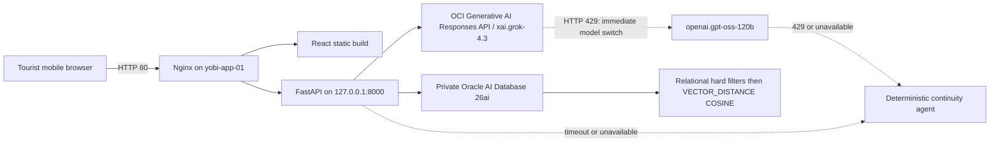

# Architecture

YOBI is a mobile-first React application served by Nginx from the existing
`yobi-app-01` VM. Nginx is the only public process. It proxies `/api/`, `/healthz`,
and `/readyz` to one Uvicorn worker bound to `127.0.0.1:8000`.

The LLM interprets intent, chooses allowlisted tools, and writes English explanations.
Oracle remains authoritative for menu facts, prices, options, evidence, carts, payment
state, and mock orders. Allergy, dietary, availability, budget, and price constraints
are deterministic and are never delegated to vector similarity or model prose.

The runtime never sleeps through a user request to satisfy a one-RPM model limit. A
primary-model 429 records a short cooldown derived from `Retry-After` (or 65–70
seconds plus jitter), immediately switches the same bounded tool loop to
`openai.gpt-oss-120b`, and uses the deterministic continuity agent if the fallback is
also rate-limited or unavailable. Bootstrap smoke tests may wait and retry at most
twice because they are offline deployment checks rather than interactive traffic.

Local development uses the same repository interface with SQLite and semantic-hash
embeddings. That path proves UI continuity but is not evidence of Oracle or Grok
integration. Production selects `DEMO_DB_BACKEND=oracle`.

The address image endpoint validates size, MIME type, magic bytes, and decodability.
Only a SHA-256 digest and confirmed synthetic address record are retained; raw image
bytes are never written to disk or database.
