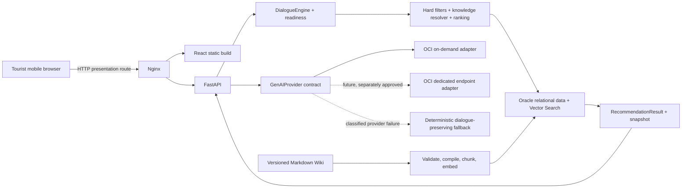

# Architecture

YOBI is a mobile-first React application served by Nginx from the existing OCI VM.
Nginx is the only public process. It serves the frontend and proxies `/api/`,
`/healthz`, and `/readyz` to one Uvicorn worker bound to `127.0.0.1:8000`.

`DialogueEngine` owns cumulative user needs, current `DialogueAct`, corrections,
recommendation holds, and readiness. Oracle/SQLite repositories own menu constraints,
knowledge inheritance, prices, options, carts, mock payment/order state, and
idempotency. The LLM is a language/orchestration adapter; it does not have final
authority over candidates or safety.

`RecommendationResult` is the single source for assistant body references and cards.
It is persisted with the exact assistant message and state version. Browser select,
reject, compare, and option actions return through the conversation-event API, so a
refresh hydrates server state rather than reconstructing it from UI-only memory.

The menu Wiki remains editable Markdown under `knowledge/dishes/`. Deployment
compiles it into release-scoped dish concepts, relations, closure, claims, documents,
chunks, menu mappings, merchant origin declarations, and option effects. Only a
count-verified release with compatible non-null embeddings becomes active. General
Wiki claims, merchant context, and menu/option facts retain separate scopes.

The default public generation path is OCI on-demand with a logical primary and
fallback model. `GenAIProvider` isolates serving-mode request normalization and
capabilities. A dedicated adapter contract exists for future use, but no live
dedicated endpoint is claimed without separate provisioning and smoke evidence.
Generation settings are independent from embedding model/dimension/version.

Interactive retry is bounded. Rate limits trigger cooldown/model fallback rather
than an in-request minute-long wait; transient timeout/network/server failures use
bounded exponential backoff with jitter. A deterministic fallback preserves the
current dialogue act and uses the same repository facts. Message POSTs may carry a
session-scoped client `request_id`: an identical content/intent replay returns the
persisted turn, while payload reuse is rejected. The browser retains an unfinished
request identity across an SSE retry, and the server derives the agent mutation key
from that stable identity. This closes the lost-response boundary between a committed
cart/delivery/checkout mutation and a failed provider continuation or transport.

Checkout idempotency is narrower than a cart ID alone. Migration 008 stores the
confirmed cart version and a server-computed cart/version/total fingerprint on each
mock checkout and enforces one checkout per `(cart_id, cart_version)`. The frontend
confirms first and keys checkout creation with that returned version. Existing
checkout/order constraints still prevent duplicate mock orders; a later cart version
is a distinct reviewed snapshot rather than a replay of the earlier checkout.

Review snippets remain synthetic display data and have recommendation/safety weight
`0`. Allergy, dietary, service-area, availability, budget, spice, Wiki core-ingredient
conflicts, and prices are deterministic constraints, never delegated to vector
similarity, review prose, or model prose.

Local development uses the same repository contract with SQLite, fixture address
extraction, and deterministic semantic-hash embeddings. It proves local dialogue,
domain, and UI continuity but is not evidence of Oracle Vector Search, OCI GenAI,
Nginx/systemd, or the public deployment.

The address image endpoint validates size, MIME type, magic bytes, and decodability.
Only a SHA-256 digest and confirmed synthetic address record are retained; raw image
bytes are never written to disk or database.
