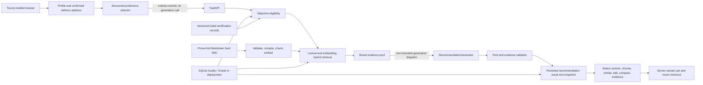

# Architecture

> Current product authority: [`STRUCTURED_RECOMMENDATION_IMPLEMENTATION_PLAN.md`](STRUCTURED_RECOMMENDATION_IMPLEMENTATION_PLAN.md).
> This document describes the 2026-08-12 structured-recommendation source tree. It
> does not claim that migration `010`, Oracle Vector Search, OCI GenAI, or the public
> site has been exercised for this revision.

YOBI is a mobile-first React application. In the deployed topology, Nginx serves the
frontend and proxies `/api/`, `/healthz`, and `/readyz` to one Uvicorn worker. Local
development uses the same FastAPI contracts with SQLite and deterministic embeddings.

## Responsibility boundaries

The browser owns an editable criteria draft and renders the server-published,
localized preference catalog. Multiple values in one category mean `OR`; non-empty
categories express the user's cross-category `AND` intent. Subjective prose is not
converted into SQL booleans: a normal result must cite a passage for every active
category, while the LLM judges semantic fit inside the pool. The recommendation surface
has no free-text composer. Profile, criteria, result, and active request state are
rehydrated from the server after a reload. Delivery notes remain a separate order-stage
text field.

The server owns merchant service-area compatibility, menu availability, base price
bands, the reviewed five-level spice ceiling, valid halal certification scope, and
confirmed vegan conflicts. It applies those objective conditions before retrieval and
again before committing a selectable result. Nationality, language, and religion never
activate halal or vegan filters. Allergy data retained for backward-compatible storage
is not consumed by the public v2 recommendation or checkout path.

After objective eligibility, the repository retrieves public Wiki passages with
lexical and embedding signals and builds a broad evidence pool. Retrieval rank is not
the final recommendation order. In the normal path, exactly one bounded generation
request chooses menus from that pool and writes their explanations in the same
response. The server validates pool membership, evidence references, active-category
coverage, objective eligibility, result order, and internal-ID leakage; it preserves
the model's valid order instead of reranking it. The prompt forbids unsupported prose,
but the current validator is not a general textual-entailment or hallucination
detector. Generated-prose faithfulness remains an explicit provider/evaluation gate.

The generation request has no tools, continuation turn, or automatic model retry.
An empty eligible pool completes without a generation call. A timeout or invalid
response can return a visibly distinct search-result fallback from the already saved
pool without a second generation dispatch. This proximity fallback does not claim
that every subjective category is satisfied. A model `NO_MATCH` is also respected and
does not silently relax the user's conditions.

`SIMILAR` creates a new request with the same committed conditions and excludes menu
IDs already shown, rejected, or selected according to server state. `SELECT_MENU`,
option updates, cart, delivery, mock checkout, and mock order continue through
server-authoritative state transitions and idempotency checks.

## Wiki and release boundary

Markdown under `knowledge/dishes/` is the editable food Wiki. Stable concept
identity, relationships, defining ingredients/preparation, provenance, and review
status may be structured. Taste, texture, temperature impressions, cultural context,
and other subjective qualities remain encyclopedia-style prose. The compiler creates
paragraph and essential-fact chunks with stable provenance and release-bound
embeddings. Allergy/safety prose inherited from the older facet format is retained
internally but excluded from the public v2 RAG pool.

`RECOMMENDATION_RELEASE_FAMILY` binds a compatible knowledge release, catalog,
preference vocabulary, spice references, certification release, and embedding
identity. A recommendation request pins one active family for eligibility, retrieval,
generation, and its snapshot. Reviews and merchant promotional prose remain synthetic
display data with recommendation and grounding weight `0`.

Locally, only the knowledge identity is enforced by a release foreign key; the other
identities are versioned seed rows checked by application counts. Independent
catalog/certification manifests plus a live atomic activation/rollback proof remain a
deployment gate and are not inferred from the local pointer. The current `/readyz`
checks the canonical catalog, active knowledge/vector state, and required production
provider configuration; it is not yet a complete v2 family-manifest readiness check.

## Request and persistence boundary

Criteria commits use an expected state version, stable request ID, semantic hash, and
catalog version. Recommendation requests are reserved by `(session_id, request_id)`.
An identical replay returns the persisted request; reusing an ID for another payload
is rejected. The request hash covers the criteria identity/version, mode, expected
state version, locale, and session/profile identity; the reserved row separately pins
the release family/time and later stores the exact pool. A changed profile, address,
or similar-history state requires a new state transition and request ID rather than
reusing an old semantic identity. Dispatch state is committed immediately before
calling the provider, and
the database lock is not held during the remote request. A crash after dispatch is
reported as `UNKNOWN_AFTER_DISPATCH` and is never automatically redispatched.
A stale reservation that never reached dispatch is instead terminalized as a failed
retrieval owner; because no generation dispatch occurred, the UI may offer an explicit
new-request retry.

A validated selectable result and its recommendation snapshot are committed together.
At that commit, both repositories re-check the pinned release family at current UTC,
drop newly ineligible menus, and refresh server-owned menu price, delivery fee/ETA,
halal, and vegan fields without rewriting the model's prose or order. The stored
snapshot carries that menu payload and evidence provenance used by subsequent button
events. A later terminal-request GET/reload computes a fresh read projection and can
hide stale menus without mutating the stored model result or calling generation.
Existing cart-confirmation fingerprints and one-checkout-per-cart-version constraints
continue to protect mock checkout replay and stale cart changes. In the v2 order path,
current-meal criteria—not retained profile allergy/religion fields—own halal, vegan,
spice, and service-area revalidation. A price-band drift alone is a non-blocking
updated-price warning; the server reprices the cart and requires confirmation of the
new total/fingerprint instead of treating the menu as newly ineligible.

## Runtime and evidence boundary

The default deployment configuration targets OCI on-demand generation; a dedicated
adapter is only a future integration surface. The current local structured-flow tests
use SQLite, deterministic embeddings, and fake generation providers where applicable.
Those checks prove source-level contracts, not live Oracle Vector Search, OCI model
behavior, Nginx/systemd, or the public site. See [`TEST_REPORT.md`](TEST_REPORT.md) for
the exact verified and unverified boundaries.

The address-image endpoint validates size, MIME type, magic bytes, and decodability.
Only its digest and the confirmed synthetic address record are retained; raw image
bytes are not written to the database or filesystem.
