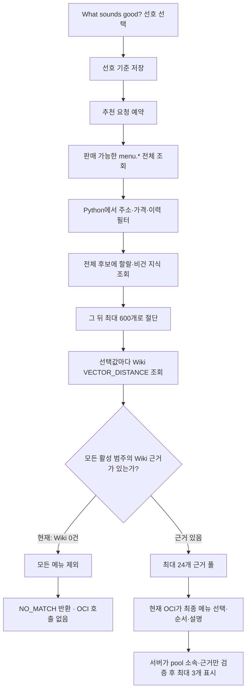
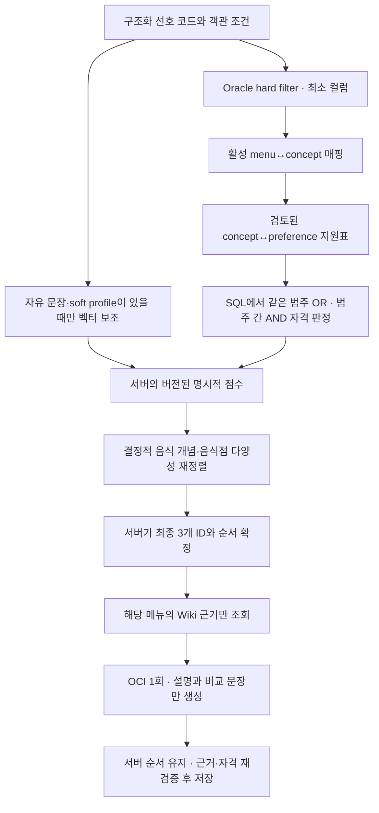

# YOBI 음식 추천 기능 진단·성능 개선 및 OCI 적용 실행계획

> 검토 기준 시각: 2026-08-16 03:41 KST
> 검토 대상: 현재 작업 트리, 운영 OCI Oracle 26ai 공개 상태, 외부 카탈로그 로컬 미러
> 검토 목적: DB 교체 이후 추천 실패와 지연의 원인을 다시 검증하고, 새 세션이 기능·속도·근거 품질을 복구해 기존 OCI에 배포할 수 있는 실행 계약을 제공한다.
> 실행 승인: **2026-08-16 KST. 모델이 미결정 사항을 근거에 따라 자율 확정하고, 코드·SQLite·기존 OCI Oracle·표준 애플리케이션 배포 흐름의 변경과 적용을 별도 승인 없이 완료할 수 있다.**
> 검토 판정: **새 세션 실행 인수인계로 사용할 수 있다. 단, 시각이 있는 운영 수치는 시작 시 읽기 전용으로 다시 확인하고 새 증거로 교체해야 한다.**
> 개정 사항: 2026-08-16 외부 아키텍처 의견과 인용 연구를 재검토해 서버 소유의 최종 순위, 설명 전용 LLM, 릴리스 연동 선호 UI를 반영했다. 사용자의 자율 의사결정·OCI 적용 승인을 실행 계약과 확정 기본값에 추가했으며, 기존 표준 배포 흐름을 보완해 배포·롤백·재배포하는 절차로 정리했다.

## 0. 새 세션 실행 계약

이 절은 이 작업을 새 세션에서 중단 없이 수행하기 위한 **현재 사용자 승인과 실행 경계**다. 새 세션은 이 파일을 처음부터 끝까지 읽은 뒤 단순 재분석이나 계획 재승인을 요청하지 말고, 아래 권한 안에서 구현·검증·기존 OCI 적용까지 진행한다.

### 0.1 목표와 완료 정의

작업 디렉터리는 `/Users/kimjunggil/Documents/YOBI/mvp`다. 최종 목표는 다음을 모두 만족하는 것이다.

1. 외부 메뉴 카탈로그와 호환되는 음식 개념·Wiki·메뉴 매핑·선호 지원 릴리스를 만든다.
2. 추천 경로를 `SQL hard filter → concept support → 서버 점수·다양성 재정렬 → 최종 Wiki 근거 → OCI 설명 1회`로 바꾼다.
3. 선호 화면을 지원 릴리스와 연동하고 SQL preview로 0건 조합을 추천 요청 전에 설명한다.
4. SQLite와 Oracle의 의미를 일치시키고 기능·데이터·성능·실패·롤백 게이트를 통과한다.
5. 변경된 애플리케이션과 DB 릴리스를 현재 표준 OCI 배포 흐름으로 배포한다. 현재 자원을 우선 재사용하며, 이 추천 복구에 불필요한 새 인프라는 만들지 않는다.
6. 공개 추천→선택→옵션→장바구니→고정 주소→목업 주문 흐름을 다시 검증한다.
7. 새 릴리스의 정상 동작, 이전 릴리스로의 롤백, 최종 재배포 증거가 남아 있어야 한다.

사용자는 제공된 `YOGIYO_PUBLIC_WEB` 자료를 OCI DB에 저장·사용할 권한이 있다고 명시했다. 상호·메뉴명·가격·옵션은 그 출처를 유지하고, YOBI가 만든 음식 개념 연결과 일반 Wiki는 별도 파생·합성 출처로 표시한다.

### 0.2 문서 권위와 충돌 해결

이 작업 범위의 우선순위는 다음과 같다.

1. 이 절에 기록된 2026-08-16 사용자 승인과 제품·데이터·보안 불변식
2. 이 문서의 목표 구조·확정 기본값·실행 게이트
3. 영향받지 않는 제품 흐름에 대한 `docs/STRUCTURED_RECOMMENDATION_IMPLEMENTATION_PLAN.md`
4. 제품 전체의 역사적 범위에 대한 `YOBI_FINAL_MVP_CODEX_MASTER_PROMPT.md`
5. 현재 코드·스키마·테스트와 시작 시 재확인한 읽기 전용 운영 사실
6. `docs/IMPLEMENTATION_STATUS.md`, `docs/TEST_REPORT.md`, `docs/OCI_DEPLOYMENT.md`의 과거 증거

이 문서는 추천 범위에서 기존 권위 문서의 “LLM이 evidence pool에서 최종 메뉴와 순서를 결정한다”는 계약을 **서버가 최종 메뉴와 순서를 확정하고 LLM은 설명만 생성한다**는 계약으로 대체하도록 승인한다. 구현 첫 단계에서 `docs/STRUCTURED_RECOMMENDATION_IMPLEMENTATION_PLAN.md`, README, API·아키텍처·상태·테스트 문서의 충돌 문구를 함께 갱신한다. 과거 배포 기록은 삭제하거나 성공 증거를 다시 쓰지 않고, 대체 범위와 새 릴리스 증거를 추가한다.

운영 개수·릴리스 ID·지연·실행계획처럼 변할 수 있는 사실은 이 문서의 2026-08-16 스냅샷보다 **새 세션에서 재확인한 현재 증거**를 우선한다. 단, 새 증거를 이유로 출처 경계, 데이터 보존, same-category `OR`/cross-category `AND`, 서버 최종 순위, 설명 전용 LLM 같은 제품 불변식을 임의로 완화하지 않는다.

### 0.3 별도 승인 없이 허용된 작업

| 대상 | 허용 작업 | 필수 조건 |
|---|---|---|
| 로컬 저장소 | 코드·문서·테스트·Wiki·migration·배포 도구 수정, 빌드와 테스트 | 기존 미커밋·미추적 파일 보존, 무관한 변경 삭제·되돌리기 금지 |
| 로컬 SQLite | 임시 DB의 additive migration, 데이터 생성·적재·검증·삭제 | 기본 개발 DB를 덮지 말고 작업별 임시 경로 사용 |
| 기존 OCI Oracle 논리 DB | additive DDL(테이블·컬럼·논리 인덱스·제약), DML, 지식·추천 릴리스 적재와 활성 포인터 전환 | 기존 카탈로그·주문 보존, 새 버전 ID 사용, 활성화 전 검증, 이전 포인터 기록; 벡터 인덱스는 §7.6의 실측 gate를 통과할 때만 허용 |
| 표준 OCI 배포 | 기존 `deploy/deploy.sh`·`make deploy`를 필요한 만큼 보완해 패키징, migration, 앱 배포, 서비스 반영, smoke 수행 | 현재 배포 구조와 자원을 우선 재사용, 비밀값 비출력, 활성화 전 gate, 실패 시 자동 롤백 |
| OCI 운영 확인 | 기존 자원 조회, VM 접속, DB/API 상태·로그·실행계획 확인 | 기존 `rndmgr` 프로필 재사용, 시크릿·전체 OCID·키·민감 주소 출력 금지 |
| 복구 | 이전 앱 symlink와 지식·추천 활성 포인터 복원, 원인 수정 후 최종 릴리스 재배포 | 이전 포인터와 migration ledger 기록, public health/readiness 재검증 |

위 작업은 이번 문서의 목표 달성을 위해 **추가 사용자 승인 없이** 수행한다. 표준 배포 과정에서 기존 배포 스크립트가 수행하는 패키지·서비스·Nginx·런타임 정책 정합화도 배포 범위에 포함한다. 다만 이 추천 복구와 관계없는 OCI 자원 신설·재구성은 할 이유가 없으므로 계획에 넣지 않는다. 새 세션은 사용자가 별도로 요청하지 않은 외부 Git push나 PR 생성도 하지 않는다.

### 0.4 자율 의사결정 원칙과 유일한 중단 조건

§12의 선택은 사용자 승인을 반영한 기본 계약이다. 구현 모델은 추가 질문 없이 적용한다. 데이터·실측이 더 나은 비파괴적 선택을 명확히 지지하면 다음 조건 아래 세부 구현값을 조정할 수 있다.

1. same-category `OR`, cross-category `AND`, 숨은 완화 금지, 정식 할랄 근거, 서버 최종 순위, 설명 전용 LLM 같은 제품 불변식을 지킨다.
2. 가장 작고 되돌릴 수 있으며 SQLite·Oracle 의미가 같은 대안을 선택한다.
3. 메뉴·음식점·release ID, 결과, 현재 행 수를 하드코딩하지 않고 버전된 데이터·설정·manifest와 현재 DB에서 재현한다. 점수 가중치·임계값은 한 개의 versioned ranking policy 정의로 관리하며 프런트·두 저장소에 중복 상수로 흩어놓지 않는다.
4. 변경 이유, 비교한 대안, 증거, 영향, policy/version을 실행 기록에 남긴다.
5. 품질·성능·데이터·복구 gate가 더 나빠지면 원래 기본값으로 복구한다.

테스트 실패, 구현 난도, 긴 실행 시간, 가중치 선택은 중단 사유가 아니다. 안전한 범위에서 원인을 진단하고 수정·재검증한다. 다음 경우에만 작업을 중단하고 blocker를 보고한다.

- 기존 자격증명이나 VM/DB 접근이 실제로 없어 승인 범위 안의 적용이 불가능함
- backward-compatible additive migration과 버전 포인터 롤백으로 데이터 보존을 보장할 수 없음
- 제공 자료 또는 검토 근거가 손상·누락되어 사실을 조작하지 않고는 필수 데이터 gate를 통과할 수 없음
- 앱·DB 롤백 후에도 기존 공개 서비스가 health/readiness를 회복하지 못함

blocker가 아니면 계획 설명만 남기고 멈추지 않는다. 로컬 구현, 테스트, Oracle 적용, 표준 OCI 배포, 공개 검증, 문서·증거 갱신까지 완료한다.

### 0.5 새 세션 시작 체크리스트

1. 이 문서 전체와 `docs/STRUCTURED_RECOMMENDATION_IMPLEMENTATION_PLAN.md`, `README.md`, `docs/IMPLEMENTATION_STATUS.md`, `docs/TEST_REPORT.md`, `docs/OCI_DEPLOYMENT.md`를 읽는다.
2. `pwd`, `git status --short --branch`, `git diff --stat`, migration 목록을 확인한다. 현재 작업 트리는 이미 수정·미추적 파일이 있으므로 reset, checkout, clean, stash, 덮어쓰기를 하지 않는다.
3. 운영 OCI·Oracle·공개 API를 읽기 전용으로 다시 확인하고 이 문서의 시각 있는 수치와 차이를 실행 기록에 남긴다.
4. 현재 앱·지식·추천 활성 포인터, migration ledger, 표준 배포 스크립트와 public readiness 기준선을 기록한다.
5. 현재 테스트 기준선을 기록하고 Phase 0부터 순서대로 수행한다.
6. 각 Phase 완료 gate를 증거로 통과한 뒤 다음 단계로 진행한다. 실패하면 같은 Phase 안에서 수정한다.
7. 구현 과정의 최종 파일·명령·테스트 수·성능·release ID·rollback·재배포 결과를 §16 형식으로 기록한다.

새 세션에 전달할 실행 요청은 다음 한 문장이면 충분하다.

> `/Users/kimjunggil/Documents/YOBI/mvp/docs/RECOMMENDATION_PERFORMANCE_DIAGNOSIS_AND_IMPROVEMENT_PLAN.md`를 처음부터 끝까지 읽고, §0의 승인과 제품·데이터·보안 불변식을 지키면서 Phase 0부터 표준 OCI 배포와 공개 회귀까지 중단 없이 수행하고 §16 증거를 완성해라.

## 1. 기술 요약

재검토 결과, 기존 진단의 핵심은 그대로 유효하다.

1. **현재 `NO_MATCH`의 직접 원인은 메뉴 수가 아니라 활성 Wiki 지식이 0건인 상태다.**
   운영 카탈로그에는 메뉴 15,085개가 있지만 활성 지식 릴리스에는 음식 개념, 문서, 청크, 주장과 메뉴 매핑이 모두 0건이다. 추천 서비스는 Wiki 근거가 없는 메뉴를 모두 제외하므로 정상 추천 후보를 만들 수 없다.

2. **메뉴 증가가 지연을 키울 수 있다는 판단도 맞다.**
   현재 Oracle 경로는 판매 가능한 메뉴 약 15,012개의 `menu.*`를 먼저 전부 가져온 뒤 Python에서 최대 600개만 남긴다. `menu.*`에는 1,536차원 `FLOAT32` 벡터도 포함된다. 벡터 값만 계산한 원시 데이터량은 약 87.96 MiB이며, 과거 600메뉴 기준 3.52 MiB의 약 25배다. 이 수치는 실제 네트워크 전송량이 아니라 벡터 값 자체의 크기이며, 다른 컬럼과 드라이버 객체 비용은 별도다.

3. **현재 긴 `NO_MATCH`가 OCI 생성 모델 때문이라는 근거는 없다.**
   근거 풀이 비면 생성 모델을 호출하기 전에 바로 `NO_MATCH`로 반환한다. 현재 실패 경로의 지연은 후보 조회, Python 필터, 할랄·비건 지식 조회, DB 왕복 등 생성 이전 단계에서 발생한다. 다만 단계별 운영 로그가 없으므로 각 단계의 실제 기여 시간은 아직 측정하지 못했다.

4. **복구는 기존 Wiki를 새 메뉴에 무작정 붙이는 작업이 아니다.**
   기존 102개 Wiki 문서는 `SYNTHETIC_WIKI / REVIEWED_DEMO` 자료다. 새 메뉴는 `YOGIYO_PUBLIC_WEB` 출처다. 일반 음식 지식은 재사용할 수 있지만, 이를 요기요 또는 개별 음식점이 제공한 재료·인증 사실처럼 표현하면 안 된다. 메뉴↔음식 개념 매핑, 일반 음식 지식, 매장별 사실과 정식 인증의 출처를 분리해야 한다.

5. **권장 구조는 `메뉴 전체를 읽고 RAG`가 아니라 `SQL hard filter → 음식 개념 지원 판정 → 서버의 명시적 점수 → 벡터 보조 → 결정적 다양성 재정렬 → Wiki 근거 조회 → OCI 설명 1회`다.**
   고정된 선호 버튼은 매 요청마다 벡터 검색할 필요가 없다. Wiki 릴리스 생성 시 각 음식 개념이 어떤 선호값을 어떤 청크로 뒷받침하는지 미리 계산해 두면, 런타임에서는 인덱스 가능한 관계형 조인으로 same-category `OR`, cross-category `AND`를 처리할 수 있다. 최종 메뉴 ID와 표시 순서는 서버가 확정하고, LLM은 그 결과를 바꾸지 않은 채 설명만 생성하는 편이 더 일관적이다.

6. **외부 의견은 대부분 타당하지만, 현재 구현을 일부 과장한 표현은 그대로 받아들이지 않는다.**
   현재 LLM이 가격·주소·판매 상태·할랄 같은 hard eligibility를 직접 판정하는 것은 아니다. 이 조건은 이미 서버가 적용하고, 결과도 서버가 재검증한다. 실제 추가 개선점은 LLM이 evidence pool 안에서 최종 메뉴와 순서를 결정하는 현재 계약을 서버 소유의 결정적 ranking으로 옮기는 것이다. 이 변경은 현재 `NO_MATCH`의 직접 원인이나 전체 조회 병목을 대신 해결하지 않으며, 지식 복구와 SQL 축소가 여전히 먼저다.

7. **`Find your meal / What sounds good?`의 선호 키워드도 새 Wiki·지원표와 같은 릴리스 단위로 맞춰야 한다.**
   원본 메뉴의 세부 카테고리를 화면에 그대로 늘리는 방식은 권장하지 않는다. 기존의 안정적인 선호 코드는 유지하되, 현재 릴리스에서 실제로 지원되는 값만 노출하고, 핵심 선호·추가 선호·정확 조건으로 구분한다. 사용자가 칩을 누를 때는 벡터나 LLM 없이 SQL로 예상 메뉴·음식점 수를 계산해 0건 조합을 추천 요청 전에 설명해야 한다.

8. **새 세션은 추가 제품 결정을 묻지 않고 표준 OCI 배포까지 진행한다.**
   사용자는 코드·SQLite·기존 Oracle 논리 DB·애플리케이션 릴리스 변경과 적용을 승인했다. 별도 전용 경로를 만들지 않고 기존 `deploy/deploy.sh`·`make deploy`를 기준으로 삼는다. 다만 현재 migration 기대 목록과 외부 카탈로그 smoke 계약이 새 추천 구조를 반영하도록 먼저 보완한 뒤, 동일한 표준 경로로 배포·롤백·재배포한다.

## 2. 이번 검토가 답하는 질문

| 질문 | 재검토 결론 | 확신도 |
|---|---|---:|
| DB가 너무 커져서 추천이 안 나오는가? | 추천 불능의 직접 원인은 아님. 그러나 현 조회 구조에서는 지연과 후보 편향을 키우는 고위험 요인임 | 높음 |
| 내부 음식 Wiki를 갱신해야 하는가? | 필요함. 더 정확히는 새 메뉴와 호환되는 개념 매핑·문서·청크·임베딩·추천 릴리스를 함께 만들어야 함 | 매우 높음 |
| 현재 AI가 추천을 못 하는 것인가? | 현재 빈 근거 경로에서는 AI를 호출하지도 않음 | 매우 높음 |
| 선호 정보를 많이 주면 추천이 쉬워지는가? | 같은 범주 안에서는 `OR`지만 서로 다른 범주는 `AND`라서, 범주가 많아질수록 통과 조건이 엄격해짐 | 매우 높음 |
| `/readyz=true`이면 추천 가능한가? | 현재 외부 모드에서는 아님. 0개 지식 상태의 정직한 적재도 `knowledge_ready=true`가 됨 | 매우 높음 |
| 벡터 인덱스를 추가하면 바로 해결되는가? | 아님. 먼저 전체 행 전송과 런타임 중복 조인을 제거해야 함. 인덱스 효과는 실제 실행계획·정확도 측정 후 판단해야 함 | 높음 |
| 외부 의견처럼 LLM은 설명만 맡겨야 하는가? | 현재 데모의 구조화 입력에는 권장함. 서버가 최종 메뉴·순서를 확정하고 LLM은 근거 기반 설명만 작성하도록 목표 구조를 보완함 | 높음 |
| 선호 키워드 화면도 새 DB에 맞춰 바꿔야 하는가? | 필요함. 단, 메뉴별 키워드를 늘리는 것이 아니라 안정 코드는 유지하고 지원 범위·표현·묶음·조합 가능 수를 새 지식 릴리스와 맞춰야 함 | 높음 |
| 새 세션이 별도 승인 없이 결정·Oracle 적용·앱 배포까지 가능한가? | 가능함. §12 기본값을 자율 적용하고, 보완된 기존 표준 배포 경로로 OCI 적용·롤백·재배포까지 완료함 | 매우 높음 |

### 2.1 외부 의견의 수용 범위

| 외부 의견 | 판정 | YOBI 근거와 적용 범위 |
|---|---|---|
| SQL hard filter가 객관 조건을 소유 | 수용, 기존 계획과 동일 | 서비스 지역·판매 상태·가격·정식 인증·검토된 식단 충돌은 이미 서버 권한이며, 더 많은 조건과 후보 상한을 Oracle 안으로 옮겨야 함 |
| 신규 사용자에게 Wiki 기반 추천이 유리 | 잠재 장점만 수용 | 주문 이력이 없어도 content/knowledge 기반 추천은 가능하지만, 현재 활성 Wiki·매핑이 0건이므로 지금 동작하는 장점은 아님 |
| 음식 설명·문화 맥락·근거 표시가 강점 | 방향성 수용 | Wiki와 provenance가 있을 때의 장점임. 현재 활성 근거 0건이며 기존 Wiki도 일반 합성 지식이므로 매장별 사실처럼 표현하면 안 됨 |
| 고정 선호 버튼은 음식 개념 지원표로 판정 | 수용, 기존 계획과 동일 | 기존 초안의 `concept_preference_support`가 같은 해법임. 단, `support_score`가 boolean `AND`를 몰래 완화하지 않도록 검토된 `support_status`를 별도로 둬야 함 |
| 벡터는 자유 문장·감성·다국어 의미의 보조 신호 | 수용, 기존 계획과 동일 | 현재 고정 코드별 반복 벡터 검색을 제거하고 soft profile·자유 문장·유사 음식·최종 설명 청크 검색에만 제한 |
| Wiki/RAG는 근거와 설명에 집중 | 수용, 기존 계획과 대체로 동일 | Wiki는 일반 음식 지식과 설명 근거를 제공하되 매장별 재료·인증을 대신 증명하지 않음 |
| 현재 LLM이 hard 조건까지 전부 판정 | 그대로는 기각 | 서버가 이미 objective eligibility와 pool membership을 강제한다. 다만 RAG가 주관 조건 eligibility를 매번 만들고 LLM이 최종 메뉴·순서를 정하는 책임은 실제로 큼 |
| 최종 메뉴와 순서를 서버 점수가 소유 | **추가 수용** | 기존 개선 초안은 LLM의 최대 3개 선택·정렬을 유지했다. 이를 버전된 결정적 scorer와 다양성 reranker가 최종 3개를 확정하는 구조로 수정 |
| LLM ranking은 위치 편향 때문에 위험 | 방향성 수용, YOBI 실측은 없음 | 관련 연구는 생성형 listwise ranking의 순서 관계·position bias 위험을 보고하지만 현재 OCI 모델과 프롬프트의 변동성을 직접 측정한 증거는 아님 |
| 장기 개인화가 부족 | 수용, 즉시 복구와는 분리 | 현재는 profile soft signal과 세션 내 노출·거절·선택 제외가 있지만, 사용자 행동으로 학습한 장기 ranking 모델은 없음 |
| 지금 two-tower를 도입 | 보류 | 현재는 200개 음식점의 데모이고 학습할 장기 사용자 행동 데이터가 부족함. 이벤트 정의·품질·표본이 쌓인 뒤 검토 |

연구 자료는 설계 방향을 보조하지만 YOBI에 대한 직접 비교 실험은 아니다. 음식 지식 그래프 연구는 명시적 식단·건강 제약을 지식 기반 제약으로 처리하는 접근을 보여주고, RAG 원 논문은 외부 지식과 provenance를 활용한 지식 집약적 생성을 보여준다. 이것만으로 “RAG는 설명에만 사용해야 한다”가 증명되는 것은 아니다. 생성형 LLM ranker 연구 역시 일반적인 위험을 뒷받침하지만 YOBI의 현재 모델을 실험한 결과는 아니다.

- [Personalized Food Recommendation as Constrained QA over a Food Knowledge Graph](https://arxiv.org/abs/2101.01775)
- [Retrieval-Augmented Generation for Knowledge-Intensive NLP Tasks](https://arxiv.org/abs/2005.11401)
- [Make Large Language Model a Better Ranker](https://aclanthology.org/2024.findings-emnlp.51/)
- [Google Recommendation Systems Overview](https://developers.google.com/machine-learning/recommendation/overview/types)
- [Deep Neural Networks for YouTube Recommendations](https://research.google.com/pubs/pub45530.html)

외부 의견의 “LLM에 후보 10~20개를 주고 최종 3개를 작성하게 한다”는 예시는 그대로 채택하지 않는다. 그러면 설명 전용이라는 결론과 달리 LLM이 다시 최종 선택·순위를 갖게 된다. 목표 구조에서는 서버가 최종 3개를 먼저 확정하고 LLM에는 그 세 메뉴만 전달한다.

## 3. 검토 범위와 근거

### 3.1 확인한 운영 상태

2026-08-16 03:41 KST에 운영 OCI의 공개 읽기 API를 다시 확인했다.

| 항목 | 운영 확인값 |
|---|---:|
| DB | Oracle 26ai |
| 카탈로그 모드 | `EXTERNAL_SOURCE` |
| 출처 | `YOGIYO_PUBLIC_WEB` |
| 음식점 | 200 |
| 전체 메뉴 | 15,085 |
| 옵션 그룹 | 31,293 |
| 옵션 항목 | 208,513 |
| 표준 메뉴 카테고리 | 0 |
| 음식 개념 | 0 |
| Wiki 문서 | 0 |
| Wiki 청크 | 0 |
| 지식 주장 | 0 |
| `MAPPED` 메뉴 | 0 |
| `UNMAPPED` 메뉴 | 15,085 |
| 재료·식단·인증 사실 행 | 0 |
| 데모 주소 | 1, 정상 |
| `canonical_ready` | `true` |
| `knowledge_ready` | `true` |
| `vector_ready` | `true` |

운영 응답은 다음 원천 한계도 명시한다.

- `NO_REVIEWED_INGREDIENT_DATA`
- `NO_FORMAL_CERTIFICATION_DATA`
- `NO_REVIEWED_DISH_CONCEPT_MAPPING`
- `SPICE_AND_SERVES_NOT_PROVIDED`

### 3.2 로컬 외부 카탈로그 미러 재검산

`tmp/catalog-import-20260816/sqlite-mirror-v4-demo-address.db`를 읽기 전용으로 검사했다. 카탈로그 핵심 개수는 운영 OCI와 일치했다. 로컬 미러는 주소 적용 전 파일이라 주소 행은 운영과 직접 비교하지 않았다.

| 품질 항목 | 결과 | 해석 |
|---|---:|---|
| 음식점 ID 중복 | 0 | 핵심 키 정상 |
| 메뉴 ID 중복 | 0 | 핵심 키 정상 |
| 옵션 그룹 ID 중복 | 0 | 핵심 키 정상 |
| 옵션 항목 ID 중복 | 0 | 핵심 키 정상 |
| 고아 메뉴·옵션·매핑 | 0 | 참조 무결성 정상 |
| 잘못된 필수 옵션 그룹 | 0 | 주문 구조 정상 |
| 판매 가능 메뉴 | 15,012 | 추천 기본 모집단 |
| 품절 메뉴 | 73 | 판매 상태 구분 가능 |
| 메뉴 설명 보유율 | 77.06% | 일부 설명 부족 |
| 영문 메뉴명 보유율 | 0% | 비한국어 UX 품질 저하 |
| 문화 설명 보유율 | 0% | Wiki 없이는 문화 설명 불가 |
| 맵기 보유율 | 0% | 맵기 필터가 사실상 검증되지 않음 |
| 인분 정보 보유율 | 0% | 인원 기반 판단 불가 |
| 표준 `category_id` 보유율 | 0% | 표준 분류 연결 없음 |
| `semantic_text` 보유율 | 100% | 메뉴 벡터 생성 입력은 존재 |
| 원본 `category` 고유값 | 971 | 음식 분류와 매장 섹션명이 혼재 |

가격과 특수 메뉴 분포는 다음과 같다.

| 구간·경계값 | 메뉴 수 |
|---|---:|
| 1만원 미만 | 9,294 |
| 1만~2만원 미만 | 3,321 |
| 2만~3만원 미만 | 1,572 |
| 3만원 이상 | 898 |
| 주류·성인 표시 메뉴 | 370 |
| 가격 0원 메뉴 | 1 |
| 옵션이 있는 메뉴 | 8,352 |
| 한 메뉴의 최대 옵션 그룹 | 20 |
| 한 옵션 그룹의 최대 항목 | 63 |
| 음식점당 평균 메뉴 | 75.4 |
| 한 음식점의 최대 메뉴 | 812 |

### 3.3 코드와 테스트

확인한 주요 경로는 다음과 같다.

- `frontend/src/routes/ChatPage.tsx`: 선호 저장, 동기 추천 요청, 상태 복구
- `frontend/src/lib/api.ts`: 추천 API 호출, 요청 제한시간·취소 부재
- `backend/app/services/structured_recommendation.py`: 근거 풀 생성, 빈 풀 조기 반환, OCI 생성
- `backend/app/db/oracle_repository.py`: 객관 조건, Wiki 조회, 후보 풀 조립
- `scripts/import_external_catalog.py`: 0개 지식 릴리스와 전체 `UNMAPPED` 상태 생성
- `scripts/catalog_mode.py`: 외부 카탈로그 readiness 확인
- `deploy/deploy.sh`: 외부 모드에서 정상 추천 smoke를 DB 검증으로 교체
- `scripts/structured_recommendation_smoke.py`: 정상 추천·Wiki 근거·1회 생성 검증

다음 회귀 테스트를 현재 작업 트리에서 다시 실행했다.

```text
33 passed, 1 warning in 21.57s
```

대상은 구조화 추천 서비스·저장소·선호 카탈로그·배포 안전 테스트다. 이 통과는 현재 코드 계약을 확인하지만, 외부 카탈로그에서 실제 추천이 성공한다는 증거는 아니다. 현재 테스트 검색 결과 외부 카탈로그 추천 성공 E2E는 없고, 외부 배포 게이트는 정상 추천 smoke를 실행하지 않는다.

### 3.4 이번에 확인하지 않은 것

- 실제 운영 추천 요청의 단계별 `p50/p95/max` 지연
- Oracle `EXPLAIN PLAN`과 실제 실행계획
- 운영 DB에 수동 생성된 벡터 인덱스 존재 여부
- OCI 생성 모델의 현재 지연 분포
- 실제 사용자 선호 조합별 추천 적합도

이 진단 스냅샷을 수집한 단계에서는 네트워크 규칙이나 운영 DB를 변경하지 않았고, 새 프로필·세션·추천 요청도 운영 DB에 쓰지 않았다. 이후 구현·DB·표준 OCI 배포 권한은 §0에 반영됐다. 이 문서의 진단 수치와 실제 적용 결과는 구분해 기록한다.

## 4. 현재 추천 경로와 실패 지점



### 4.1 객관 조건 필터는 SQL 한 번으로 끝나지 않는다

`_structured_objective_candidates()`는 Oracle에서 다음 조건만 직접 적용한다.

- `availability='AVAILABLE'`
- `spice_level IS NULL OR spice_level<=:max_spice_level`

이후 다음을 Python에서 처리한다.

- 과거 표시·거절·선택 이력 제외
- 특정 메뉴 ID 제한
- 서비스 지역
- 가격대

또한 할랄·비건 분류는 최대 600개로 자르기 전에 전체 잔여 후보에 대해 실행된다. 특히 비건 분류는 사용자가 비건 필터를 켜지 않아도 최종 표시 정보를 만들기 위해 호출되며, 지식·재료·알레르겐·상인 재료 관련 여러 쿼리를 수행한다.

### 4.2 구조화 추천은 메뉴 벡터로 먼저 줄이지 않는다

현재 핵심 화면은 메뉴의 `embedding_vector`로 후보를 정렬하지 않는다. 그런데 `SELECT menu.*` 때문에 사용하지 않는 메뉴 벡터까지 애플리케이션으로 가져온다.

15,012개 판매 가능 메뉴의 벡터 원시 크기 계산은 다음과 같다.

```text
15,012 menus × 1,536 dimensions × 4 bytes = 92,233,728 bytes = 87.96 MiB
```

과거 600개 기준은 3.52 MiB다. 현재 후보 600개는 판매 가능 메뉴의 약 4.00%이며, SQL에 `ORDER BY`가 없기 때문에 어느 600개가 남는지 추천 의미 기준으로 보장되지 않는다.

### 4.3 Wiki 검색도 DB의 상위 K에서 끝나지 않는다

`_public_rag_hits()`는 선택값 하나마다 다음 조인을 수행한다.

```text
menu_concept_map
→ dish_concept_closure
→ knowledge_chunk
→ knowledge_document
→ dish_concept
```

하지만 SQL에는 거리 기준 `ORDER BY ... FETCH FIRST K`가 없다. 후보에 연결된 모든 공개 청크와 거리 값을 애플리케이션으로 가져온 뒤 Python에서 `raw_hits_per_value`를 적용한다. 같은 음식 개념에 여러 메뉴가 연결되면 동일한 청크가 메뉴 수만큼 반복될 수 있다.

현재는 Wiki 청크가 0개라 결과가 비어 있지만, Wiki를 복구한 뒤 이 구조를 그대로 유지하면 선택값 수와 메뉴 매핑 수가 늘수록 비용이 커질 가능성이 높다.

### 4.4 조건을 많이 고를수록 더 엄격해진다

동일 범주 안의 여러 선택값은 `OR`다.

```text
맛 = 매운맛 OR 고소한맛
```

서로 다른 비어 있지 않은 범주는 `AND`다.

```text
한식 AND 닭고기 AND 바삭함 AND 튀김
```

한 메뉴가 각 범주에서 최소 하나의 Wiki 근거를 가져야 한다. 이 규칙은 합의된 제품 계약이며 버그는 아니다. 다만 현재처럼 Wiki가 0건이면 한 범주만 선택해도 실패하고, Wiki 복구 후에도 과도한 범주 선택은 자연스럽게 후보를 줄인다.

### 4.5 빈 근거 경로는 성능 로그도 빠져 있다

서비스는 빈 근거 풀에서 바로 반환한다. 전체 `latency_ms` 로그는 OCI 생성 이후 공통 경로에만 있어 현재의 대표 실패 경로가 완료 로그를 남기지 않는다. 따라서 사용자 체감 지연을 단계별로 설명할 운영 증거가 없다.

## 5. 재검토한 문제 판정

### 5.1 Critical — 활성 Wiki와 메뉴 연결이 완전히 비어 있다

**판정: 확정, 기능 중단의 직접 원인**

외부 적재기는 의도적으로 다음을 생성한다.

- 개념·문서·청크·주장 수가 모두 0인 `READY` 지식 릴리스
- 모든 메뉴의 `UNMAPPED` 행
- 인증 0건을 가리키는 추천 릴리스 패밀리

이는 출처에 없는 재료·인증을 꾸며내지 않기 위한 정직한 경계다. 문제는 이 상태가 추천 불가능한 제품 상태라는 점이다. 코드상 Wiki 청크가 없으면 가격만 선택한 경우에도 fallback Wiki 근거가 없어 모든 메뉴가 제외된다.

### 5.2 Critical — readiness와 배포 게이트가 제품 준비 상태를 증명하지 않는다

**판정: 확정, 재발 가능성 높음**

외부 모드의 `source_knowledge_boundary_honest`는 다음을 성공 조건으로 사용한다.

```text
mapped_count == 0
AND unmapped_count == menu_count
AND source_fact_rows == 0
```

이 조건을 포함한 전체 검사가 통과하면 `knowledge_ready=true`가 된다. 또한 배포 스크립트는 외부 모드에서 `structured_recommendation_smoke.py`를 `catalog_mode.py verify-external`로 교체한다.

따라서 현재 초록불은 다음만 증명한다.

- 외부 데이터 개수와 출처가 정확함
- 모르는 정보를 임의로 채우지 않았음
- 추천 릴리스 포인터가 존재함

다음은 증명하지 않는다.

- 추천 후보가 존재함
- Wiki 근거가 존재함
- OCI가 근거 있는 3개 결과를 생성함
- 추천 속도가 목표 안에 들어옴

### 5.3 High — 600개용 구현이 15,085개 카탈로그에 그대로 적용됐다

**판정: 확정된 구조적 비효율, 실제 지연 기여도는 미측정**

소스 주석은 후보 상한 600이 “의도적으로 600메뉴인 데모 코퍼스”를 전제로 한다. DB 교체 후 메뉴가 약 25배 늘었지만 다음 구조는 유지됐다.

- 전체 `menu.*` 조회
- Python 필터
- 전체 후보에 비건 분류
- 마지막에 `[:600]`

이 구조는 카탈로그 증가에 비례해 DB 결과 물질화, 네트워크·드라이버 변환, Python 메모리와 반복 작업을 늘린다.

### 5.4 High — 고정형 선호 버튼을 매 요청마다 RAG로 다시 계산한다

**판정: 확정된 중복 작업**

`KOREAN`, `SPICY`, `CHICKEN`, `CRISPY` 같은 선택 코드는 고정된 제품 어휘다. 그런데 현재는 매 요청마다 선택 코드별 검색 문장을 만들고, 벡터를 생성하고, Wiki 청크 거리를 계산한다.

고정형 선택지는 Wiki 릴리스 생성 시 다음을 미리 계산할 수 있다.

```text
(knowledge_release_id, concept_id, category_code, option_code)
→ supporting_chunk_id, support_score, review_status
```

이를 버전된 지원표로 저장하면 런타임은 관계형 조인으로 조건을 확인하고, RAG는 최종 근거 문장 조회와 동적 soft-profile 처리에만 사용하면 된다.

### 5.5 High — 할랄·비건·맵기 버튼은 현재 데이터와 호환되지 않는다

**판정: 확정**

- 정식 할랄 인증 0건 → 할랄 전용 필터를 켜면 후보 0개
- 재료·식단 사실 0건 → 비건 분류가 전부 `UNKNOWN`; 비건 필터를 켜면 후보 0개
- 맵기 전부 `NULL` → 현재 SQL은 모르는 맵기를 통과시키므로 최대 맵기 선택이 실제 제한을 보장하지 않음

이는 성능뿐 아니라 결과 의미의 문제다. 출처 없는 안전·식단 사실을 생성해 해결해서는 안 된다.

### 5.6 High — 화면의 선호 카탈로그가 새 지식 지원 범위를 반영하지 않는다

**판정: 확정**

운영은 과거 카탈로그 버전의 활성 옵션 40개를 그대로 노출한다. 로컬 빈 DB에 외부 패키지를 적재하면 44개가 모두 활성화되어 운영과 로컬도 다르다. 운영 가격 선택에는 `3만원 이상`이 없지만 실제 메뉴는 898개다.

코드에는 원래 다음 지원 기준이 있다.

- 해당 옵션을 뒷받침하는 메뉴 3개 이상
- 음식점 2개 이상
- 검토된 Wiki 문서 1개 이상

외부 적재기는 이 계산을 다시 하지 않고 “선호 옵션 행이 1개 이상 존재함”만 확인한다.

ETag도 `preference catalog version`만 포함하며 응답에 포함된 `knowledge_release_id`는 반영하지 않는다. 지식 지원 범위가 바뀌어도 브라우저가 최대 5분 동안 이전 버튼을 재사용할 수 있다.

현재 프런트엔드는 서버가 준 범주를 그대로 나열하고, 선택 개수 상한 없이 한 개만 골라도 제출할 수 있다. 할랄+돼지고기와 비건+동물성 주재료 같은 직접 충돌은 막지만, 현재 선택 조합으로 실제 메뉴가 몇 개 남는지 미리 계산하거나 0건이 되는 추가 선택을 설명하는 경로는 없다. 따라서 새 Wiki만 복구하고 화면을 그대로 두면, 사용자가 여러 범주의 `AND` 조건을 과도하게 쌓아 다시 `NO_MATCH`에 도달할 수 있다.

### 5.7 Medium — 기존 102개 Wiki만으로는 현재 메뉴를 충분히 설명하기 어렵다

**판정: 방향성 확인, 정확한 자동 매핑률은 아직 미정**

기존 Wiki의 한국어 정식명·별칭 중 3자 이상 문자열이 판매 가능 메뉴명에 포함되는지 보수적으로 확인했다.

| 진단 값 | 결과 |
|---|---:|
| 판매 가능 메뉴 | 15,012 |
| 기존 Wiki 개념 | 102 |
| 사용할 수 있는 한국어 별칭이 있는 개념 | 96 |
| 최소 하나가 문자열로 일치한 메뉴 | 1,344 |
| 단순 일치율 | 8.95% |
| 실제로 한 번 이상 일치한 개념 | 49 |

이 검사는 의미 매핑이 아니라 메뉴명 표면 일치 진단이다. 오탐과 미탐이 모두 가능하므로 8.95%를 최종 매핑률이나 엄밀한 하한값으로 사용하면 안 된다. 다만 “기존 102개 개념을 그대로 연결하는 것만으로 충분하다”는 가설은 지지하지 않는다.

또한 메뉴명에 `세트`, `SET`, `+`, `＋`가 포함된 단순 휴리스틱 결과는 1,679개, 전체의 11.13%였다. 현재 `menu_concept_map`은 릴리스별 메뉴당 개념 하나만 허용한다. 복합 메뉴를 주메뉴 하나로 연결할지, 복합 개념을 만들지, 다중 개념 구조로 확장할지는 별도 품질 검증이 필요하다. P0 복구에서는 주개념 매핑과 명시적 제외 이유로 시작하고, 실제 품질 문제가 확인될 때만 다중 매핑을 추가하는 편이 안전하다.

### 5.8 Medium — 현재 임베딩은 일반 의미 모델이 아니라 결정적 해시다

**판정: 확정, 현재 `NO_MATCH`의 직접 원인은 아님**

운영 모델은 `yobi-semantic-hash-v1` 1,536차원이다. 이 구현은 토큰과 동의어를 해시해 겹침을 보존하는 오프라인 데모용이다. OCI 임베딩이 아니며, 일반적인 다국어 의미 이해를 보장하지 않는다.

새 메뉴의 `semantic_text`는 한국어 메뉴명·원본 카테고리·설명·상호명·태그로 구성된다. 영문 이름은 0%다. 따라서 구형 자유검색이나 동적 soft-profile 검색에서 언어가 다르면 품질이 약해질 수 있다.

그러나 고정 선택 버튼을 사전 계산된 개념 지원표로 바꾸면, P0 구조화 추천 복구를 위해 임베딩 모델을 즉시 교체할 필요는 없다. 임베딩 교체는 동적 검색 품질을 별도로 평가한 뒤 진행해야 한다.

### 5.9 Medium — 비음식·주류·프로모션 제외가 추천 SQL에 명시되지 않았다

**판정: 잠재 위험, 현재는 Wiki 0건이라 사용자 결과로 노출되지 않음**

원본 세부정보에는 주류·성인 표시가 있지만 구조화 후보 SQL은 이를 조회하지 않는다. 가격 0원의 `포토 리뷰 이벤트 참여` 메뉴도 존재한다. Wiki를 복구할 때 이러한 행을 잘못 매핑하면 추천 후보가 될 수 있다.

### 5.10 Medium — 최종 메뉴와 표시 순서를 LLM이 결정한다

**판정: 현재 계약으로 확인된 일관성 위험, 실제 변동 폭은 미측정**

현재 서버는 hard eligibility, evidence pool 소속, 카테고리 근거 ID를 검증한다. 따라서 LLM이 15,000개 전체를 검색하거나 객관 조건을 마음대로 우회하는 구조는 아니다. 그러나 정상 경로에서는 다음 권한이 LLM에 남아 있다.

- 최대 24개 evidence pool에서 최종 메뉴 ID 선택
- 최종 표시 순서 결정
- 결과가 없다는 `NO_MATCH` 최종 응답 가능
- 선택 이유와 설명 생성

현재 prompt는 모델에 직접 `rank them yourself`를 지시하고, 서버는 모델 순서를 retrieval score로 다시 정렬하지 않는다. 기존 acceptance 기준도 같은 입력에서 동일 메뉴 ID를 강제하지 않는다. 서버 validator는 pool 밖 메뉴와 근거 없는 결과를 막지만, “왜 1번이 2번보다 위인가”를 결정적 점수와 비교해 검증하지 않는다.

[LLM listwise ranker 연구](https://aclanthology.org/2024.findings-emnlp.51/)는 생성 모델의 ranking objective 불일치와 position bias를 다루므로 이 위험의 방향은 뒷받침한다. 다만 이 논문은 별도 학습 프레임워크와 데이터셋에서의 결과이며, 현재 OCI 모델·prompt의 실제 순서 변동을 측정한 것은 아니다.

반대로 LLM ranking은 복수의 주관적 설명을 한꺼번에 읽고 비선형적인 조합을 비교하는 장점이 있을 수 있다. 따라서 “결정적 서버 rank가 언제나 추천 적합도도 더 높다”는 결론은 아직 증명되지 않았다. 이 변경은 일관성·재현성·장애 격리를 우선한 아키텍처 권고이며, 현재 LLM-rank 기준선과 동일 후보 풀에서 golden-set top-3 품질을 비교해야 한다.

데모의 핵심 입력이 구조화된 버튼이고 추천 속도·재현성이 중요하므로, 목표 구조에서는 서버가 버전된 점수와 안정적 tie-break로 최종 3개와 순서를 먼저 확정하는 편을 권장한다. LLM은 고정된 세 메뉴의 설명과 비교 문장만 생성한다. 이 변경은 추천의 일관성과 provider 장애 격리를 개선하지만, Wiki 0건과 전체 `menu.*` 조회 병목을 해결하는 대체재는 아니다.

## 6. 지연에 대한 엄밀한 해석

현재 정상 요청의 총 지연은 개념적으로 다음과 같다.

```text
T_total
= T_criteria_persistence
+ T_request_reservation
+ T_objective_candidate_fetch
+ T_certification_and_vegan
+ T_preference_embedding
+ T_wiki_retrieval
+ T_pool_assembly
+ T_oci_generation
+ T_validation_and_persistence
+ T_network_and_render
```

현재 대표 `NO_MATCH` 경로에는 `T_oci_generation`이 없다.

### 6.1 확인된 사실

- 후보 SQL이 15,012개 `menu.*` 행을 가져온다.
- Python 필터와 비건 분류가 후보 상한 적용 전에 실행된다.
- Wiki 쿼리가 선택값별로 반복된다.
- Wiki SQL에 DB 상위 K 제한이 없다.
- 빈 근거 경로가 완료 지연 로그 전에 반환된다.
- 프런트엔드 `fetch`에는 `AbortController`와 요청 제한시간이 없다.
- OCI 생성 클라이언트 제한시간은 최대 120초이며 SDK 자동 재시도는 0회다.
- 운영 Uvicorn은 한 프로세스다. 동기 FastAPI 경로가 스레드풀을 사용할 수 있으므로 “한 worker라서 모든 요청이 직렬화된다”고 단정할 수는 없지만, 큰 결과 물질화의 메모리·CPU 위험은 한 프로세스에 집중된다.

### 6.2 아직 단정할 수 없는 것

- 사용자 체감 시간 중 Oracle 후보 SQL이 차지하는 정확한 비율
- Python 객체 변환과 비건 분류의 실제 시간
- Wiki 복구 후 청크 수에 따른 정확 검색 비용
- OCI 생성이 정상 경로에서 차지하는 비율
- worker 증가가 실제로 개선하는 처리량
- HNSW 또는 IVF 인덱스의 비용 대비 효과

공개 기본 읽기 API 5회 확인에서는 `/readyz` 중앙값이 약 0.322초, 선호 카탈로그가 약 0.021초였다. 이는 네트워크와 앱 전체가 항상 느리다는 증거는 아니지만, 추천 경로의 성능을 대신 측정하지도 않는다.

## 7. 권장 목표 구조



### 7.1 데이터·출처 경계를 먼저 복구한다

새 추천 지식 릴리스에는 최소 다음 출처 구분이 필요하다.

| 데이터 | 권장 출처 표시 | 허용되는 사용 |
|---|---|---|
| 상호·메뉴명·가격·옵션 | `YOGIYO_PUBLIC_WEB` | 현재 판매 카탈로그 사실 |
| 메뉴→일반 음식 개념 매핑 | `YOBI_DERIVED_DEMO_MAPPING` 등 별도 파생 출처 | 추천 관련성·일반 설명 연결 |
| 기존·신규 일반 음식 Wiki | `SYNTHETIC_WIKI`, `REVIEWED_DEMO` | 전형적인 맛·식감·문화 설명 |
| 매장별 재료 | 검증된 별도 출처가 있을 때만 | 식단·알레르겐 판단 |
| 할랄 인증 | 발급기관·번호·범위·유효기간이 있는 정식 자료만 | `halal_certified_only` 필터 |

일반 Wiki 문구는 다음처럼 표현해야 한다.

- 허용: “김치찌개는 일반적으로 발효 김치와 육수를 사용하는 찌개입니다.”
- 금지: “이 음식점의 이 메뉴에는 돼지고기와 새우젓이 들어갑니다.”

두 번째 문장은 매장별 확인 자료가 없으면 주장할 수 없다.

### 7.2 모든 메뉴를 `추천 가능`, `비음식 제외`, `검토 필요`로 분류한다

현재 스키마는 `MAPPED`와 `UNMAPPED`만 허용한다. 우선 불필요한 스키마 확대 없이 다음과 같이 사용할 수 있다.

- `MAPPED`: 충분한 근거로 음식 개념에 연결됨
- `UNMAPPED / NON_FOOD_OR_PROMOTION`: 주류·이벤트·비음식
- `UNMAPPED / AMBIGUOUS_NAME`: 이름만으로 음식 개념 판단 불가
- `UNMAPPED / UNSUPPORTED_COMPOSITE`: 복합 메뉴를 안전하게 표현할 개념 부족
- `UNMAPPED / CONCEPT_NOT_AUTHORED`: 음식이지만 Wiki 개념 미작성

완료 기준은 모든 메뉴가 `MAPPED`일 필요가 있다는 뜻이 아니다. **전체 15,085개가 추천 가능 또는 명시적 제외·검토 이유 중 하나로 100% 분류되어야 하며, 이유 없는 `UNMAPPED`가 없어야 한다.**

### 7.3 고정 선호값의 Wiki 지원을 릴리스 시 미리 계산한다

신규 버전 테이블 또는 동등한 물질화 구조를 권장한다.

```text
concept_preference_support
- knowledge_release_id
- concept_id
- category_code
- option_code
- support_status: SUPPORTED | UNSUPPORTED | REVIEW_REQUIRED
- support_strength
- evidence_chunk_id
- provenance_type
- review_status
- support_method_version
```

이 데이터는 메뉴 ID를 하드코딩하는 것이 아니다. 버전된 Wiki와 선호 정의에서 재현 가능하게 생성되는 파생 데이터다.

`support_status`와 `support_strength`는 역할이 다르다.

- `support_status=SUPPORTED`: 해당 음식 개념이 고정 선호 코드를 뒷받침한다고 검토된 boolean 자격
- `support_strength`: 이미 모든 필수 범주를 통과한 후보끼리 순위를 정할 때만 사용하는 보조값
- `REVIEW_REQUIRED`: 자동으로 `SUPPORTED`처럼 취급하지 않음

따라서 낮은 점수라도 cross-category `AND`를 통과시키거나, 높은 벡터 유사도로 빠진 범주를 보충해서는 안 된다.

릴리스 생성 시 다음을 수행한다.

1. Wiki 문서 검증·컴파일·청크 생성
2. 음식 개념별 고정 선호 코드 지원 계산
3. 각 지원 관계에 실제 근거 청크 연결
4. 활성 메뉴·음식점 커버리지 계산
5. 메뉴 3개, 음식점 2개, 검토 문서 1개 이상인 옵션만 화면에 활성화
6. 지원 manifest hash를 추천 릴리스와 캐시 버전에 포함

런타임에서는 선택된 범주 수와 실제로 지원한 범주 수를 SQL에서 비교한다.

```sql
-- 구현 방향을 설명하기 위한 의사 SQL이며 최종 Oracle 문법은 실행계획과 함께 확정한다.
WITH eligible_menu AS (...최소 컬럼·객관 조건...),
matched_support AS (...선택된 option_code와 SUPPORTED concept 조인...),
qualified AS (
  SELECT menu_id
  FROM matched_support
  GROUP BY menu_id
  HAVING COUNT(DISTINCT category_code) = :selected_category_count
),
diverse AS (...음식점별 점유 상한과 안정적 정렬...)
SELECT ...
FROM diverse
FETCH FIRST :candidate_limit ROWS ONLY;
```

### 7.4 객관 조건과 후보 제한을 Oracle 안으로 옮긴다

첫 쿼리는 `menu.*` 대신 다음 정도의 최소 투영만 가져와야 한다.

- `menu_id`
- `merchant_id`
- `concept_id`
- `price`
- `availability`
- 서비스 지역
- 검토된 맵기 상태와 값
- 추천 제외 상태

다음 조건은 SQL에서 적용한다.

- 판매 가능 여부
- 고정 데모 서비스 지역
- 가격대
- 이미 본·거절한 메뉴 제외
- 주류·성인·프로모션 제외
- 명시적 할랄·비건 필터
- 맵기 정책

비건·인증·전체 근거를 화면 표시 목적으로 항상 계산하지 말고, 필터에 필요하거나 최종 제한 후보가 만들어진 뒤 일괄 조회한다.

후보 상한과 음식점 다양성도 SQL에서 적용한다. 상한은 환경 설정값으로 관리하고 메뉴 ID 목록을 코드에 하드코딩하지 않는다. 기존 의도인 음식점당 후보 점유율 최대 25%는 자격 음식점 수가 충분한 경우 유지할 수 있다.

### 7.5 서버가 최종 점수와 순서를 소유한다

hard filter와 모든 활성 주관 범주를 통과한 후보만 점수 계산 대상으로 삼는다. 점수는 자격을 대신하지 않고 **자격 후보 간 순서만 정한다.**

```text
eligible
→ explicit_support_score
+ optional_semantic_score
+ source_backed_operational_score
+ session_novelty_score
→ deterministic diversity rerank
→ final menu IDs and order
```

구성 원칙은 다음과 같다.

- `explicit_support_score`: 검토된 음식 개념 지원 강도. 선택한 필수 범주 누락을 점수로 보상하지 않음
- `optional_semantic_score`: 자유 문장·favorite food·감성 표현이 있을 때만 활성화. 구조화 버튼만 있으면 0 또는 제외
- `source_backed_operational_score`: 실제 출처가 있는 운영 필드만 사용. 현재 없는 ETA·평점·인기 값을 꾸며내지 않음
- `session_novelty_score`: 이미 본·거절·선택한 메뉴를 제외하거나 낮춤. 장기 학습 개인화와는 구분
- diversity rerank: 음식 개념과 음식점 편중을 제한하되 자격 조건을 완화하지 않음

가중치와 임계값은 코드 곳곳에 숫자로 흩뿌리지 않고 `ranking_policy_version`에 묶인 설정·manifest로 관리한다. 각 결과에는 component score, 적용된 policy version, tie-break 이유를 저장해 재현할 수 있어야 한다. 동점은 예를 들어 `score DESC → concept_id → merchant_id → menu_id`처럼 안정적인 키로 해소한다.

완료 상태에서는 같은 카탈로그·지식·ranking policy·사용자 입력·운영 상태가 같으면 동일한 최종 메뉴 ID와 순서를 반환해야 한다. 이 불변식은 LLM 응답의 후보 배열 순서와 무관해야 한다.

일반적인 `candidate generation → scoring → re-ranking` 분리는 대규모 추천 시스템에서 널리 쓰이는 패턴이지만, YOBI가 YouTube 규모나 학습 모델을 그대로 따라야 한다는 뜻은 아니다. 여기서는 같은 책임 분리를 규칙·지식 기반의 작은 데모에 적용한다.

- [Google Recommendation Systems Overview](https://developers.google.com/machine-learning/recommendation/overview/types)
- [Deep Neural Networks for YouTube Recommendations](https://research.google.com/pubs/pub45530.html)

### 7.6 RAG는 최종 근거와 동적 신호에 집중한다

고정 버튼 조건은 `concept_preference_support`가 처리한다. 런타임 벡터 검색은 다음 용도로 제한한다.

- 사용자의 favorite food처럼 동적인 soft-profile 신호
- 최종 후보의 가장 관련 있는 설명 청크 선택
- 향후 자유 텍스트 검색이 다시 필요할 때

벡터 검색은 먼저 개념·청크 수준에서 상위 K를 DB에서 제한해야 한다. Oracle 공식 문서는 `ORDER BY VECTOR_DISTANCE(...) FETCH FIRST ...` 형태의 top-K 검색과 HNSW/IVF 기반 근사 검색을 지원한다.

- [Oracle 26ai — Perform Exact Similarity Search](https://docs.oracle.com/en/database/oracle/oracle-database/26/vecse/perform-exact-similarity-search.html)
- [Oracle 26ai — Guidelines for Using Vector Indexes](https://docs.oracle.com/en/database/oracle/oracle-database/26/vecse/guidelines-using-vector-indexes.html)
- [Oracle 26ai — DBMS_VECTOR.QUERY](https://docs.oracle.com/en/database/oracle/oracle-database/26/vecse/query.html)

현재 저장소 migration에는 `CREATE VECTOR INDEX`가 없다. 운영 DB에 수동 인덱스가 있는지는 이번 검토에서 확인하지 못했다. 다만 현재 Wiki 쿼리는 SQL top-K가 없어, 인덱스 추가만으로 Python 전체 후처리 구조가 해결되지는 않는다.

권장 순서는 다음과 같다.

1. 메뉴 중복 조인 제거와 concept-first top-K 구현
2. 정확 검색의 실제 `p95`와 recall 측정
3. 코퍼스가 커져 목표를 넘길 때만 HNSW 또는 IVF 후보 실험
4. `EXPLAIN PLAN`, 인덱스 사용 여부, 정확 검색 대비 recall과 메모리 확인
5. 이점이 입증된 인덱스만 migration에 포함

### 7.7 OCI 생성은 최종 선택을 바꾸지 않고 설명만 만든다

기존 계약인 생성 1회는 유지한다.

- 서버가 객관 조건, 주관 범주 충족, 점수, 다양성, 최종 3개 ID와 순서를 먼저 확정
- 생성 모델에는 확정된 세 메뉴와 각 메뉴에 허용된 Wiki·메뉴 사실만 전달
- 생성 모델은 선택 이유, 문화·맛·식감 설명, 세 후보의 차이점만 작성
- 모델 출력은 `menu_id`별 설명 payload이며 새 메뉴 추가·삭제·순서 변경 권한이 없음
- 가격·인증·식단 상태·옵션·최종 rank는 모델 문장이 아니라 서버 snapshot이 권위
- provider 실패 시에도 같은 세 메뉴와 순서를 유지하고, 저장된 근거로 결정적 설명 fallback을 표시

이 구조에서는 LLM에 최대 24개 후보를 다시 보낼 필요가 없다. 서버가 확정한 최대 3개와 필요한 청크만 전달하므로 입력 크기와 모델의 선택 변동성을 함께 줄일 수 있다. 메뉴당 청크 수는 실제 입력 바이트, 제공자 지연, 설명 품질을 측정해 조정한다.

LLM은 서버가 이미 추천 가능하다고 판정한 세 메뉴에 대해 `NO_MATCH`를 반환하지 않는다. 빈 후보 여부는 서버가 생성 호출 전에 결정한다. 설명이 검증을 통과하지 못하면 추천 자체를 폐기하기보다 같은 서버 추천에 결정적 설명 fallback을 적용한다.

### 7.8 프런트엔드는 느림을 숨기지 말고 안전하게 처리한다

백엔드 최적화와 함께 다음을 추가한다.

- `AbortController` 기반 취소
- 단계별 상태: 후보 확인, Wiki 근거 확인, 설명 생성
- 제한시간 초과 시 동일 request ID로 상태 조회
- 빈 근거, 실제 조건 불일치, 제공자 실패를 서로 다른 안내로 표시
- 선호 카탈로그 ETag에 지식 릴리스 또는 지원 manifest hash 포함

비동기 작업 큐와 즉시 `202` 반환은 OCI 생성 지연이 목표를 반복해서 넘을 때 검토한다. DB 쿼리 비효율을 해결하기 전에 큐를 추가하면 느림을 숨길 뿐이다.

### 7.9 선호 입력은 지식 릴리스와 함께 최적화한다

선호 화면은 추천 엔진과 별개의 정적 설문이 아니라, 현재 카탈로그·Wiki·음식 개념 지원 범위를 보여주는 입구다. 다음 원칙을 적용한다.

1. 원본 메뉴 카테고리를 직접 하드코딩하지 않고, 현재의 다국어 안정 코드와 서버 주도 카탈로그를 유지한다.
2. 활성 `concept_preference_support`에서 최소 지원 기준을 충족한 값만 노출하고, 카탈로그·Wiki·지원표·ranking policy를 하나의 호환 릴리스로 묶는다.
3. 화면은 `핵심 선호(음식 계통·주재료·음식 형태)`, `추가 선호(맛·식감·조리 방식·온도)`, `정확 조건(가격·할랄·비건·최대 맵기)`으로 구분한다. 주관 범주는 1~3개 선택을 안내하되 임의의 강제 상한은 두지 않는다.
4. 선택 중인 초안 기준으로 `eligible_menu_count`, `eligible_merchant_count`, `zero_reason_codes`, `release_id`를 돌려주는 읽기 전용 SQL preview를 추가한다. 이 경로는 세션 저장, 벡터 검색, Wiki 청크 검색과 LLM 호출을 하지 않는다.
5. 새 선택이 결과를 0건으로 만들면 해당 **추가 동작만** 막거나 명확히 경고하고 이유를 표시한다. 이미 선택한 칩의 해제는 항상 허용하며, 서버가 사용자의 조건을 몰래 완화하지 않는다.
6. `뜨거운/따뜻한`, `바삭한/아삭한`, 음식 형태의 `구이`/조리 방식의 `구운`, 맛의 `매운맛`/최대 맵기처럼 겹칠 수 있는 표현은 실제 지원 커버리지와 사용성 검토 후 병합·이름 변경·도움말 추가 중 하나를 결정한다. `채소`는 주재료 선호이고 `비건`은 식단 조건이라는 차이도 화면에 명시한다.
7. 완료 시간, 선택 범주 수, 0건 사전 발견률, 되돌리기·전체 초기화율, 추천 완료율을 기록한다. 이후 장바구니 추가 같은 행동 지표가 쌓이면 키워드 구성의 효과를 조정한다.

이 변경의 목적은 키워드 수를 무조건 줄이거나 늘리는 것이 아니라, 사용자가 고를 수 있는 값과 실제 추천 가능 범위를 일치시키고 잘못된 조합을 비싼 추천 요청 전에 발견하는 것이다.

## 8. 실행 계획

### Phase 0 — 현재 상태 동결, 권위 갱신, 측정 가능 상태 만들기

**목적: 기존 변경을 보존하고 최적화 전후를 같은 기준으로 비교한다.**

작업:

1. 작업 디렉터리, branch, commit, `git status`, 수정·미추적 파일 목록과 migration checksum을 실행 기록에 남김
2. 현재 공개 API·Oracle 상태·활성 지식/추천 릴리스·카탈로그 개수를 읽기 전용으로 다시 확인
3. 현재 앱·지식·추천 활성 포인터, migration ledger, 표준 배포 스크립트와 public readiness 기준선 기록
4. `docs/STRUCTURED_RECOMMENDATION_IMPLEMENTATION_PLAN.md`, README, API·아키텍처 문서에 이 문서가 대체하는 추천 권한과 승인 범위를 먼저 반영
5. 현재 전체 테스트와 대표 실패 요청의 기준선을 기록하되 실패를 숨기거나 외부 카탈로그를 합성 데이터로 교체하지 않음
6. 빈 근거 조기 반환을 포함한 모든 추천 종료 경로에 총 지연 로그 추가
7. 다음 단계별 시간과 개수 기록
   - criteria/load/reservation
   - objective SQL
   - fetched candidate count
   - certification/vegan
   - Wiki/support lookup
   - explicit scoring/diversity rerank
   - final candidate freeze
   - Wiki explanation evidence lookup
   - OCI explanation generation
   - persistence
   - total
8. 선택 범주 수, 쿼리 수, RAG 반환 행 수, 후보 음식점·개념 수, 최종 component score와 ranking policy version 기록
9. 세션 ID는 해시하고 주소·원문 개인정보는 로그에 남기지 않음
10. 운영과 같은 Oracle 환경에서 측정용 데모 세션으로 기준선 수집

주요 예상 파일:

- `backend/app/services/structured_recommendation.py`
- `backend/app/db/oracle_repository.py`
- `backend/app/db/sqlite_repository.py`
- `docs/STRUCTURED_RECOMMENDATION_IMPLEMENTATION_PLAN.md`
- `docs/API.md`
- `docs/ARCHITECTURE.md`
- 관측·테스트 문서

완료 게이트:

- 성공, `NO_MATCH`, fallback, provider failure 모두 단계별 지연 기록
- 한 요청의 단계 합과 총 시간이 합리적으로 일치
- 원문 주소·민감 프로필 로그 0건
- 시작 전 작업 트리 manifest 존재, 기존 무관 변경의 삭제·되돌림 0건
- 운영 스냅샷 갱신 시각·조회 경로·활성 release ID가 비민감 형태로 기록됨
- 현재 migration ledger와 표준 배포 기준선이 비민감 형태로 기록됨
- 현재 권위 문서의 LLM 최종 선택 문구가 서버 최종 순위·설명 전용 LLM 계약으로 갱신됨

### Phase 1 — 외부 카탈로그용 지식 릴리스 복구

**목적: 정상 추천 후보를 만들 수 있게 한다.**

작업:

1. 메뉴명 정규화 규칙 정의
2. 주류·이벤트·비음식 제외 분류
3. 기존 102개 일반 음식 Wiki 재사용 범위 검토
4. 현재 메뉴에 필요한 음식 개념과 Wiki 문서 추가
5. `MAPPED/high`, `REVIEW_REQUIRED`, 이유 있는 `UNMAPPED`를 분리하고 high만 활성 추천에 사용
6. 복합 메뉴는 우선 주개념 또는 명시적 `UNMAPPED` 이유로 처리
7. 모든 매핑에 파생 출처·방법 버전·확신도 기록
8. 일반 Wiki 사실과 매장별 사실을 분리
9. 문서·청크·기존 호환 임베딩·closure·claim을 새 릴리스로 컴파일
10. 새 카탈로그와 호환되는 추천 릴리스 패밀리 생성

주요 예상 파일:

- `knowledge/dishes/**/*.md`
- `backend/app/knowledge/*`
- `scripts/import_external_catalog.py`
- 신규 `scripts/build_external_knowledge_release.py` 또는 동등한 단일 책임 빌드 도구
- 신규 외부 지식 검증·mapping quality 도구
- 관련 migration 또는 release manifest

완료 게이트:

- 시작 시 재확인한 전체 메뉴 수(현재 스냅샷 15,085)의 분류 이유 100% 존재
- 추천 가능한 음식 메뉴의 `MAPPED` 행과 실제 개념 존재
- 모든 `MAPPED` 개념에 검토된 공개 RAG 문서·청크 존재
- `mapped_high + review_required + classified_unmapped = refreshed_total_menu_count`
- medium/low/`REVIEW_REQUIRED`가 활성 추천 자격을 얻은 행 0건
- 출처 없는 매장별 재료·인증 주장 0건

### Phase 2 — concept-first 후보 검색, 서버 점수와 사전 지원표 구현

**목적: 15,000행·벡터 전송과 선택값별 전체 Wiki 조인을 제거하고, 최종 메뉴·순서를 서버가 재현 가능하게 확정한다.**

작업:

1. `support_status`, `support_strength`, provenance를 포함한 `concept_preference_support` 또는 동등 구조 추가
2. 릴리스 빌드 시 고정 선호 지원과 근거 청크 계산
3. 객관 조건을 Oracle SQL로 이동
4. 최소 컬럼 projection 적용
5. 할랄·비건 상세 조회를 필터 필요 시점 또는 제한 후보 이후로 이동
6. 범주 `OR/AND`를 SQL 집계로 구현
7. 버전된 ranking policy와 component score trace 구현
8. §12의 `yobi-concept-rank-v1`을 설정·snapshot·request provenance에 기록
9. 구조화 선호 점수와 선택적 soft semantic 점수를 분리하고 soft signal 부재 시 가중치를 재정규화
10. §12의 안정적 tie-break와 음식 개념·음식점 다양성 재정렬 적용
11. 후보 상한을 DB에서 먼저 적용하고 서버가 최종 3개 ID·순서를 동결
12. 최종 3개만 상세 메뉴·Wiki 근거 조회
13. LLM 계약을 메뉴 선택·순위·`NO_MATCH`가 없는 설명 전용 schema로 변경
14. API schema·replay·snapshot·selection 검증을 서버 rank 권한에 맞게 갱신
15. SQLite와 Oracle 동작을 함께 갱신

주요 예상 파일:

- 다음 미사용 additive migration(현재 작업 트리 기준 `012`)
- `backend/app/db/oracle_repository.py`
- `backend/app/db/sqlite_repository.py`
- `backend/app/db/repository.py`
- `backend/app/services/structured_recommendation.py`
- `backend/app/genai/recommendation_generator.py`
- 외부 지식 빌드·검증 스크립트
- `docs/STRUCTURED_RECOMMENDATION_IMPLEMENTATION_PLAN.md`
- `docs/API.md`, `docs/DATA_MODEL.md`, `docs/RAG_DESIGN.md`

완료 게이트:

- 구조화 추천 경로에서 전체 `menu.*` 조회 0회
- 15,012개 메뉴 벡터 애플리케이션 전송 0회
- 후보 제한이 SQL 내부에서 적용됨
- 고정 선택값당 런타임 Wiki 전체 거리 계산 0회
- 같은 입력의 SQLite·Oracle 자격 후보 의미가 동일
- 같은 release·ranking policy·입력·운영 상태에서 최종 메뉴 ID와 순서가 동일
- 각 최종 rank의 component score와 tie-break가 재현 가능
- LLM 입력에는 서버가 확정한 최대 3개만 존재하며 모델이 메뉴를 추가·삭제·재정렬할 수 없음
- provider 정상·timeout·invalid output에서 메뉴 ID와 순서가 동일
- 기존 active release를 읽는 구버전·신버전 호환 구간과 additive migration checksum 검증 통과

### Phase 3 — 선호·식단·캐시 정합성 복구

**목적: 사용자가 선택할 수 있는 조건과 실제 지원 범위를 일치시키고, 0건 조합을 추천 요청 전에 설명한다.**

작업:

1. 활성 선호 옵션을 현재 릴리스 지원 커버리지로 재계산
2. 운영 40개·로컬 44개 불일치 제거
3. 실제 지원 커버리지와 사용자 이해를 기준으로 중복·모호한 키워드의 병합, 이름, 도움말 재검토
4. 핵심 선호·추가 선호·정확 조건으로 화면을 단계화하고 주관 범주 1~3개 선택 안내
5. 저장·벡터·LLM 호출이 없는 SQL-only 조합 preview 구현
6. 0건이 되는 추가 선택을 이유와 함께 차단하고, 선택 해제는 항상 허용
7. 3만원 이상 가격 선택은 지식·음식점 최소 지원 기준을 통과하면 노출
8. 현재 정식 인증 0건인 할랄 컨트롤 비활성화와 이유 표시
9. 현재 검토 재료·옵션 충돌 0건인 비건 컨트롤 비활성화와 이유 표시
10. 최대 맵기 hard filter 비활성화, KR/US 참고 척도와 `SPICY` 맛 선호의 의미 분리
11. ETag에 지식·지원 manifest 정체성 포함
12. 선택 완료 시간·선택 범주 수·0건 사전 발견·되돌리기·추천 완료 이벤트 추가
13. 주류·프로모션 제외와 preview-실제 후보 수 일치 회귀 테스트 추가

완료 게이트:

- 노출된 모든 선호 옵션이 메뉴 3개·음식점 2개·검토 문서 1개 이상 보유
- 지원 0건 옵션 노출 0개
- 할랄 인증 오표시 0건
- 검토 재료 데이터 없이 비건 적합으로 확정된 메뉴 0건
- 맵기 `UNKNOWN`을 검토값처럼 표시하는 경우 0건
- 비활성 할랄·비건·최대 맵기 컨트롤에 사용자 설명 존재
- 캐시된 버튼과 활성 추천 릴리스 불일치 0건
- preview 수와 같은 조건의 실제 SQL 자격 메뉴·음식점 수 불일치 0건
- preview 경로의 벡터·Wiki 청크·LLM 호출과 세션 상태 변경 0건
- 대표 0건 조합을 추천 제출 이후에야 처음 발견하는 사례 0건
- 기존 안정 코드의 의미를 바꾸지 않고 라벨·묶음·노출 범위를 릴리스별로 재현 가능

### Phase 4 — 제품 readiness와 표준 배포 안전성 강화

**목적: 같은 장애가 초록불로 재배포되지 않게 하고, 기존 표준 배포 경로가 새 추천 계약과 안전한 복구를 모두 보장하게 한다.**

readiness를 분리한다.

- `source_integrity_ready`: 외부 데이터 개수·출처·NULL 보존·옵션 무결성
- `recommendation_ready`: 매핑·Wiki·선호 지원·추천 성공·벡터 호환성

배포에서는 두 검사를 모두 실행한다.

```text
active-query-plan
AND verify-external
AND structured-recommendation-smoke
AND performance-smoke
```

현재처럼 하나가 다른 하나를 대체하면 안 된다.

배포 작업:

1. 기존 `deploy/deploy.sh`·`make deploy`를 표준 경로로 유지하고 새 추천 릴리스를 처리하도록 보완
2. 패키지에 포함된 migration 목록·순서·checksum을 검증하고, 코드에 고정된 오래된 기대 목록 때문에 새 migration이 누락되지 않게 함
3. additive migration 적용, 비활성 지식/추천 릴리스 적재·검증, 앱 배포, 포인터 활성화의 순서를 하나의 실패 폐쇄형 흐름으로 유지
4. 앱·지식·추천 세 포인터의 이전값을 기록하고 활성화 이후 어느 단계에서 실패해도 모두 복원
5. `scripts/recommendation_performance_smoke.py` 또는 동등한 반복 가능한 성능 gate 구현
6. `backend/tests/test_deploy_release_safety.py`에 migration 불일치, smoke 누락, 활성화 전후 실패 주입, rollback 회귀 추가
7. archive에 로컬 DB·캐시·시크릿이 포함되지 않고 로그에 원문 env·키·전체 OCID가 출력되지 않는지 검증
8. 외부 카탈로그에서도 active Oracle query-plan, `verify-external`, `structured-recommendation-smoke`, `performance-smoke`를 모두 실행하도록 release gate 수정

완료 게이트:

- 일반 기준에서 Wiki 근거를 포함한 정상 추천
- 추천 결과와 snapshot 존재
- 서버가 생성 dispatch 전에 최종 메뉴 ID와 순서를 저장
- 설명이 필요한 정상 경로의 생성 dispatch 정확히 1회
- LLM 결과 순서를 섞어도 표시 메뉴와 순서가 변하지 않음
- provider 실패 시 같은 메뉴·순서에 결정적 설명 fallback 적용
- 동일 request replay 결과 동일
- 같은 release·policy·입력의 별도 반복 실행도 운영 상태가 같으면 같은 메뉴·순서
- `NO_MATCH` 대표 케이스가 빠르고 이유가 정확함
- 실패 시 자동 rollback 또는 활성 포인터 복원
- 표준 배포의 migration·archive·gate·실패 주입·rollback 테스트 통과
- packaged migration 목록·checksum과 Oracle ledger의 expected/actual 일치
- 외부 모드에서 active Oracle query plan, source integrity, 정상 추천, performance smoke의 정확한 네 gate가 모두 통과해야 ready marker 생성
- 이때 `structured` gate는 active 외부 추천을 동적으로 선택해 필수 옵션→장바구니→고정
  데모 주소→mock checkout→synthetic order와 cascade cleanup을 검증한 정상 smoke, 그리고
  전역 failure mode를 바꾸지 않는 격리된 Oracle provider-timeout frozen-order fallback
  smoke가 모두 통과한 뒤에만 완료로 기록

### Phase 5 — OCI 실측, 조정, 안전한 활성화

**목적: 기능 복구가 실제 속도와 동시성에서도 유지되는지 증명한다.**

작업 순서:

1. 임시 SQLite 미러에서 migration·지식 빌드·기능·계약·데이터 품질 테스트
2. `make test`, `make build`, `make e2e`, `make evaluate`와 신규 targeted/performance 테스트 실행
3. 현재 앱·지식·추천 포인터, Oracle migration ledger, public health/readiness 기준선 기록
4. 보완된 `deploy/deploy.sh`·`make deploy`의 archive, migration manifest, 네 release gate, rollback 준비 상태 검증
5. Oracle에 다음 additive migration을 적용하고 새 지식·추천 릴리스를 **비활성 상태로** 적재
6. Oracle expected/actual counts, provenance, orphan, checksum, high-confidence mapping, preference support를 독립 검증
7. Oracle `EXPLAIN PLAN`과 실제 cold/warm·단일/동시 지연을 수집하고 gate 실패 시 가장 작고 되돌릴 수 있는 코드·SQL·인덱스·배포 설정 대안을 선택
8. 같은 동결 후보 풀에서 현재 LLM-rank와 신규 서버-rank를 blind golden set으로 비교
9. top-3 적합도, hard-condition 정확도, 음식점·개념 다양성, permutation 안정성, latency를 함께 보고
10. 보완된 표준 `make deploy` 또는 `deploy/deploy.sh`로 검증된 애플리케이션·DB 릴리스를 배포
11. 지식·카탈로그·선호·ranking policy 포인터를 검증된 새 family로 전환하고 표준 배포 절차대로 서비스를 반영
12. health/readiness, source integrity, structured recommendation, performance, 전역
    제어 상태를 바꾸지 않는 격리 provider fallback을 검증
13. OCI 설명 생성 포함 공개 추천·선택·옵션·장바구니·고정 주소를 검증한다. UI/UX
    문서 §5에 따라 보이는 브라우저 흐름은 요기요 이동 목업에서 끝내고, synthetic
    mock checkout·주문 완료는 같은 배포의 backend API release smoke로 별도 검증한다.
14. 앱 symlink·지식 포인터·추천 포인터 rollback 리허설 후 이전 공개 흐름 검증, 같은 표준 경로로 새 릴리스를 재배포·재검증
15. §16 실행 증거와 README·API·아키텍처·상태·테스트·배포 문서를 실제 release ID와 결과로 갱신

Phase 5에서는 별도 사용자 승인을 기다리지 않는다. gate 실패는 같은 단계에서 수정·재검증하고, 새 릴리스 활성화 후 실패하면 세 버전 포인터를 자동 복원한다. §0.4의 실제 blocker가 아니면 원인을 고친 뒤 표준 경로로 재배포한다.

## 9. 승인된 완료 기준

다음 수치는 현재 실측 결과가 아니라 2026-08-16 사용자 승인으로 채택한 **초기 활성화 gate**다. 구현 모델은 별도 승인을 요청하지 않고 측정하며, 실패하면 구현·데이터·배포 범위에서 개선한다. 데이터가 더 엄밀한 경계를 지지해 조정할 때는 새 policy version과 근거를 §16에 기록한다.

### 9.1 기능·근거

- 일반적인 단일 범주·다중 범주 기준에서 최대 3개 정상 추천
- 모든 최종 메뉴가 활성 카탈로그와 활성 지식 릴리스에 속함
- 모든 활성 주관 범주에 실제 근거 청크 최소 1개
- 숨은 조건 완화 0건
- 최종 메뉴 ID와 rank를 생성 호출 전에 서버가 확정
- 같은 release·ranking policy·입력·운영 상태에서 동일 메뉴·순서
- LLM에 의한 메뉴 추가·삭제·재정렬 0건
- OCI 생성 dispatch 최대 1회
- 근거 풀 외 메뉴 선택 0건
- provider 실패 전후 추천 메뉴·순서 변경 0건
- 주류·이벤트 메뉴 추천 0건
- 정식 근거 없는 할랄 인증 표시 0건

### 9.2 데이터 품질

- 메뉴·옵션 키 중복 0건
- 고아 매핑·청크·옵션 0건
- 메뉴 분류 커버리지 100%
- 이유 없는 `UNMAPPED` 0건
- 고정 선호 지원 관계에 `support_status`, 근거 청크, provenance, 검토 상태 존재
- `REVIEW_REQUIRED`를 `SUPPORTED`로 자동 사용한 행 0건
- 노출 선호 코드별 기존 최소 지원 기준 충족
- 지식 릴리스 expected/actual counts 정확히 일치
- mapping/Wiki/catalog 출처 경계 테스트 통과

### 9.3 성능

초기 활성화 gate:

| 구간 | 초기 활성화 gate |
|---|---:|
| 선호 조합 SQL preview, warm P95 | 500ms 이하 |
| 애플리케이션 소유 retrieval·scoring·rerank 전체, warm P95 | 2초 이하 |
| 애플리케이션 소유 retrieval·scoring·rerank 전체, cold P95 | 3초 이하 |
| 빈 후보·`NO_MATCH` P95 | 2초 이하 |
| OCI 설명 생성 포함 정상 추천 P90 | 8초 이하 |
| OCI 설명 생성 포함 정상 추천 최대 허용, 정상 제공자 상태 | 15초 이하 |
| 동시 3요청 오류율 | 0% |

측정 방법:

- retrieval·scoring·rerank-only 대표 기준 조합별 100회 warm 측정
- 선호 조합 preview는 대표 추가·해제 조합별 100회 warm 측정하고 실제 자격 수와 대조
- 프로세스·캐시 조건을 기록한 cold 측정 최소 20회
- OCI 설명 생성 포함 대표 조합 최소 30회; 중앙값, P90, 최대값 보고
- 한 범주, 다중 `AND`, 가격만, `NO_MATCH`, `SIMILAR`, 한국어·영어를 분리
- 성능 숫자와 함께 후보 수·음식점 수·청크 수를 기록

P95/P90는 요청 수가 너무 적으면 신뢰하기 어렵다. OCI 호출 비용 때문에 표본을 줄여야 한다면 P95를 과장해 제시하지 말고 중앙값·P90·최대값으로 보고한다.

### 9.4 다양성

- 자격 음식점이 충분하면 한 음식점이 근거 풀의 25%를 초과하지 않음
- 동일 메뉴·동일 개념의 과도한 중복을 제한
- 다양성 제한 때문에 더 좋은 후보를 무조건 제거하지 않도록 제한 전후 relevance를 함께 비교

### 9.5 표준 배포·복구

- 기존 `deploy/deploy.sh`·`make deploy`의 package·migration·smoke·rollback 회귀 통과
- additive Oracle migration checksum과 ledger expected/actual 일치
- 활성화 전 비활성 지식·추천 릴리스의 expected/actual counts와 provenance 일치
- 앱·지식·추천 이전 포인터 3개 기록, 실패 주입 시 모두 복원
- rollback 및 표준 경로 재배포 후 health/readiness/공개 정상 흐름 통과
- 외부 모드에서 active Oracle query plan·source integrity·정상 추천·performance smoke가 모두 실행되고 통과
- 시크릿, 원문 env, private key, wallet, 전체 OCID 출력 0건
- `docs/STRUCTURED_RECOMMENDATION_IMPLEMENTATION_PLAN.md`, README, API, 데이터 모델, 아키텍처, 상태, 테스트, OCI 배포 문서가 실제 새 release 증거와 일치

## 10. 검증 시나리오

### 10.1 필수 정상 시나리오

- 한식만 선택
- 맛 하나만 선택
- 가격만 선택
- 한식 + 닭고기
- 한식 + 닭고기 + 바삭함 + 튀김
- 같은 범주에서 두 값 선택
- 핵심 선호 1개와 핵심·추가 선호 1~3개 조합의 preview 수가 실제 후보 수와 일치
- 0건이 되는 칩 추가는 이유가 표시되고, 기존 선택 해제 후 다시 선택 가능
- `SIMILAR`로 기존 결과 제외
- 자유 문장·favorite food가 없을 때 semantic score 비활성화
- soft profile이 있을 때도 hard 범주 누락 후보가 점수로 복구되지 않음
- 추천 선택 후 active 메뉴의 필수 옵션·장바구니·고정 데모 주소·배송·확정까지 검증하고
  브라우저는 요기요 이동 목업에서 종료
- 같은 배포의 backend API smoke는 mock checkout `SUCCEEDED`, synthetic order
  `CONFIRMED`, 생성 dispatch 1회, 임시 profile/session/cart/checkout/order cascade cleanup을 검증

### 10.2 필수 실패·경계 시나리오

- 실제 지원이 없는 조합
- 할랄 인증 데이터가 없는 상태에서 컨트롤 비활성·이유 표시, API 강제 입력도 서버 거절
- 비건 근거가 전부 `UNKNOWN`인 상태에서 컨트롤 비활성·이유 표시, API 강제 입력도 서버 거절
- 맵기 미확인 상태에서 최대 맵기 비활성·이유 표시, `SPICY` 맛 선호와 혼동되지 않음
- 3만원 이상 메뉴
- 가격 0원 프로모션
- 주류·성인 메뉴
- 품절 메뉴
- 한 음식점에 메뉴가 수백 개인 경우
- 옵션 그룹 20개 또는 항목 63개인 메뉴

### 10.3 릴리스·복구 시나리오

- 지식 릴리스와 카탈로그 버전 불일치 거부
- 이전 브라우저 ETag가 새 지식 릴리스에서 304를 받지 않음
- 같은 안정 코드를 유지한 채 새 지원 manifest에 따라 라벨·노출·preview가 함께 갱신됨
- 생성 완료 후 replay에서 dispatch 증가 없음
- DB 반환 행·동점 후보 입력 순서를 섞어도 최종 rank 동일
- LLM이 설명 배열을 재정렬하거나 알 수 없는 메뉴 ID를 반환해도 서버 rank 불변 또는 응답 거절
- 전역 public failure mode를 바꾸지 않는 격리된 생성 timeout에서 동일 메뉴·순서를
  유지한 결정적 설명 fallback, dispatch 1회, 임시 profile cascade cleanup
- `NO_MATCH`는 LLM 호출 전에 서버가 결정
- 활성화 실패 시 이전 릴리스 포인터 복원

### 10.4 표준 배포·롤백 시나리오

- packaged migration 목록·순서·checksum이 기대값 또는 Oracle ledger와 다르면 활성화 전에 실패
- 외부 모드에서 active Oracle query plan·source integrity·structured umbrella(정상
  dynamic order + 격리 provider fallback)·performance smoke 중 하나라도 빠지거나
  실패하면 ready marker를 만들지 않음
- archive에 `.env`, private key, wallet, 로컬 DB, `backend/backend/`, 캐시·테스트 결과가 포함되지 않음
- migration 또는 비활성 릴리스 검증 실패 시 앱·지식·추천 active pointer가 하나도 바뀌지 않음
- 앱 symlink 전환 후 health 실패 시 세 포인터가 이전값으로 복원됨
- rollback 대상 구버전이 additive schema와 이전 active family에서 정상 기동함
- rollback 후 같은 표준 경로로 새 릴리스를 재배포하면 새 세 포인터와 공개 흐름이 복구됨
- 로그와 실행 증거에 시크릿·원문 env·전체 OCID·private endpoint가 없음

## 11. 우선하지 않을 작업

다음은 단독으로 문제를 해결하지 못하거나 측정 전에는 과도한 작업이다.

### 11.1 서버 사양이나 worker 수만 늘리기

전체 행·벡터를 전송하는 구조가 남아 있으면 비용과 메모리 사용만 키울 수 있다. SQL과 데이터 흐름을 먼저 줄인 뒤 동시성 측정으로 결정한다.

### 11.2 메뉴 벡터만 다시 생성하기

현재 구조화 추천의 필수 근거는 Wiki 청크다. 메뉴 벡터가 100% 있어도 Wiki 매핑과 청크가 0이면 정상 추천은 나오지 않는다.

### 11.3 기존 102개 Wiki를 자동으로 전 메뉴에 강제 연결하기

기존 Wiki는 일반 합성 지식이고 현재 메뉴 범위도 훨씬 넓다. 잘못된 재료·식단 설명과 낮은 추천 품질을 만들 수 있다.

### 11.4 사용자 조건을 몰래 완화해 결과를 만들기

현재 제품 계약은 same-category `OR`, cross-category `AND`, 숨은 완화 없음이다. 조건이 실제로 맞지 않으면 빠르고 설명 가능한 `NO_MATCH`가 맞다.

### 11.5 DB 최적화 전에 비동기 큐부터 추가하기

사용자 화면의 블로킹은 줄어도 동일한 비효율 작업은 계속 실행된다. 쿼리와 후보 규모를 먼저 줄인다.

### 11.6 벡터 인덱스를 검증 없이 추가하기

ANN은 속도와 recall 사이의 교환관계가 있고 메모리·유지보수 비용이 있다. 실제 corpus, top-K 쿼리, 목표 정확도와 실행계획을 확인한 뒤 추가한다.

### 11.7 지금 two-tower·협업 필터링을 도입하기

Two-tower는 큰 corpus에서 사용자·아이템 표현을 학습해 후보를 빠르게 찾는 검증된 계열이지만, 현재 YOBI에는 학습할 장기 사용자 행동과 온라인 평가 기반이 부족하다. 지금 넣으면 규칙 기반 기준선보다 검증하기 어려운 복잡성만 늘 수 있다. 우선 노출, 선택, 다시 추천, 장바구니, 주문 같은 이벤트의 의미·position·release·policy를 정확히 기록하고 충분한 표본이 생긴 뒤 offline evaluation과 A/B 계획을 갖춰 검토한다.

- [Mixed Negative Sampling for Learning Two-tower Neural Networks in Recommendations](https://research.google/pubs/mixed-negative-sampling-for-learning-two-tower-neural-networks-in-recommendations/)

## 12. 사용자 승인으로 확정된 자율 실행 기본값

이 절은 더 이상 사용자에게 물어볼 미결정 목록이 아니다. 2026-08-16 승인에 따라 새 세션은 아래 값을 기본 계약으로 구현한다. 실측이 다른 세부값을 더 강하게 지지하면 §0.4 절차로 자율 조정하고 실행 기록에 근거를 남기되, 제품·데이터·보안 불변식은 바꾸지 않는다.

1. **일반 합성 Wiki 사용 범위 — 사용**
   기존과 신규 일반 음식 Wiki는 `SYNTHETIC_WIKI / REVIEWED_DEMO` 또는 동등한 명시적 출처로 사용한다. 전형적 맛·식감·조리·문화 설명과 음식 개념 지원 근거에는 사용할 수 있지만, 특정 음식점 메뉴의 실제 재료·인증·안전 사실로 사용하지 않는다.

2. **메뉴→음식 개념 매핑 — high-confidence만 활성 추천에 사용**
   정규화 이름·검토 별칭·원본 카테고리 등 독립 신호가 한 개념으로 명확히 모이는 매핑만 `MAPPED/high`로 활성화한다. 복수 개념이 경쟁하거나 이름만으로 확정할 수 없는 행은 `REVIEW_REQUIRED` 또는 이유 있는 `UNMAPPED`로 남겨 추천에서 제외한다. medium/low를 결과 수 확보 목적으로 자동 승격하지 않는다. 확신도 규칙과 방법 버전은 데이터에서 재생성 가능해야 한다.

3. **복합 메뉴 — 주개념 우선, 애매하면 명시적 제외**
   세트·콤보라도 이름과 구성에서 지배적인 주메뉴가 명확하면 그 개념 하나에 연결한다. 여러 음식이 동등하거나 실제 옵션을 골라야 개념이 정해지면 `UNMAPPED / UNSUPPORTED_COMPOSITE`로 분류한다. 초기 복구를 위해 다중 개념 스키마를 먼저 도입하지 않으며, golden set이 실제 손실을 증명할 때만 additive 후속 확장을 허용한다.

4. **할랄 — 현재 외부 릴리스에서는 비활성화**
   정식 인증이 0건이므로 선택 컨트롤을 비활성화하고 “확인 가능한 정식 인증 정보가 없습니다”라는 이유를 표시한다. 일반 Wiki, 상호, 메뉴명, 광고 문구로 인증을 추론하지 않는다. 향후 발급기관·번호·유효기간·적용 범위가 검증된 행이 최소 지원 기준을 통과하면 코드 변경 없이 릴리스 데이터로 다시 활성화한다.

5. **비건 — 현재 외부 릴리스에서는 비활성화**
   검토된 매장별 재료·옵션 충돌 사실이 0건이므로 비건 hard filter를 비활성화하고 이유를 표시한다. 음식 개념의 전형적 특성은 설명이나 검토 후보에만 사용할 수 있으며 특정 메뉴의 비건 적합성을 확정하지 않는다. `채소` 주재료 선호는 비건 인증과 분리해 유지한다.

6. **맵기 — 최대 맵기 hard filter는 비활성화, `SPICY` 맛 선호는 유지**
   메뉴별 `spice_level`이 전부 미확인이므로 KR/US 1~5 참고 척도는 안내로 남길 수 있지만 최대 허용 맵기 필터는 현재 외부 릴리스에서 선택할 수 없게 한다. 일반 음식 개념이 매운 편이라는 Wiki 근거는 `SPICY` 맛 선호 지원에 사용할 수 있으나 특정 매장 메뉴의 1~5 안전 한도로 표현하지 않는다.

7. **3만원 이상 가격대 — 지원 기준을 통과하면 노출**
   가격은 서버 권위 원본 사실이며 현재 3만원 이상 메뉴가 존재한다. 활성 매핑·음식점·검토 문서 최소 커버리지를 만족하면 다른 가격대와 동일하게 노출한다. 메뉴 수만 있고 지식 지원이 없으면 카탈로그 릴리스가 준비될 때까지 숨긴다.

8. **임베딩 — 고정 버튼에서는 제거하고 기존 해시는 호환용으로 유지**
   구조화 선호의 자격 판정은 `concept_preference_support`만 사용한다. 초기 복구에서는 `yobi-semantic-hash-v1`을 자유 문장 없는 현재 UI의 비핵심 soft signal·유사 음식·Wiki 검색 호환용으로 유지한다. 다국어 의미 임베딩 교체는 golden set에서 의미 품질 개선과 운영 비용·지연의 수용 가능성이 함께 증명될 때 후속 versioned release로 검토하며, 이번 복구의 선행 blocker로 삼지 않는다.

9. **최종 추천 권한 — 서버의 버전된 결정적 ranking**
   서버가 hard eligibility, 모든 선택 범주의 지원, 점수, 다양성, 최종 최대 3개 메뉴 ID와 순서를 생성 호출 전에 확정한다. LLM은 그 세 메뉴의 설명·비교만 반환하며 추가·삭제·재정렬·`NO_MATCH` 권한이 없다. provider 실패나 잘못된 설명에서도 같은 메뉴와 순서를 유지한 결정적 fallback을 사용한다.

10. **초기 점수와 다양성 정책 — `yobi-concept-rank-v1`**
    cross-category는 점수가 아니라 boolean `AND` 자격이다. 같은 범주의 여러 값은 `OR`로 통과하고 그 범주에서 가장 강한 검토 지원값을 사용한다. 모든 활성 범주를 통과한 후보에 대해 범주별 `support_strength` 평균을 `explicit_score`로 둔다. non-empty soft profile이 있을 때만 `0.85 × explicit_score + 0.15 × semantic_score`, 없으면 `explicit_score` 100%를 사용한다. 가격·판매 상태·식단·서비스 지역은 가산점이 아니라 hard 조건이다.

    기본 정렬은 `score DESC → 최소 범주 support_strength DESC → 검토 근거 수 DESC → merchant_id ASC → menu_id ASC`다. 최종 3개는 상위 relevance와 0.10 이내인 후보 중 아직 선택되지 않은 음식점·개념을 우선하는 결정적 greedy rerank를 적용한다. 세 음식점 또는 세 개념이 부족하면 개념 다양성을 먼저, 음식점 다양성을 다음으로 완화하되 eligibility는 절대 완화하지 않는다. 가중치·0.10 경계는 golden set의 적합도·다양성·안정성을 함께 개선할 때만 새 policy version으로 조정한다.

11. **선호 UI — 0건 추가 선택 차단과 설명**
    핵심 선호·추가 선호·정확 조건으로 단계화하고 주관 범주 1~3개 선택을 안내하되 강제 상한은 두지 않는다. SQL preview 결과 새 칩 추가가 0건을 만들면 추가 동작을 막고 이유와 남은 메뉴·음식점 수를 표시한다. 이미 선택한 칩 해제는 항상 가능하며 조건을 몰래 제거하지 않는다.

12. **성능 gate — §9.3 값을 초기 release gate로 채택**
    SQL preview warm P95 500ms, retrieval·scoring·rerank warm P95 2초/cold P95 3초, `NO_MATCH` P95 2초, OCI 설명 포함 P90 8초·정상 최대 15초를 목표가 아니라 초기 활성화 gate로 사용한다. 실패하면 먼저 코드·SQL·데이터 흐름의 병목을 제거한다. 이후에도 실측상 compute·worker·DB·GenAI 설정이 병목이면 효과·비용·복구 가능성을 비교해 가장 작은 변경을 자율 적용한다. 표본이 부족하면 percentile을 허위로 통과 처리하지 않는다.

13. **OCI 적용 — 보완된 기존 표준 배포**
    `deploy/deploy.sh`·`make deploy`를 표준 경로로 유지한다. 다음 migration 자동 포함, 외부 모드의 active Oracle query plan·source integrity·정상 추천·performance smoke 동시 실행, 앱·지식·추천 포인터 rollback을 먼저 보완·검증한 뒤 additive Oracle migration·비활성 릴리스 적재·앱 symlink 준비·포인터 활성화·공개 회귀·롤백·재배포를 별도 승인 없이 수행한다.

이 기본값으로 구현을 시작하기 위해 추가 제품 의사결정은 필요하지 않다.

## 13. 검증 판정

### 전체 평가: 새 세션 실행 인수인계로 사용 가능, 구현 결과와 성능은 OCI 실측으로 닫아야 함

| 핵심 주장 | 검증 결과 | 근거 수준 |
|---|---|---:|
| Wiki 0건이 현재 `NO_MATCH`의 직접 원인 | 검증됨 | 매우 높음 |
| 현재 빈 풀에서 OCI 생성은 호출되지 않음 | 검증됨 | 매우 높음 |
| 메뉴 증가가 현재 쿼리 비용을 키움 | 구조적으로 검증됨 | 높음 |
| 현재 지연의 대부분이 Oracle 후보 조회임 | 미검증 | 운영 단계 로그 필요 |
| 기존 Wiki만 그대로 쓰면 충분함 | 지지되지 않음 | 보수적 별칭 표면 일치가 8.95%에 그쳤고 실제 품질 검증이 필요함 |
| concept-first·사전 지원표가 런타임 중복을 줄임 | 코드 구조상 강하게 지지됨 | 높음, OCI 실측 필요 |
| 현재 LLM이 hard eligibility를 직접 판정함 | 지지되지 않음 | 서버가 객관 조건과 pool 소속을 이미 강제함 |
| 현재 LLM이 최종 메뉴와 순서를 결정함 | 검증됨 | prompt·schema·권위 계획에 명시됨 |
| LLM ranking이 현재 YOBI에서 실제 순서 변동을 일으킴 | 미검증 | 반복·permutation 실험 없음 |
| 서버 소유 결정적 rank가 일관성과 장애 격리를 개선함 | 코드 구조상 강하게 지지됨 | 추천 품질은 golden set 비교 필요 |
| 벡터 인덱스가 반드시 필요함 | 미검증 | corpus·실행계획·정확도 실험 필요 |
| worker 증설이 반드시 필요함 | 미검증 | 동시성 측정 필요 |
| 현재 외부 배포 gate가 정상 추천 smoke까지 보장함 | 지지되지 않음 | 외부 모드에서 source integrity 검사가 정상 추천 smoke를 대체함 |
| 현재 migration 기대 목록이 다음 migration을 자동 포함함 | 지지되지 않음 | 배포 스크립트의 고정 목록을 Phase 4에서 갱신·검증해야 함 |

이번 재검토에서 기존 핵심 진단을 억지로 바꾸지는 않았다. 외부 의견의 대부분은 이미 기존 개선안에 포함되어 있었다. 최종적으로 유지·보완한 핵심은 다음 아홉 가지다.

1. 기존 Wiki의 합성 일반지식과 새 공개 메뉴의 출처 경계를 분리해야 한다.
2. 고정형 선호 버튼은 런타임 RAG가 아니라 릴리스 시 사전 계산할 수 있다.
3. 현재 Wiki SQL도 DB top-K가 없어 Wiki 복구 후 새로운 병목이 될 수 있다.
4. 벡터 인덱스·worker·비동기 큐는 첫 해결책이 아니라 측정 후 선택할 최적화다.
5. hard eligibility는 현재도 서버 권한이므로 “LLM이 모든 판정을 한다”는 평가는 과장이다.
6. 다만 최종 메뉴 ID·순서는 실제로 LLM 권한이므로, 이를 서버의 버전된 결정적 scorer·reranker로 옮기고 LLM은 설명만 담당하도록 목표 구조를 수정한다.
7. 선호 입력 화면도 새 Wiki·지원표와 같은 릴리스 계약으로 묶고, SQL preview로 0건 조합을 비싼 추천 요청 전에 발견한다.
8. 사용자가 미결정 항목의 자율 결정을 승인했으므로 §12 기본값으로 중단 없이 구현하고, 근거가 더 나은 세부값은 versioned policy로 조정한다.
9. 코드·Oracle·OCI 표준 배포는 승인됐다. 별도 전용 경로를 만들지 말고, 기존 배포 스크립트의 migration·추천 smoke·rollback 계약을 보완해 사용한다.

## 14. 근거 인덱스

| 근거 | 위치 |
|---|---|
| 후보 상한 600과 과거 600메뉴 전제 | `backend/app/db/oracle_repository.py:107-110` |
| 전체 `menu.*` 조회와 Python 필터 | `backend/app/db/oracle_repository.py:1833-1925` |
| 후보 상한이 전체 조회 후 적용됨 | `backend/app/db/oracle_repository.py:2048-2057` |
| 선택값별 Wiki 쿼리 | `backend/app/db/oracle_repository.py:2093-2101` |
| Wiki SQL에 DB top-K 없음 | `backend/app/db/oracle_repository.py:1973-2024` |
| 범주 간 근거 완전성 요구 | `backend/app/db/oracle_repository.py:2138-2196` |
| 현재 retrieval score와 안정적 pool 정렬 | `backend/app/db/oracle_repository.py:2236-2292` |
| 빈 근거 풀 조기 `NO_MATCH` | `backend/app/services/structured_recommendation.py:85-108` |
| 현재 LLM 호출·LLM `NO_MATCH` 처리 | `backend/app/services/structured_recommendation.py:110-154` |
| 빈 경로 이후에만 존재하는 총 지연 로그 | `backend/app/services/structured_recommendation.py:173-184` |
| 현재 prompt가 LLM에 최종 선택·rank를 지시 | `backend/app/genai/recommendation_generator.py:417-430` |
| 현재 validator가 pool·근거를 검증하되 서버 rank와 비교하지 않음 | `backend/app/genai/recommendation_generator.py:198-255` |
| 현재 권위 계획의 LLM 최종 선택·순서 계약 | `docs/STRUCTURED_RECOMMENDATION_IMPLEMENTATION_PLAN.md:48-56`, `447-507`, `935-952` |
| 프런트 추천 요청과 제한시간 부재 | `frontend/src/lib/api.ts:18-29`, `137-145` |
| 0개 지식 릴리스 생성 | `scripts/import_external_catalog.py:790-897` |
| 전 메뉴 `UNMAPPED` 기록 | `scripts/import_external_catalog.py:900-970` |
| 외부 0매핑 상태를 성공으로 검증 | `scripts/import_external_catalog.py:1043-1063` |
| 외부 readiness의 0매핑 성공 조건 | `backend/app/db/oracle_repository.py:5426-5516` |
| 외부 배포가 정상 추천 smoke를 교체 | `deploy/deploy.sh:425-435` |
| 정상 추천 smoke의 요구조건 | `scripts/structured_recommendation_smoke.py:100-168` |
| 과거 정상 지식·추천 운영 증거 | `docs/TEST_REPORT.md:94-105` |
| 기존 Wiki가 합성 지식임 | `knowledge/dishes/**/*.md`, `backend/app/knowledge/authoring.py` |
| 결정적 해시 임베딩 | `backend/app/rag/providers.py:21-28`, `backend/app/rag/embeddings.py:405-422` |
| 외부 메뉴 벡터 생성 방식 | `scripts/import_external_catalog.py:534-564` |
| 선호 지원 최소 기준 | `backend/app/db/sqlite_repository.py:678-758`, `scripts/seed_demo.py:401-481` |
| 안정 선호 코드 8개 범주와 다국어 카탈로그 | `backend/app/domain/preference_catalog.py:30-68`, `516-590` |
| 현재 선택 수·제출·직접 충돌 처리와 범주 렌더링 | `frontend/src/components/PreferenceSelector.tsx:11-20`, `49-86`, `103-129` |
| 현재 조합 preview API가 없는 추천 입력 경로 | `frontend/src/lib/api.ts:101-145`, `backend/app/main.py:375-447` |
| 선호 ETag가 카탈로그 버전만 사용 | `backend/app/main.py:375-393` |
| 단일 Uvicorn 프로세스 | `deploy/systemd/yobi-api.service:6-15` |
| 진단 당시 migration 목록을 001–011로 고정(현재 worktree는 001–012로 보완) | `deploy/deploy.sh`의 실행 전 진단 snapshot; §16 실제 결과가 현재 상태의 권위 |

## 15. 문서 상태

- 이 문서는 진단, 확정 설계, 사용자 승인, 실행 순서, 제품·데이터·보안 경계, 완료 gate와 증거 형식을 함께 담는 현재 추천 복구 실행 인수인계다.
- 2026-08-16 실행 worktree는 migration `012`, 외부 지식 builder, 서버 순위,
  preview/readiness, UI, 배포·성능 도구와 권위 문서를 구현했다. 전체 로컬
  regression/build/evaluation과 로컬 브라우저 검증은 통과했다.
- Oracle에는 외부 카탈로그 지식·지원·ranking family가 적용됐고 세 번의 배포
  시도가 있었다. 세 후보는 각각 Oracle plan 판정 결함, invalid bind, provider
  rate-limit이 포함된 정상 추천 표본 부족으로 ready marker 전에 실패했으며,
  자동 복구 후 application은 `20260815T231426Z-64ea3e65938c`에 있다. 이 상태는
  최종 후보 성공이 아니라 검증된 recovery checkpoint다.
- 권위 문서는 서버가 최종 메뉴·순서를 정하고 LLM은 설명만 생성하는 계약으로
  갱신됐다. 최종 rehearsal, 최종 active application ID, final-release public API와
  public browser 증거가 모두 닫힐 때까지 상태는 `IN_PROGRESS`다.
- 현재 작업 트리에는 본 문서 작성 전부터 외부 카탈로그·데모 주소 관련 수정·미추적 파일이 존재한다. 새 세션은 이를 사용자 작업으로 간주하고 삭제·reset·checkout·stash하지 않는다.
- 코드·DB·표준 OCI 적용에는 추가 승인 게이트가 없다. 새 세션은 §12 기본값과 실측을 바탕으로 필요한 세부 결정을 자율 수행한다.
- Phase 4에서 보완한 migration·smoke·rollback 계약으로 OCI 후보 적용과 실패 시
  복구를 검증했다. 남은 작업은 동일 source의 candidate→rollback→redeploy 최종
  rehearsal과 최종 public 검증이다.
- 실제 완료 여부는 §16의 모든 증거가 채워지고 §9 gate가 통과한 뒤에만 `COMPLETE`로 바꾼다.

## 16. 새 세션 실행 증거 기록

새 세션은 작업하면서 이 절과 `docs/IMPLEMENTATION_STATUS.md`, `docs/TEST_REPORT.md`, `docs/OCI_DEPLOYMENT.md`를 실제 결과로 갱신한다. 명령을 실행했다는 서술만으로 통과 처리하지 않고, 종료 코드·개수·지연·release ID·복구·재배포 결과를 남긴다. 시크릿, 원문 env, 전체 OCID, private endpoint와 사용자 개인정보는 기록하지 않는다.

### 16.1 Phase 진행표

| Phase | 상태 | 필수 증거 | 실제 결과 |
|---|---|---|---|
| 0. baseline·권위·관측 | `PASS` | git manifest, refreshed runtime snapshot, active pointers, migration/deploy/test baseline | Dirty worktree preserved. Initial public baseline was health/readiness 200, protected route 403, external 200 merchants/15,085 menus, recommendation knowledge 0. Final application `20260816T201131Z-29fbc2f9fd32` and expanded data-family identities were read back. |
| 1. 지식 릴리스 | `PASS` | concept/Wiki/mapping/classification counts, provenance, quality sample | Expanded SQLite mirror and Oracle active family agree on 198 concepts/documents, 1,551 chunks, 3,922 high mappings, 15,085/15,085 classifications and 1,499 support rows; source-specific invented merchant facts 0. This adds 84 Wiki documents and 1,967 mappings over the predecessor. |
| 2. 후보·ranking·LLM 경계 | `PASS` | migration, query plan, SQLite/Oracle parity, deterministic rank, provider invariance | Migration `012`, bounded candidate plan, server-owned frozen top-three, one-dispatch/no-auto-retry contract and isolated Oracle/OCI provider probes passed. GPT-OSS 120b required the verified 2,048-token cap; three calls under concurrency limit 2 all succeeded in 14,960.069 ms wall time. Final acceptance is the separately recorded quality-five gate. |
| 3. 선호 UI | `PASS` | support catalog, preview parity, disabled safety controls, UI/E2E | Vitest 47/47, ESLint, production build, Playwright 24 pass/36 intentional skip/0 fail, and local desktop/mobile/Arabic RTL flows passed. Final public browser verified welcome/address, seven cuisine buttons and no horizontal overflow. |
| 4. readiness·표준 deploy | `PASS` | migration/archive/smoke tests, rollback injection, standard deploy | Exact 001–012 archive/gate contract, failure injection, three-pointer rollback, reviewed-five evidence binding and zero-provider post-review mode passed. Final standard deploy wrote quality and ready markers. |
| 5. Oracle·OCI 활성화 | `PASS` | Oracle apply, quality, release IDs, public E2E, rollback safety | Final application `20260816T201131Z-29fbc2f9fd32` is active after staged/active query-plan, source-integrity, Italian deterministic fallback and reviewed-five gates. Public API/browser and final Bastion/network cleanup passed. Full30 was superseded by exactly five user-approved provider observations. |

허용 상태는 `PENDING`, `IN_PROGRESS`, `PASS`, `BLOCKED`다. `PASS`는 해당 완료 gate의 저장된 증거가 있을 때만 사용한다. `BLOCKED`는 §0.4의 유일한 중단 조건과 복구 결과를 함께 기록한다.

### 16.2 자율 결정 기록

§12 기본값을 그대로 쓰면 `기본값 유지`라고 기록한다. 조정하면 다음 표에 반드시 남긴다.

| decision_id | 기본값 | 채택값·policy version | 비교 증거 | 품질·성능 영향 | rollback 값 |
|---|---|---|---|---|---|
| `ranking-policy` | 서버 소유 고정 순위 | `yobi-concept-rank-v1` | Local/Oracle manifest, deterministic rank, provider invariance and evaluation gates passed | Provider가 메뉴/order를 바꾸지 못하게 함 | Previous compatible recommendation family pointer |
| `cold-label` | cold 20 | `process-cold/db-cache-unspecified` | 새 Python process 1회씩; 권한 있는 DB/OS cache flush 없음 | 거짓 cold-cache 주장을 방지 | 해당 없음 |
| `deploy-access` | 기존 표준 deploy | 현재 source IPv4 `/32`를 명령 실행 동안만 허용 | 초기 TCP22=0/TCP80=1 baseline; exact created rule cleanup + final recount | 상시 SSH 노출 없음 | exact rule delete; 실패 시 release success 금지 |
| `order-e2e-boundary` | 성능 문서의 목업 주문 완료 + UI 문서의 요기요 handoff 종료 | 브라우저는 요기요 handoff 목업에서 종료; backend release smoke는 synthetic checkout/order/cascade cleanup 유지 | UI/UX §5가 내부 mock 결제·주문 완료 화면을 명시적으로 금지하고 성능 §10.1은 ordering integrity 증거를 요구 | 실제 연동 오인을 막으면서 cart/order 도메인 회귀 보존 | Backend smoke 제거가 아니라 이전 API regression으로 유지 |
| `structured-model` | 설명 전용 단일 dispatch | `openai.gpt-oss-120b`, output cap 2,048, provider concurrency 2, 자동 retry/model fallback 없음 | Full structured prompt 6,663.421 ms; caps 1,024/1,536 failed grounding; three-call bounded-concurrency probe all succeeded | 서버 순위 불변, one-dispatch 계약 유지, 429 위험을 동시성 2와 release pacing으로 제한 | 이전 compatible application release |

### 16.3 필수 검증 명령과 결과

저장소의 현재 표준 명령은 다음과 같다. 신규 스크립트에는 재실행 가능한 CLI와 `--help`, validate/dry-run 모드를 추가한다. 실제 실행 시 명령, 종료 코드, 테스트 수와 결과 파일 경로를 기록한다.

```text
make test
make build
make e2e
make evaluate
```

추가 필수 증거:

- 임시 SQLite migration·지식 빌드·seed/import·verify 결과
- backend targeted tests와 전체 Pytest, Ruff, MyPy
- frontend lint·Vitest·build·구조화 추천 Playwright
- Oracle migration checksum/ledger와 expected/actual counts
- Oracle `EXPLAIN PLAN`, 후보/행/청크 수, cold/warm/동시성 성능
- 같은 입력 반복·DB 행 순서 permutation·provider 실패의 동일 menu ID/order
- public API와 브라우저 추천→목업 주문
- 표준 배포 dry-run·실패 주입·rollback·재배포

2026-08-16 현재 실행 결과는 실행 위치에 따라 분리한다.

#### LOCAL

| 명령/검사 | 종료 | 결과 |
|---|---:|---|
| `make test` | `0` | Ruff PASS, MyPy 83 files PASS, backend Pytest 478/478 PASS in 1,026.07s, frontend Vitest 47/47 PASS, ESLint PASS. Starlette deprecation 2건과 Vitest localStorage 경고만 존재한다. |
| `make build` | `0` | 1,805 modules, JS 631.19 kB / gzip 210.20 kB. 500 kB bundle-size warning만 존재한다. |
| `make evaluate` | `0` | 100 queries, policy/grounding/ordering violation·failure 0; chatbot acceptance 369 assertions, failures 0. |
| Playwright final matrix | `0` | 24 PASS, 36 intentional skips, 0 failure across iPhone, Pixel, 1366px and 1920px profiles. |
| Local in-app browser | `0` | Desktop/mobile/Arabic RTL, fixed address, chat card/carousel, common navigation, KDH/ranking, option/cart/review/handoff flows passed. This is not public-browser evidence. |
| Python 3.9 source AST | `0` | 129 files, parse failures 0. |
| Post-archive cache exclusion target | `0` | 34 tests PASS; exact archive contract has 353 members and size 3,630,171 bytes. |

아래 표는 위 최종 회귀를 만들기까지의 focused/local diagnostic history다. 이전
실패와 `INCONCLUSIVE` 실행은 회귀 원인을 보존하기 위해 삭제하지 않는다.

| 명령/검사 | 종료 | 결과 |
|---|---:|---|
| final expansion/deploy focused target | `0` | 85 tests PASS; Ruff PASS; MyPy 86 sources; Python 3.9 AST 87 files. Expanded SQLite Italian fallback returned three ordered results with criterion evidence and no provider call. |
| historical external builder apply + verify (15,085-menu SQLite mirror) | `0` | 114 concepts/docs, 1,299 chunks, 1,955 high mappings, 15,085 classifications, 1,073 support rows, invented source facts 0; superseded by the active 198/1,551/3,922/1,499 family. |
| `pytest -q backend/tests/test_deploy_release_safety.py backend/tests/test_external_knowledge_release.py backend/tests/test_release_gate_failure_injection.py` | `0` | PASS — 40 tests in 6.85s after staged-load/deploy-order changes; superseded by the full 478-test backend regression above |
| historical combined release/deploy/seed/performance/structured-smoke target (6 test files) | `0` | PASS — 77 tests, Starlette deprecation warning 1, 43.45s. Includes staged pointer/failure/archive contracts, seed manifest parity, honest scenario performance reporting, and executable fresh-SQLite normal HTTP dynamic-order + isolated provider-timeout fallback runs. Final Oracle evidence is recorded separately below. |
| executable structured normal-order/fallback target | `0` | PASS — 3 tests, Starlette deprecation warning 1, 30.44s. Grounded fake normal provider가 실제 HTTP smoke의 동적 recommendation/menu/options/cart/fixed address/delivery/confirm/mock success/`CONFIRMED` order와 cascade cleanup을 통과시켰고, 별도 SQLite timeout run이 frozen top-three/결정적 다국어 copy/dispatch 1을 보존했다. Deploy는 둘 뒤에만 structured 완료를 기록한다. |
| whole-source MyPy (`backend/app backend/evaluation scripts`) | `0` | PASS — 83 source files; locale-aware fallback signature와 신규 scripts 포함. Oracle/provider 실행 증거는 아님. |
| `pytest -q backend/tests/test_seed_integrity.py` | `0` | PASS — 31 tests in 10.83s; synthetic SQLite/Oracle seed가 shared reviewed-Wiki support compiler, exact manifest와 ranking v1 identity를 사용함을 검증. Live Oracle 실행 증거는 아님. |
| seed parity + performance harness reporting target | `0` | PASS — 33 tests in 9.55s; 축소 표본 percentile 금지와 aggregate가 통과해도 느린 개별 scenario가 실패할 수 있는 gate를 포함. |
| `python -m py_compile` (5개 release script, deploy gate helper, 3개 targeted test module) | `0` | PASS |
| Ruff (같은 release/deploy target) | `0` | PASS |
| `bash -n` (deploy, guarded-ingress, remote-rollback, release-rehearsal scripts) | `0` | PASS; parse only, no OCI mutation |
| staged-release active-family `--verify-only` | `0` | PASS — release-scoped support/ranking digests and all integrity checks true on the 15,085-menu SQLite mirror |
| historical staged SQLite query-plan gate | `0` | PASS — 1,762 eligible menus/160 merchants; DB limit 24; 28 operators; 10 index accesses; four expected core indexes used; `menu.*` absent. Final staged and active Oracle query plans passed during deployment. |
| transitional per-scenario reduced repository performance (`warm=1` each, `cold=1`) | `0` | `INCONCLUSIVE` by design; parity failures 0. Preview/retrieval은 single 52.985/300.370 ms, multi-category AND 57.078/305.432 ms, price-only 1,212.697/1,434.990 ms, NO_MATCH 18.970 ms, process-cold single 52.580/300.088 ms. Exact-only fix 전 당시 price-only objective SQL outlier를 분리한 실행이다. Cardinality는 single 1,192/149, multi 830/132, price 800/129, NO_MATCH 0/0이고 정상 final candidate/merchant/chunk는 3/3/9다. 표본 1이므로 percentile 판정 없음. |
| pre-optimization formal repository performance (`warm=100` aggregate, `process-cold=20`) | `1` | **FAIL** — parity failures 0. Warm preview median/P95/max 78.084/1,453.197/2,485.401 ms로 500 ms gate 초과. Warm retrieval P95 1,679.755 ms, NO_MATCH P95 37.952 ms, process-cold retrieval P95 1,428.923 ms는 각각 2 s/2 s/3 s gate 통과. Eager capability scan과 scenario aggregate-only 보고를 발견한 실행이며 최적화된 per-scenario 재측정이 필요하다. Cold는 `process-cold/db-cache-unspecified`; OCI/provider 경로가 아니다. |
| fixed-source formal per-scenario repository performance (`warm=100` each, aggregate 300; `process-cold=20`) | `0` | **PASS** — aggregate preview median/P95/max 121.790/397.019/1,111.366 ms, retrieval 594.017/1,643.525/3,522.458 ms, NO_MATCH 41.814/145.925/375.443 ms, parity failures 0. Single preview/retrieval P95 427.795/1,498.342 ms, multi-category AND 383.992/1,696.977 ms, price-only 393.983/1,643.525 ms로 각 500 ms/2 s gate 통과. Process-cold preview/retrieval P95 91.406/378.589 ms이며 DB cache는 unspecified다. SQLite mirror only; OCI/provider 경로 아님. |
| OCI expanded-cuisine quality-five observation | `1` strict gate, reviewed | 정확히 5회 실행: Japanese/American/Southeast Asian/Mexican 정상 PASS, Italian은 메뉴 3/매장 3을 보존한 `SEARCH_FALLBACK`으로 strict FAIL. Median 6,407.546 ms, max 6,542.866 ms, percentile 주장 없음. 폴백이 기존 선택 근거를 비우는 결함을 수정했고 SQLite·Oracle에서 추가 provider 호출 0회로 근거/순서 회귀 PASS. 최종 배포는 reviewed 4-normal/1-safe-fallback 증거를 정직하게 고정한다. |

위 fixed-source formal 명령은 다음과 같았다.

```bash
DEMO_DB_BACKEND=sqlite SQLITE_PATH=/tmp/yobi-concept-test-subagent.db \
  .venv/bin/python scripts/recommendation_performance_smoke.py \
  --repository-only --warm-samples 100 --cold-samples 20 \
  --full-samples 1 --concurrency 1
```

개별 scenario의 preview/retrieval `median/P95/max`는 single
`112.320/427.795/1,082.372`와 `539.048/1,498.342/2,171.569`, multi-category AND
`129.538/383.992/697.709`와 `547.925/1,696.977/2,545.410`, price-only
`122.924/393.983/1,111.366`와 `682.478/1,643.525/3,522.458` ms였다. Eligible
menu/merchant는 각각 `1,192/149`, `830/132`, `800/129`였고 모두 final
menu/merchant/chunk `3/3/9`였다. NO_MATCH는 `0/0`, preview
`41.814/145.925/375.443` ms였다. 이 값은 sanitized JSON 필드만 옮긴 것이며 raw
SQL·row/release ID·DSN·provider response를 포함하지 않는다.

#### ORACLE-OCI

| 검사 | 결과 | 경계 |
|---|---|---|
| Migration/data apply | PASS | Migration `012`; active catalog `yogiyo-public-web:20260814:yobi-diverse-merchant-selection-v2:8a9d54b7230a`, import `yogiyo_20260814_8a9d54b7230ad6c8`, knowledge `external-knowledge-0ffd2f53ba2e2539ee9c5a27`, recommendation family `external-recommendation-0ffd2f53ba2e2539ee9c5a27-71a41f074c-5515c9c687`. |
| Active support/ranking identity | PASS | 1,499 support rows; manifest `71a41f074cb7fa0693b2d92009bcdf708ac0a335a08802171c5f1a408066d5f4`; ranking policy hash `5515c9c6877641a111e29ba418890b166b84374101877005749257eae826e191`. |
| Isolated GPT-OSS full prompt | PASS | `openai.gpt-oss-120b`, cap 2,048, 6,663.421 ms, 2,077 response bytes, frozen order preserved. Caps 1,024 and 1,536 failed grounding and were rejected. |
| Isolated bounded concurrency | PASS | Three requests with internal semaphore 2 all succeeded: 8,701.317 / 10,123.580 / 14,957.480 ms; wall time 14,960.069 ms. Historical capacity evidence, separate from final quality-five acceptance. |
| Current final application | PASS | `20260816T201131Z-29fbc2f9fd32`; staged/active plan, source, Italian fallback, reviewed-five binding, final markers, public API/browser and Bastion/network cleanup passed; final provider dispatches 0. |

#### PUBLIC API

- Current final release: health `200`, readiness `200`, root/demo QR `200`,
  unauthenticated protected route `403`.
- Current readiness reports `source_integrity_ready=true` and
  `recommendation_ready=true` for the active external data family.
- Final release public API: health/readiness/root/QR `200`, protected route `403`,
  source/recommendation readiness true.

#### PUBLIC BROWSER

- Final public combined welcome+locale→fixed address→preference selector: `PASS`.
  Seven cuisine buttons were present, document/client width was 1,280/1,280, and the
  generated test profile/session was deleted. The earlier local Playwright matrix
  separately covers chat recommendation→options/cart/review→explicit Yogiyo handoff,
  mobile, and Arabic RTL; no real payment, cart transfer, or order is claimed.

### 16.4 배포·롤백·재배포 증거

| 항목 | 배포 전 | 배포 후 | 판정 |
|---|---|---|---|
| application release ID | predecessor `20260816T034237Z-e9417303ad55` | final `20260816T201131Z-29fbc2f9fd32` | reviewed quality + ready markers verified |
| active knowledge release ID | `external-knowledge-fe97d5a7bf7205681f75aeb5` | `external-knowledge-0ffd2f53ba2e2539ee9c5a27` | 198 docs/1,551 chunks/3,922 mappings read back |
| active recommendation family ID | `external-recommendation-fe97d5a7bf7205681f75aeb5-78909a764a-5515c9c687` | `external-recommendation-0ffd2f53ba2e2539ee9c5a27-71a41f074c-5515c9c687` | 1,499 support rows and digest verified |
| Oracle migration ledger | migration `012` 적용 확인 | exact migrations `001`–`012` verified in final deploy | PASS |
| 표준 배포 네 gate | expanded quality observation 4 normal/1 fallback, automatic rollback | query-plan/source-integrity/structured/quality-five-reviewed PASS | final deploy provider calls 0 |
| rollback safety | 세 실패에서 recovery 복원 검증 | PASS | 추가 인위적 rollback/redeploy는 사용자 지시로 생략 |
| final activation | predecessor 활성 | expanded app/data activation | evidence SHA-256 `59a442314d6c22b5fe301d02e829e662f4b661e05dbe3f5af83e2dad0eeaa501` 고정 |
| public API | recovery health/readiness/root/QR 200, protected 403 | final health/readiness/root/QR 200, protected 403 | PASS |
| public browser | local browser matrix PASS | welcome+locale→fixed address→seven-cuisine selector, no overflow, test graph cleanup | PASS |

최종 rehearsal 전에 발생한 실패 기록은 다음과 같으며 성공으로 승계하지 않는다.

| 시도 application ID | 중단 gate/원인 | recovery 결과 |
|---|---|---|
| `20260815T231001Z-b32f68c7353f` | staged Oracle plan에서 covering index를 table proof로 인정하지 않아 실패 | ready marker 없음; 기존 app health 200, 일시 ready 503; exact SSH rule cleanup |
| `20260815T231426Z-64ea3e65938c` | plan/source/structured normal+fallback 후 performance에서 `DPY-4008` invalid bind | marker 없음; app/data recovery가 활성화되고 public health/readiness 200 복구; exact SSH rule cleanup |
| `20260815T232437Z-50c1721d66b5` | bind 수정 후 plan/source/structured 통과, performance에서 `PERFORMANCE_NORMAL_RECOMMENDATION_REQUIRED`; provider rate-limit 표본 존재 | 자동 rollback으로 `20260815T231426Z-64ea3e65938c` 복원; ready marker 없음; exact SSH rule cleanup |

### 16.5 최종 완료 체크리스트

- [x] refreshed 운영 상태와 시작 시각 기록
- [x] 기존 무관 작업 보존, 삭제·reset 0건
- [x] 권위 문서·코드·API·SQLite·Oracle 계약 일치
- [x] 전체 메뉴 분류와 high-confidence mapping/Wiki/support provenance gate 통과
- [x] SQL 후보 제한, 서버 최종 rank, 설명 전용 LLM, provider invariance 통과
- [x] 선호 preview·비활성 할랄/비건/최대 맵기·0건 사전 차단 통과
- [x] §9 기능·데이터·품질·다양성 gate 검토 — 사용자 승인 5회는 4 normal/1 safe fallback으로 정직하게 기록하고, 발견된 fallback 근거 누락을 추가 provider 호출 없이 수정·검증
- [x] 표준 배포의 migration·archive·release gate·rollback safety 통과 — full30/추가 인위적 rehearsal은 사용자 지시로 대체
- [x] Oracle/OCI 적용, public 검증, rollback safety, final marker 통과
- [x] README·API·데이터 모델·아키텍처·상태·테스트·OCI 배포 문서 사전 갱신
- [x] 실제 release ID·test counts·latency·caveat를 최종 보고

위 항목이 모두 충족되면 Phase 상태를 `PASS`, 문서 상태를 `COMPLETE`로 바꾼다. 하나라도 미충족이면 구현이 많이 진행됐더라도 완료라고 보고하지 않는다.
