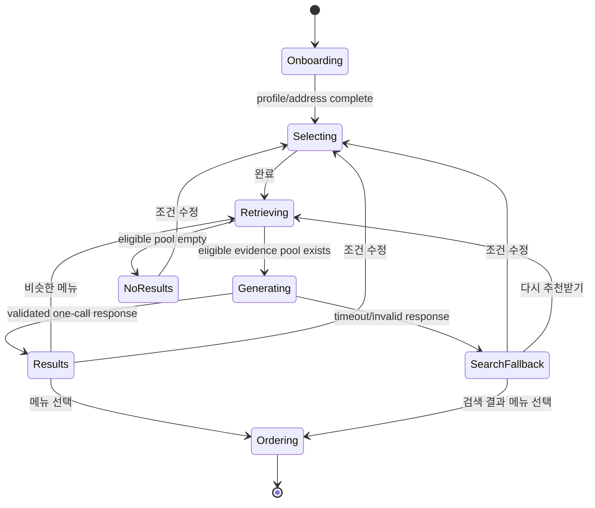

# YOBI 구조화 선택 기반 Hybrid RAG 추천 전면 개편 구현계획서

- 상태: **구현·Oracle/OCI 배포·공개 회귀·롤백 리허설 완료(Implementation, Oracle/OCI deployment, public regression, and rollback rehearsal complete)**
- 제품 결정 승인일: **2026-08-12 KST**
- 기준 체크아웃: `codex/master-spec-completion` / `68ad8ef05080bf341d9ed84ed6e91f8dc20ff02a`
- 현재 문서 상태: 제품 코드, SQLite/Oracle 저장소, additive migration `010`,
  Wiki/seed, 프런트엔드와 문서가 배포 릴리스
  `20260812T141008Z-8418f92b7e37`에 반영됐다. Oracle ledger `001`–`010`, 실제
  Oracle vector query, OCI GenAI 단일 dispatch, 공개 E2E, 호환 릴리스 롤백 및
  최종 재배포를 2026-08-12 KST에 검증했다. 상세 증적은 `TEST_REPORT.md`가
  권위다.
- 적용 대상: React 프런트엔드, FastAPI 백엔드, SQLite/Oracle 저장소, 내부 음식 Wiki, 추천/RAG, 테스트, 데모 문서

## 1. 문서 권위와 대체 범위

이 문서는 다음 영역에 대한 후속 구현의 현재 권위 문서다.

1. 자유 입력 기반 다중 턴 대화와 채팅 입력창
2. `GREET → COLLECT_NEEDS → RECOMMEND` readiness 흐름
3. 서버가 최종 추천 메뉴를 확정하고 LLM은 설명만 생성하는 기존 추천 경계
4. 알레르기 입력, 필터, 추천 경고, 옵션 잠금, 장바구니·주문 차단
5. 3단계 맵기
6. 국적·종교에서 식이 규칙을 자동 추론하는 동작

위 항목에서는 이 문서가 아래 기존 문서보다 우선한다.

- `YOBI_FINAL_MVP_CODEX_MASTER_PROMPT.md`
- `YOBI_CHATBOT_IMPROVEMENT_CODEX_GOAL.md`
- `docs/IMPLEMENTATION_PLAN.md`
- `docs/CHATBOT_IMPROVEMENT_IMPLEMENTATION.md`
- `docs/ARCHITECTURE.md`
- `docs/RAG_DESIGN.md`
- `docs/design/UI_DIRECTION.md`

기존 문서는 삭제하거나 과거 기록을 다시 쓰지 않는다. 구현 시 각 문서에 이 계획서가 대체하는 범위를 표시한다.

다음 계약은 계속 유효하다.

- 주소 확인, 서비스 지역, 서버 권위 가격·옵션·장바구니·주문 상태
- mock 결제·주문과 실제 서비스의 구분
- 인증·권한·개인정보·idempotency·state version·transaction 무결성
- SQLite와 Oracle의 동작 일치
- Markdown Wiki의 release 기반 컴파일·활성화·rollback
- 로컬, Oracle, OCI GenAI, Public 검증을 서로 다른 증거로 구분하는 원칙

## 2. 확정된 제품 결정

| 영역 | 확정 계약 |
|---|---|
| 추천 진입 | 프로필·주소 확인 후 자유 채팅이 아니라 구조화된 음식 선호 선택 화면을 연다. |
| 사용자 입력 | 음식 계통, 맛, 주재료, 음식 형태, 온도, 가격대, 식감, 조리 방식, 할랄, 비건, 맵기를 버튼·칩으로 선택한다. |
| 선택 논리 | 같은 카테고리의 복수 선택은 `OR`, 서로 다른 활성 카테고리는 `AND`, 빈 카테고리는 조건에서 제외한다. |
| LLM 호출 전 | 선택·수정 과정에서는 생성 LLM을 호출하지 않는다. |
| 검색 | 서버가 객관적 eligibility를 적용한 뒤 lexical + embedding hybrid search로 넓은 RAG evidence pool을 만든다. |
| 최종 추천 권한 | 정상 성공 경로에서는 생성 LLM dispatch 한 번이 evidence pool 안에서 최종 메뉴 선택과 설명 생성을 함께 수행한다. |
| LLM 제한 | evidence pool 밖 메뉴 생성, 객관적 eligibility 우회, 전달되지 않은 Wiki·메뉴 사실 사용을 허용하지 않는다. |
| 후속 행동 | 메뉴 선택, 비슷한 메뉴, 조건 수정, 비교, Wiki 근거 보기를 버튼으로 제공한다. 추천 채팅 composer는 없다. |
| 알레르기 | 사용자 기능 전체에서 제거한다. 기존 내부 데이터와 과거 DB 컬럼은 첫 전환에서 물리 삭제하지 않는다. |
| 할랄 | 사용자가 직접 선택하는 유효 인증 범위 기반 hard eligibility다. 종교·국적으로 자동 활성화하지 않는다. |
| 비건 | 확인된 동물성 충돌은 제외하고, 변경 가능성은 경고와 함께 포함하며, 완전 `UNKNOWN`은 기본 결과에서 제외한다. |
| 맵기 | `1..5`의 최대 허용 맵기로 취급한다. 한국·미국 대표 음식은 선택을 돕는 참고 예시다. |
| 가격 | 메뉴 1개의 서버 기준 기본가격으로 판정한다. 선택한 여러 가격 구간은 같은 카테고리의 `OR`다. |
| 결과 없음 | 조건을 몰래 완화하지 않는다. 맞지 않는 조건을 보여주고 `조건 수정` 행동을 제공한다. |
| 비슷한 메뉴 | 같은 hard eligibility와 기존 조건을 유지하고 이미 노출·거절·선택한 메뉴를 제외한 새 pool을 만든다. |
| 데이터 노출 | 화면은 실제 서비스처럼 자연스럽게 작성한다. 내부 코드나 반복적인 “데모/합성” 배지를 노출하지 않되, 실제 인증·실주문·전국 실데이터인 것처럼 허위 표현하지 않는다. |

현재 구현을 시작하기 위해 추가로 필요한 제품 결정은 없다. 아래의 숫자성 기본값은 설정으로 분리하며, 실제 데이터·모델 입력 한도 검증 과정에서 품질을 보존하는 범위 안에서 조정할 수 있다.

## 3. 목표와 비목표

### 3.1 목표

- 사용자가 타이핑하지 않고도 원하는 음식의 특징을 충분히 표현한다.
- 선택 도중 생성 LLM 호출을 없애 비용과 대화 변동성을 줄인다.
- 내부 음식 Wiki의 자연스러운 백과사전형 설명과 embedding을 추천의 핵심 근거로 사용한다.
- 서버의 hybrid retrieval은 넓고 근거가 풍부한 pool을 만들고, 최종 메뉴 판단은 LLM이 수행한다.
- 정상 응답에서는 한 번 dispatch한 생성 요청이 추천 메뉴와 설명을 함께 반환한다.
- 할랄·영업·배달 등 객관적으로 판정 가능한 자격 조건은 LLM이 우회하지 못하게 한다.
- 추천 이후의 선택·옵션·장바구니·주문은 기존 서버 권위 흐름을 유지한다.

### 3.2 비목표

- 알레르기 안전 판정 또는 알레르기 관련 사용자 기능
- 실제 요기요 가게·주문·결제 연동
- 현재 목업 가게를 공공데이터의 실제 식당과 연결하거나 실제 인증을 받았다고 주장하는 것
- 모든 음식 특성을 enum이나 boolean으로 정형화하는 것
- 맛·식감·문화적 맥락 같은 주관적 정보를 SQL hard filter로 바꾸는 것
- LLM이 자유롭게 검색 도구를 반복 호출하는 agentic RAG
- 추천 한 건에서 자동 tool continuation, 모델 교체, 두 번째 생성 호출로 응답을 수리하는 것

## 4. 목표 사용자 흐름



### 4.1 화면 상태

- `SELECTING`
  - 카테고리별 다중 선택 칩
  - 선택 요약과 카테고리별 초기화
  - 새 현재 식사 조건은 할랄·비건 `false`, 최대 맵기 `3`으로 시작
  - 한국어 프로필은 KR, 그 외 locale은 US 참고 예시를 처음 보여주되 사용자가 전환 가능
  - 할랄·비건 토글과 1~5 맵기, KR/US 참고 기준을 현재 식사에 맞게 수정
  - 음식 선호 배열 하나 이상 또는 명시적 할랄·비건 필터가 있을 때 `완료` 활성화
- `RETRIEVING`
  - 객관적 eligibility와 hybrid search 수행
  - 생성 LLM 0회
- `GENERATING`
  - evidence pool이 있을 때 애플리케이션 기준 생성 LLM dispatch 최대 1회
- `RESULTS`
  - LLM이 고른 최대 3개 메뉴를 LLM 순서 그대로 표시
  - 메뉴별 선택 이유, Wiki 설명, 가격·배달 정보, 할랄/비건 상태
  - `이 메뉴 선택`, `비슷한 메뉴`, `조건 수정`, `비교`, `근거 보기`
- `ORDERING`
  - 기존 옵션·장바구니·배달·검토·mock 결제 흐름 재사용

추천용 자유 입력창은 제거한다. 배달 요청사항처럼 거래 단계에 필요한 별도 텍스트 입력은 유지한다.

개인정보 입력 화면은 할랄·비건·맵기를 받지 않는다. 추천 요청의 직접 권위는
사용자가 추천 선택 화면에서 확인한 `committed criteria`다. 선택 화면의 조건은
현재 식사에만 적용하며, 초기 릴리스에는 이를 프로필 기본 설정으로 저장하는
행동을 제공하지 않는다.

## 5. 사용자 선택 계약

### 5.1 `RecommendationCriteriaV2`

```text
schema_version: "2"
cuisine_origins: string[]
flavors: string[]
main_ingredients: string[]
food_forms: string[]
temperatures: string[]
price_bands: string[]
textures: string[]
cooking_methods: string[]
dietary_filters:
  halal_certified_only: boolean
  vegan: boolean
max_spice_level: 1 | 2 | 3 | 4 | 5
spice_reference_country: "KR" | "US"
```

카테고리 ID는 번역 문자열이 아니라 서버가 배포하는 stable code를 사용한다. 프런트는 표시 label만 locale에 맞춰 렌더링한다.

`draft`는 추천 선택 화면이 처음 열릴 때 최대 맵기 `3`, 할랄·비건 `false`로
생성된다. 맵기 기본값만으로는 `완료` 조건을 충족하지 않는다. 사용자가 선택
화면에서 할랄 또는 비건을 명시적으로 켜면 그 필터는 완료 조건에 포함된다.

다음 명백한 충돌은 생성 호출 전에 선택 화면에서 안내하고 완료를 막는다.

- 비건 + `BEEF`, `PORK`, `CHICKEN`, `FISH_SEAFOOD`
- 할랄 + `PORK`

`SPICY`와 낮은 최대 맵기는 반드시 모순이라고 단정하지 않는다. 대신 낮은 맵기 안에서 매운 풍미를 찾는 조건으로 검색한다.

### 5.2 선택 의미

- 같은 배열 안에서는 선택값 중 하나와 맞으면 된다.
  - 예: `flavors=[SPICY, SAVORY]`는 매운맛 또는 고소·감칠맛 계열이다.
- 서로 다른 비어 있지 않은 배열은 모두 고려해야 한다.
  - 예: `KOREAN AND (SPICY OR SAVORY) AND NOODLES`다.
- 주관적 카테고리의 `AND`는 Wiki 줄글을 boolean 사실로 변환한다는 뜻이 아니다.
  - hybrid retrieval이 카테고리별 근거를 찾아 pool에 함께 제공한다.
  - LLM은 최종 메뉴마다 각 활성 카테고리에서 선택값 하나 이상을 뒷받침하는 근거를 반환해야 한다.
- 할랄, 확정 비건 충돌, 서비스 지역, 판매 가능, 가격, 맵기는 별도의 객관적 eligibility다.
- 0건일 때 주관적 조건이나 hard eligibility를 자동 완화하지 않는다.

### 5.3 가격 구간 기본값

| code | 서버 판정 |
|---|---|
| `UNDER_10000` | `0 <= base_price < 10,000` |
| `FROM_10000_TO_19999` | `10,000 <= base_price < 20,000` |
| `FROM_20000_TO_29999` | `20,000 <= base_price < 30,000` |
| `OVER_30000` | `30,000 <= base_price` |

여러 구간을 선택하면 합집합으로 판정한다. 배달비와 옵션 추가금은 추천 필터가 아니라 결과 카드와 주문 검토에서 별도로 표시한다.

### 5.4 preference catalog 노출 기준

`GET preference-catalog`은 코드에 박힌 전체 목록이 아니라 현재 활성 catalog/Wiki release가 실제로 지원하는 선택지를 반환한다.

기본 노출 조건은 다음과 같다.

- 확인 주소와 merchant service area가 맞는 `AVAILABLE` 메뉴 3개 이상
- 서로 다른 가게 2곳 이상
- 검토 완료된 Wiki 문서 1개 이상
- localized label과 retrieval query alias 존재

따라서 현재 자료가 부족한 양식·동남아·멕시칸 등의 선택지는 Wiki와 menu seed를 먼저 확장한 뒤 노출한다. 빈 결과만 만드는 장식용 칩은 만들지 않는다.

### 5.5 초기 preference vocabulary

다음 목록을 v2의 초기 제품 기본값으로 사용한다. 이 코드는 Wiki의 주관적 내용을 정형화하는 태그가 아니라, 사용자의 의도를 표현하고 검색 문장을 만드는 UI vocabulary다. Phase 1에서 실제 content coverage를 채우지 못한 값은 `preference-catalog` 노출 기준에 따라 숨긴다.

| 카테고리 | 초기 stable code |
|---|---|
| 음식 계통 | `KOREAN`, `CHINESE`, `WESTERN`, `SOUTHEAST_ASIAN`, `MEXICAN` |
| 맛 | `SPICY`, `SWEET`, `SALTY`, `SOUR`, `NUTTY_SAVORY`, `CLEAN_MILD` |
| 주재료 | `BEEF`, `PORK`, `CHICKEN`, `FISH_SEAFOOD`, `VEGETABLE` |
| 음식 형태 | `RICE`, `NOODLES`, `SOUP`, `STEW_HOTPOT`, `BREAD`, `SALAD`, `GRILLED_DISH` |
| 온도 | `HOT`, `WARM`, `ROOM_TEMPERATURE`, `COOL`, `FROZEN` |
| 식감 | `CRISPY`, `CHEWY`, `SOFT`, `CRUNCHY`, `THICK_RICH` |
| 조리 방식 | `GRILLED`, `BOILED`, `SIMMERED`, `STEAMED`, `FRIED`, `STIR_FRIED`, `BAKED` |

표시 label과 검색 alias는 한국어·영어 원문을 먼저 작성하되, 릴리스 완료 시점에는 현재 앱이 제공하는 모든 locale에 label을 채운다. 누락된 label을 영어로 조용히 대체하지 말고 catalog 검증을 실패시킨다. 이후 번역을 수정해도 stable code는 바꾸지 않는다.

## 6. 음식 Wiki 설계 원칙

### 6.1 Wiki는 백과사전형 줄글이 기본이다

현재 Wiki authoring이 요구하는 고정 9개 설명 facet을 새 계약의 필수 형식으로 유지하지 않는다. 문서는 자연스러운 Markdown 줄글을 기본으로 하며, 음식마다 필요한 제목과 문단을 자유롭게 구성한다.

예를 들어 맛, 식감, 온도, 문화적 맥락, 먹는 방식, 어울리는 상황은 다음처럼 자연스럽게 설명한다.

```markdown
김치찌개는 잘 익은 김치에서 오는 산미와 감칠맛이 국물에 깊게 배는 음식이다.
돼지고기나 참치가 흔히 쓰이지만 가정과 식당마다 재료와 농도에는 차이가 크다.
보통 뜨겁게 끓여 밥과 함께 먹으며, 익숙하고 든든한 한 끼를 찾을 때 자주 선택된다.
```

이 문장을 `sour=true`, `hot=true`, `comfort_food=true`처럼 무리하게 고정하지 않는다. 문단 자체를 chunk·embedding하여 검색과 RAG 근거로 사용한다.

### 6.2 구조화 허용 범위

정형화는 해당 음식의 정체성을 잃지 않는 최소한의 객관적 사실에 한정한다.

| 구조화 가능 | 줄글로 유지 |
|---|---|
| stable concept ID, 이름, 번역명, 별칭 | 맛의 강도와 균형에 대한 표현 |
| family/variant/cuisine 관계 | 식감의 주관적 인상 |
| 음식 정체성을 이루는 defining ingredient | 보통 느끼는 온도·포만감·분위기 |
| 정체성을 이루는 defining form/preparation | 문화적 배경, 먹는 상황, 어울리는 조합 |
| 명백한 cuisine 분류 | “담백하다”, “든든하다”, “매력적이다” 같은 평가 |
| 출처·검토 상태·버전·menu mapping | 흔하지만 필수는 아닌 변형 재료와 레시피 |

구조화하려면 다음 질문에 모두 `예`여야 한다.

1. 해당 값이 빠지면 보통 같은 음식이라고 부르기 어려운가?
2. 가게·가정·지역에 따른 흔한 변형에도 대체로 유지되는가?
3. 작성자가 근거와 상태를 명시할 수 있는가?

하나라도 아니면 prose로 남긴다. `COMMON`, `OPTIONAL`, `POSSIBLE`, `UNKNOWN`은 hard boolean으로 승격하지 않는다.

### 6.3 Wiki front matter 최소화

필수 front matter는 다음 수준으로 축소한다.

```text
concept_id
concept_type
names / aliases
parent_relations
essential_facts[]      # 선택적. 엄격한 allowlist와 evidence 필요
source_refs[]
review_status
```

할랄 인증, 실제 판매 가격, 영업·판매 상태, 배달 지역은 음식 Wiki 사실이 아니다. 각각 가게 인증과 runtime catalog가 소유한다.

### 6.4 chunk와 embedding

- Markdown 제목과 자연 문단 경계를 우선하여 chunk한다.
- 지나치게 짧은 문단은 같은 주제 안에서 합치고, 긴 문단은 문장 경계로 나눈다.
- 각 chunk는 `document_id`, `concept_id`, `heading_path`, `paragraph_index`, `source_ref`, `review_status`, `knowledge_release_id`를 유지한다.
- embedding 모델·차원·버전을 knowledge release에 고정한다.
- 문서 embedding은 release 생성 시 미리 계산한다.
- 사용자 선택 query text를 value code별로 중복 제거하고, Oracle은 한 번의 batch
  embedding 요청으로 계산한다. SQLite는 request-scope map에서 deterministic
  query vector를 한 번씩만 계산한다.
- 생성 모델 dispatch 1회 계약과 embedding 요청은 별도다. 정상 완료 batch의 생성 응답은 하나이며, embedding은 검색 인프라로 계측·캐시한다.
- 로컬 deterministic embedding 검증은 계약 테스트일 뿐 실제 Oracle/semantic 품질 증거로 사용하지 않는다.

현재 `KNOWLEDGE_CHUNK.facet`은 기존 release 호환을 위해 남겨 두고, 새 compiler는
추가 의미를 `metadata_json`에 기록한다.

- 각 chunk metadata에 `chunk_kind = PARAGRAPH | ESSENTIAL_FACT | LEGACY_FACET`,
  `heading_path`, `paragraph_index`, `recommendation_visibility`를 추가한다.
- 물리 `facet` 컬럼은 새 `PARAGRAPH`/`ESSENTIAL_FACT`에서도 호환용 분류값을
  유지하며, v2 공개 여부와 문단 경계의 진실 원천으로 사용하지 않는다.
- 기존 Wiki 변환기는 9개 facet의 문장을 버리지 않고 자연스러운 Markdown 제목과 문단으로 옮긴다. 자동 변환 후 원문 hash와 문단 수를 검수한다.
- runtime retrieval은 `chunk_kind`, 공개 visibility, prose, concept/menu mapping을
  사용한다. 호환 `facet`은 lexical routing 보조 신호로만 사용할 수 있고 고정
  9개 문단의 존재를 요구하지 않는다.
- 구 knowledge release는 기존 reader로 계속 읽을 수 있고, 새 release만 paragraph chunk 계약을 사용한다.
- 호환이 필요한 menu `description`은 대표 overview 문단, `cultural_description`은 존재할 때 문화 관련 문단, `semantic_text`는 concept names/aliases와 검토된 대표 문단에서 결정론적으로 만든다. 가게 광고 문구나 생성 LLM 문장을 seed 원천으로 쓰지 않는다.
- 완료 시 코드 검색과 테스트로 고정 9개 facet key가 v2 retrieval/readiness의 필수 전제가 아님을 증명한다.

## 7. 서버가 소유하는 객관적 eligibility

서버는 다음 조건만 LLM 이전에 차단한다.

| 조건 | 판정 원천 | 정책 |
|---|---|---|
| 가게 배달 범위·메뉴 판매 가능 | 확인 주소의 service area, merchant service area, menu availability | 서비스 지역이 맞지 않는 가게와 `AVAILABLE`이 아닌 메뉴 제외. 현재 merchant row에는 별도 active flag가 없음 |
| 할랄 | 유효한 certification과 적용 scope | 사용자가 선택했을 때만 인증 범위 밖 메뉴 제외 |
| 비건 확정 충돌 | menu fact 또는 Wiki의 defining/core 동물성 근거 | `CONFLICT` 제외 |
| 비건 변경 가능 | option/menu/Wiki 근거 | `POSSIBLE_WITH_CHECKS` 유지, 경고 첨부 |
| 비건 정보 없음 | 근거 없음 | 비건 필터 활성 시 기본 pool에서 제외 |
| 가격 | 서버 기준 기본가격 | 선택 가격대 밖 제외 |
| 맵기 | 검수된 `1..5` menu spice level | `menu.spice_level > max_spice_level` 제외 |
| 유사 메뉴 제외 | 서버 snapshot의 shown/rejected/selected IDs | 다음 pool에서 제외 |

음식 계통, 맛, 주재료 선호, 형태, 온도, 식감, 조리 방식은 최종 추천 취향이다. 일부 essential fact가 정확한 검색 boost에 쓰일 수는 있지만, 정보가 없다는 이유만으로 SQL에서 부적격 처리하지 않는다.

종교와 국적은 할랄·비건을 자동으로 켜지 않는다. 추천 생성에 전달하는 프로필도 추천에 실제로 유용한 최소 범위로 제한한다.

- soft context로 전달 가능: locale, 국가/문화권, 연령대, 저장된 선호 음식, 사용자가 선택한 KR/US 맵기 참고 기준
- 명시적 조건으로 전달: 할랄·비건, 최대 맵기, committed criteria
- 서버에서만 사용: 상세 주소, service area 내부 식별자, 인증/권한 정보
- 추천 판단에 전달하지 않음: 종교, 알레르기 과거 값, 원문 주소, 동의·인증 메타데이터
- soft profile context는 retrieval query와 LLM 설명의 보조 신호일 뿐이다. 사용자가 현재 식사에서 명시한 criteria와 식이 조건을 완화하거나 반대로 바꿀 수 없다.
- soft profile query는 category coverage evidence로 계산하지 않고 낮은 가중치의
  pool recall/동률 보조 신호로만 사용한다.

### 7.1 판정 시점과 live revalidation

추천 request 시작 시 `eligibility_as_of`를 UTC로 고정한다. request row는 active
release family를 고정하고, dispatch 전에 직렬화된 evidence pool에 당시의
server-owned menu payload, certification evidence/scope, vegan input evidence, Wiki
passage·fact ID, knowledge/catalog/family identity를 저장한다. 별도 catalog/menu
availability, price, service-area, option version 컬럼이 모두 존재한다고 주장하지
않는다. 현재 변경 가능 runtime row는 snapshot commit, 메뉴 선택, 옵션·주문
단계에서 다시 조회하며, 독립 catalog/certification manifest와 pointer rollback은
Phase 8 gate다.

생성 응답의 pool membership과 grounding은 이 고정 snapshot을 기준으로 검증한다. 모델 호출 중 runtime 상태가 바뀌더라도 과거 prompt의 의미를 소급해 바꾸지 않는다.

사용자에게 카드를 노출할 때와 `SELECT_MENU`를 처리할 때는 판매 가능, 최신 가격, 배달 가능, 할랄 유효 상태를 다시 조회한다. stale 메뉴는 노출/선택에서 제거하고 두 번째 생성 호출로 자동 대체하지 않는다. 가격만 바뀌면 서버 현재 가격을 표시하고 사용자가 선택 전에 확인하게 한다.

가격대는 retrieval 당시의 선호 조건이다. 가격만 선택 구간 밖으로 바뀐 경우
메뉴를 stale 처리하지 않고 최신 가격을 표시하며, cart에서는 non-blocking
updated-total 경고를 주고 새 server total/fingerprint를 다시 확인하게 한다.

snapshot completion은 pinned family를 유지한 채 current UTC로 재검증하고, 남은
결과의 서버 소유 가격·배달비/ETA·할랄·비건 projection을 다시 합성한다. 완료된
request의 GET/reload도 같은 live projection을 계산하지만 저장된 모델 원문·순서나
DB result row를 변경하지 않고 생성 LLM을 호출하지 않는다.

### 7.2 근거 우선순위

저장소는 원시 fact를 반환하고 공통 pure classifier가 다음 우선순위를 적용한다.

```text
선택된 OPTION effect
  > VERIFIED MENU-scoped fact/certification
  > active MERCHANT-scoped certification within scope
  > VARIANT Wiki essential fact
  > FAMILY Wiki essential fact
```

- 더 구체적인 scope의 검증 사실이 상위 일반 Wiki fact를 덮어쓴다.
- 할랄은 `MENU` scope가 `MERCHANT` scope보다 구체적이다. 인증의 status·validity·scope가 모두 맞아야 한다.
- 비건은 option effect와 verified menu ingredient가 먼저이며, 다음으로 variant/family의 `DEFINING` 또는 `CORE` essential fact를 사용한다.
- `COMMON`, `OPTIONAL`, `POSSIBLE`, `UNKNOWN`, 상충된 fact는 확정 충돌로 강화하지 않는다. 다만 전체 정보가 불충분하면 `UNKNOWN` 또는 `POSSIBLE_WITH_CHECKS`가 된다.
- 같은 specificity의 verified facts가 상충하면 `CONFLICTING`으로 분류하고 해당 hard filter pool에서는 보수적으로 제외한다.
- `scope_type=MENU`이면 `scope_ref`는 non-null menu FK여야 한다. merchant scope에서는 menu ref를 두지 않는다.
- 인증 유효기간은 DB와 애플리케이션 모두 UTC 기준의 닫힌 시작·열린 종료 구간으로 판정한다.

## 8. Hybrid retrieval과 evidence pool

### 8.1 역할 경계

Hybrid retrieval 결과는 최종 추천이 아니다. LLM이 검토할 수 있는 허용된 evidence pool이다.

서버는 검색 관련도 때문에 특정 3개 메뉴를 최종 추천으로 확정하지 않는다. 다만 모델 입력 한도와 비용 때문에 전체 600개 메뉴를 그대로 전달하지 않고, objective eligibility를 통과한 메뉴 중 검색 근거가 높은 넓은 pool을 구성한다.

### 8.2 검색 단계

1. `RecommendationCriteriaV2`를 canonical code 순서로 정규화한다.
2. locale label과 중앙 query alias를 사용해 선택값별 검색 문장을 만든다.
3. 객관적 eligibility로 런타임 메뉴 집합을 제한한다.
4. 각 선택값에 대해 전체 eligible public passage에서 다음 독립 stable rank를 구한다.
   - exact name/alias와 essential fact 일치
   - Wiki prose lexical/token 일치
   - Wiki paragraph embedding cosine similarity
5. rank scale 차이에 덜 민감하도록 lexical/vector/essential 결과를 reciprocal-rank
   fusion하고, 선택값마다 설정된 raw-hit 상위만 메뉴 근거로 배분한다. 0점 임의
   passage로 category coverage를 만들지 않는다.
6. 같은 카테고리에서는 선택값별 최고 신호를 사용하여 `OR`를 반영한다.
7. 모든 다른 활성 카테고리에 실제 raw-hit evidence가 있는 메뉴만 normal-generation
   pool 후보로 남기고, 근거 ID를 별도로 보존하여 `AND` 의도를 전달한다.
8. soft profile query는 낮은 가중치로 retrieval score만 보조하며 category evidence로
   사용하지 않는다.
9. 메뉴별 가장 관련 있는 Wiki passage와 객관적 menu/merchant fact를 설정된 passage
   한도 안에서 묶는다.
10. pool을 정규화된 retrieval 순서로 제한하되, 이것을 최종 추천 순서로 사용하지 않는다.

초기 설정값은 다음과 같다.

```text
raw_hits_per_selected_value = 20 chunks
evidence_pool_menu_limit = 24 menus
evidence_passage_limit_per_menu = 4 passages
final_recommendation_count = 3 menus
```

이 값들은 서버 설정으로 둔다. 변경 시 `pool recall`, prompt token, latency, 추천 다양성을 함께 측정한다.

### 8.3 `EvidencePoolItem`

각 pool 항목은 최소한 다음을 가진다.

```text
menu_id
merchant_id
knowledge_concept_id
display_name
base_price
spice_level
eligibility-checked server menu payload (raw service-area/address IDs are not sent)
halal certification scope/status when requested
vegan evidence status and warning
criterion_evidence:
  category_code -> selected_value_code -> passage/fact IDs + retrieval scores
wiki_passages[]
menu_facts[]
knowledge_release_id
catalog_release_id
recommendation_release_family_id
```

생성 입력의 `criterion_evidence`는 ID와 점수만 보존하고 같은 원문을 중복
포함하지 않는다. 모델이 읽는 원문은 위의 메뉴별 `wiki_passages[]` 한도 안에서만
제공하여 category mapping이 passage cap을 우회하지 않게 한다.

가게 광고 문구와 합성 리뷰는 추천·eligibility·grounding 입력으로 사용하지 않는다.

## 9. 한 번의 LLM 호출로 후보 선택과 설명 생성

### 9.1 호출 계약

evidence pool이 비어 있지 않은 신규 추천 batch마다 애플리케이션이 생성 LLM 요청을 최대 한 번 dispatch한다. 정상 성공 경로에서는 그 한 요청이 후보 선택과 설명을 모두 반환한다.

provider가 요청을 처리했지만 응답 저장 전에 프로세스가 종료되는 경우, provider 자체 idempotency가 검증되지 않으면 실제 inference의 end-to-end exactly-once를 증명할 수 없다. 이 경우 재호출해서 중복 가능성을 만들지 않고 request를 `UNKNOWN_AFTER_DISPATCH`로 남긴다. 따라서 제품·테스트 불변식은 다음과 같다.

- batch/request ID당 애플리케이션 dispatch `0..1회`
- 정상 완료 batch의 생성 응답 `1개`
- 자동 재dispatch `0회`
- `UNKNOWN_AFTER_DISPATCH`의 재시도는 사용자가 누르는 새 `RETRY` request ID로만 수행

- 도구 스키마를 주지 않는다.
- function calling과 continuation을 사용하지 않는다.
- 다른 생성 모델로 자동 fallback하지 않는다.
- invalid output을 고치기 위한 두 번째 생성 요청을 하지 않는다.
- request dispatch 이후 timeout/network 오류가 발생해도 자동 재호출하지 않는다.
- 동일 `request_id` 재전송은 저장된 결과 또는 진행 상태를 반환하고 새 inference를 만들지 않는다.
- rate limit, timeout, invalid output은 추가 호출 없이 실패 경로로 전환한다.
- 메뉴 선택, 조건 편집, 비교, Wiki 근거 열기, 옵션 변경, 장바구니, 주문에는 생성 LLM을 호출하지 않는다.

객관적 eligibility 결과가 0건이면 생성 LLM을 호출하지 않고 조건 수정 화면으로 연결한다.

### 9.2 모델 입력

모델에는 다음만 전달한다.

- normalized user criteria와 사용자 표시 언어
- 허용된 soft profile context와 이것이 명시적 criteria보다 우선하지 않는다는 규칙
- 각 카테고리의 `OR`/카테고리 간 `AND` 의미
- 객관적 eligibility는 이미 적용됐다는 선언
- 최대 24개의 `EvidencePoolItem`
- 추천 개수와 버튼 후속 행동에 맞는 output schema
- evidence 밖 사실·메뉴를 사용하지 말라는 grounding 규칙
- 일치 메뉴가 없으면 억지로 선택하지 않고 `NO_MATCH`를 반환하라는 규칙

원문 주소, 종교, 알레르기 과거 값, 내부 인증정보, 불필요한 개인정보는 전달하지 않는다.

### 9.3 모델 출력

```text
RecommendationGenerationV2
  status: "RECOMMENDED" | "NO_MATCH"
  criteria_summary: localized string
  recommendations[]:
    rank: 1..3
    menu_id: evidence pool member
    title: localized string
    selection_reason: localized string
    description: localized string
    matched_criteria:
      category_code:
        selected_value_codes[]
        evidence_ids[]
    wiki_evidence_ids[]
    caution_codes[]
  unmatched_category_codes[]
```

모델이 정한 `rank`를 UI 순서로 유지한다. 서버가 검색 점수로 다시 정렬하지 않는다.

가격, 가게명, 배달시간, 인증 상태, 옵션은 모델 prose에서 권위를 갖지 않는다. 카드의 해당 필드는 모델이 고른 `menu_id`를 기준으로 서버 snapshot 데이터에서 합성한다.

### 9.4 응답 검증

두 번째 LLM judge 없이 현재 서버 계약이 다음을 검사한다.

- strict JSON/Pydantic shape, 상태와 결과 개수, 중복 메뉴, 연속 rank
- 추천 `menu_id`가 evidence pool에 존재함
- snapshot commit 시 선택 메뉴가 현재 merchant service area, menu availability,
  가격·맵기·할랄·비건 eligibility를 여전히 통과함
- 각 활성 주관적 카테고리에 대해 사용자가 고른 값 하나 이상과 해당 pool
  category 안의 evidence ID를 참조함
- `wiki_evidence_ids`가 해당 pool item에 포함된 ID의 부분집합임
- 알려진 내부 ID 형태가 title/reason/description에 노출되지 않음

현재 validator는 locale과 문장 언어의 일치, evidence ID의 세부 타입별 의미,
tool/prompt 문자열 전반, 알레르기 안전·비건 인증·실제 할랄 출처 같은 임의의
자연어 과장까지 완전히 판정하지 않는다. semantic 문장과 근거의 완전한 의미
일치를 별도 LLM으로 재판정하지 않으며, query별 golden set, live provider 평가,
evidence reference 검사, 사용자 표면 QA를 Phase 8 품질 게이트로 둔다.

### 9.5 실패와 fallback

정상 경로에서 최종 추천 메뉴는 LLM이 결정한다. 모델 timeout, provider 오류, invalid/ungrounded output이 발생하면 서버가 이를 LLM 추천으로 가장하지 않는다.

- hybrid retrieval 상위 메뉴를 `조건에 가까운 검색 결과`로 표시한다.
- 설명은 전달된 Wiki 문단을 사용한 결정론적 요약만 제공한다.
- snapshot은 `SEARCH_FALLBACK`으로 저장하고 `RECOMMENDED`나 `model_selected_order`로 기록하지 않는다.
- 검색 결과 메뉴는 사용자가 선택해 주문할 수 있지만, `추천 설명을 불러오지 못해 조건에 가까운 메뉴를 보여드려요.`처럼 LLM 추천 결과가 아님을 자연스럽게 알린다.
- `조건 수정`과 사용자가 명시적으로 누르는 `다시 추천받기` 버튼을 제공한다.
- `다시 추천받기`는 새로운 사용자 동작과 새 request ID이므로 새 생성 호출 1회를 허용한다.

추천 결과 생성 후 메뉴가 판매 중지되면 해당 메뉴를 제거하되 두 번째 LLM 호출로 대체하지 않는다. 남은 결과가 없으면 자연스러운 품절 안내와 다시 추천받기 행동을 보여준다.

## 10. 할랄·비건·알레르기 계약

### 10.1 할랄

`merchant` 레코드를 MVP의 지점 단위로 취급하고, 인증 적용 범위를 별도로 보존한다.

```text
merchant_certification
  certification_id
  merchant_id
  certification_type = HALAL
  status = ACTIVE | EXPIRED | REVOKED
  issuer
  certificate_number
  valid_from / valid_to
  scope_type = MERCHANT | MENU
  scope_ref
  source_type
  source_ref
  last_verified_at
  is_synthetic
```

- 필터는 `ACTIVE`이고 현재 날짜와 scope가 맞는 메뉴만 통과시킨다.
- 종교가 Islam이어도 자동으로 켜지 않는다.
- `no_pork`와 `Muslim-friendly`를 할랄 인증과 동일하게 표시하지 않는다.
- 옵션 응답은 선택이 현재 할랄 인증 범위를 유지하는지 서버 판정 필드를
  제공하며, 범위를 깨는 옵션은 주문 전 확인 대상으로 표시한다.
- 결과 카드는 서버가 반환한 `halal_certified`와 자연어 `halal_scope_label`만
  표시하고 내부 certification ID를 노출하지 않는다. issuer·certificate number와
  전체 provenance는 DB에 보존되지만 현재 공개 카드 계약은 아니다. 합성 데이터
  경계는 반복 배지 대신 공통 안내에서 한 번 밝힌다.
- 공공데이터포털의
  [경기관광공사 경기도 무슬림 친화 음식점 데이터](https://www.data.go.kr/data/15099378/fileData.do)는
  할랄 인증 여부를 포함한 관련 필드의 존재성과 확장 가능성을 보여주는 참고
  자료다. 해당 페이지도 조사 결과가 서비스 수준이나 할랄 인증 여부를 보장하지
  않는다고 명시하므로 인증 권위로 취급하지 않으며, 현재 목업 가게의 실제 인증
  근거로 연결하지 않는다.

### 10.2 비건

```text
LIKELY_FIT
  - 확인된 defining/core 동물성 충돌 없음
  - 비건 가능 근거 있음

POSSIBLE_WITH_CHECKS
  - 특정 옵션 변경 또는 매장 확인으로 가능
  - 결과에 포함하고 자연스러운 확인 문구 표시

CONFLICT
  - 메뉴 또는 essential Wiki fact에 확정 동물성 재료
  - pool에서 제외

UNKNOWN
  - 근거가 충분하지 않음
  - 비건 필터가 켜지면 기본 pool에서 제외
```

`POSSIBLE_WITH_CHECKS`는 “비건 인증” 또는 “완전 비건”으로 표현하지 않는다. 주문 단계의 옵션 변경으로 상태가 달라지면 경고를 갱신하되, 비건은 알레르기처럼 결제를 강제 차단하는 안전 기능으로 취급하지 않는다.

사용자 문구는 다음으로 통일한다.

- `LIKELY_FIT`: `비건으로 즐기기 좋은 메뉴예요.`
- `POSSIBLE_WITH_CHECKS`: `비건으로 주문하려면 옵션이나 재료를 확인해 주세요.`
- `CONFLICT`, `UNKNOWN`: 비건 필터 결과에 노출하지 않으므로 배지를 만들지 않는다.

### 10.3 알레르기 제거

- `RecommendationCriteriaV2`는 알레르기와 심각도를 받지 않는다. 기존 v1
  profile endpoint/DB 필드는 호환을 위해 남지만 신규 UI는 빈 legacy rules만
  저장하고 추천·주문 판단에 사용하지 않는다.
- 온보딩, 추천 선택지, 결과 카드, Wiki 표시, 옵션 잠금, 장바구니·checkout 거부에서 알레르기 기능을 제거한다.
- LLM evidence와 prompt에서도 allergen claim을 제외하여 자발적인 안전 조언을 만들지 않게 한다.
- 기존 Wiki allergen claim, DB 테이블, 과거 profile JSON은 첫 릴리스에서 삭제하지 않는다.
- 기존 v1 endpoint가 남아 있는 호환 기간에도 v2 화면은 해당 값을 읽거나 적용하지 않는다.

## 11. 5단계 맵기와 KR/US 참고 기준

- runtime 값은 `1..5` 정수다.
- 사용자 값은 정확한 희망 단계가 아니라 `max_spice_level`이다.
- 메뉴 값은 기존 1~3을 기계적으로 확대하지 않고 Wiki·메뉴별로 검수하여 다시 시드한다.
- v1 public DTO와 persistence model을 분리한다. v1 호환 기간에는 기존 profile의
  1~3 컬럼을 그대로 보존하고 v2 criteria만 독립적인 `1..5` 값을 저장한다.
- v2는 v1 profile 맵기 값을 자동 승격하거나 추천 기본값으로 사용하지 않는다.
  선택 화면은 항상 `3/5`에서 시작하고 사용자가 현재 식사 기준으로 확인한다.
- v1 message API는 읽기 호환만 유지하며 신규 프런트엔드에서 호출하지 않는다.
  신규 카드와 Wiki 표시는 검수된 메뉴의 실제 `1..5` 값을 사용한다.
- KR/US 대표 음식은 추천 조건의 진실 원천이 아니라 선택을 돕는 `spice_reference_catalog` 콘텐츠다.
- 국적으로 기준을 강제하지 않는다. locale을 초기 기본값으로 사용할 수 있지만 사용자가 KR/US를 전환할 수 있어야 한다.
- 예시는 절대적인 과학 기준처럼 표현하지 않고 “이 정도로 느낄 수 있어요” 수준의 자연스러운 안내로 작성한다.
- 단계별 정확한 음식 예시와 번역은 Phase 1의 편집·검수 산출물이며 아키텍처를 막는 제품 결정은 아니다.

## 12. API와 상태 계약

### 12.1 신규·변경 API

```text
GET  /api/v1/recommendation/preferences/catalog
PUT  /api/v1/sessions/{session_id}/recommendation-criteria
POST /api/v1/sessions/{session_id}/recommendations
GET  /api/v1/sessions/{session_id}/recommendation-requests/{request_id}
GET  /api/v1/sessions/{session_id}/conversation
POST /api/v1/sessions/{session_id}/events
```

`GET preference-catalog`은 `catalog_version`, `knowledge_release_id`, locale별 label, option code, category order, KR/US spice reference와 HTTP `ETag`를 반환한다. 로딩 실패 시 선택 화면 대신 재시도 상태를 보여준다. draft가 참조한 code가 새 release에서 사라졌다면 서버는 `PREFERENCE_CATALOG_CHANGED`를 반환하고, UI는 새 catalog를 받은 뒤 사라진 선택을 표시·해제하여 사용자가 다시 완료하도록 한다. 이 경로에서는 생성 LLM을 호출하지 않는다.

`POST recommendations` 요청:

```text
request_id
expected_state_version
criteria_version
mode: INITIAL | SIMILAR | RETRY
```

서버가 snapshot에서 `shown`, `rejected`, `selected`를 계산한다. 클라이언트가 exclusion 목록을 권위 있게 덮어쓰지 못한다.

상태 변경 책임은 다음과 같이 고정한다.

1. `PUT recommendation-criteria`
   - draft를 검증해 새 immutable `criteria_version`으로 commit한다.
   - 성공할 때 session `state_version`을 한 번 올린다.
   - 생성 LLM은 호출하지 않는다.
2. `POST recommendations`
   - 지정한 committed `criteria_version`으로 `INITIAL`, `SIMILAR`, `RETRY` batch를 만든다.
   - request를 예약하고 retrieval/generation 상태를 관리한다.
   - validated snapshot이 commit될 때 session `state_version`을 한 번 올린다.
3. `GET recommendation-requests/{request_id}`
   - 공개 응답은 `PENDING | RECOMMENDED | NO_MATCH | SEARCH_FALLBACK | FAILED`,
     `RETRIEVING | GENERATING | COMPLETE` phase, 완료 snapshot reference를 반환한다.
   - 내부 ledger는 `CREATED`, `DISPATCHED`, `COMPLETED`, `NO_RESULTS`, `NO_MATCH`,
     `SEARCH_FALLBACK`, `FAILED`, `UNKNOWN_AFTER_DISPATCH`를 구분한다.
   - 새로고침·응답 유실 시 같은 request를 polling하며 새 inference를 만들지 않는다.
4. `GET conversation`
   - committed criteria, 최신 snapshot, 현재 active request ID/status를 함께 반환해 reload를 복구한다.

같은 사용자 행동을 event와 recommendation POST로 중복 기록하지 않는다.

### 12.2 event

서버 API는 기존 이벤트 타입을 계속 읽을 수 있다.

- `SELECT_MENU`
- `REJECT_MENU`
- `COMPARE_MENUS`
- `UPDATE_OPTIONS`

조건 편집은 브라우저 draft이며, `PUT recommendation-criteria`로만 commit한다. 유사 메뉴는 `POST recommendations(mode=SIMILAR)`만 사용한다. 추천 batch 생성과 같은 의미의 `EDIT_CRITERIA`·`REQUEST_SIMILAR` event는 만들지 않는다.

카드에는 `이 메뉴 선택`과 `Wiki 근거 보기`를 둔다. 결과 하단 action bar에는
`비슷한 메뉴 보기`, `조건 수정`, `현재 메뉴 비교`를 둔다. `SIMILAR`는 현재
batch를 새 결과로 교체하지만 서버의 `shown` 이력은 누적한다. 현재 UI의 비교와
Wiki 펼치기는 이미 받은 snapshot/server facts를 브라우저에서 표시하므로 별도
`COMPARE_MENUS` event나 생성 LLM을 호출하지 않는다. v1 호환 API는 기존 compare
event를 계속 받을 수 있다.

### 12.3 snapshot과 idempotency

추천 snapshot에는 다음을 보존한다.

```text
criteria + criteria_hash
knowledge_release_id
catalog_release_id
recommendation_release_family_id
embedding_model/version
evidence_pool menu/passage/fact IDs
generation_dispatch_count
generation_status
model-selected menu order
grounding validation result
shown/rejected/selected IDs
state_version
```

위 목록 중 현재 DB에 직접 저장되는 권위는 criteria/hash, release family,
직렬화된 pool, dispatch/status/result/order, snapshot grounding JSON, state/history다.
generation provider/model/prompt version과 soft-profile hash를 별도 audit column으로
저장하는 것은 아직 구현되지 않았다. 모델 identity는 runtime configuration/log
gate로 확인하고 Phase 8 증거에 정확한 provider/model/prompt 계약을 기록한다.

현재 `request_hash`는 session/profile identity, criteria hash/version, mode,
expected state version, locale을 포함한다. release family와 eligibility 시각은 request
row 예약 시 별도로 고정되고 evidence pool 자체가 dispatch 전에 저장된다. 같은
`request_id`와 hash의 replay는 그 저장 상태/snapshot을 반환한다. soft profile,
주소/service area, 또는 `SIMILAR` exclusion history를 바꾼 뒤에는 state를 먼저
갱신하고 새 request ID를 사용한다. 현재 hash가 mutable profile/address/history
내용 자체를 모두 다시 hash한다고 과장하지 않는다.

동시 요청에서도 생성 호출 1회가 깨지지 않도록 provider 호출 전에 짧은 DB transaction으로 request row를 선점한다.

1. `(session_id, request_id)`와 `request_hash`를 `CREATED`로 원자적 등록하면서
   active release family와 `eligibility_as_of`를 고정한다.
2. 최초 등록 요청만 generation owner가 된다.
3. 같은 ID·같은 hash의 동시 요청은 기존 상태 또는 완료 결과를 반환한다.
4. 같은 ID를 다른 hash에 재사용하면 `409`로 거절한다.
5. owner가 objective eligibility와 evidence pool을 계산한다. 빈 pool은 dispatch 없이
   `NO_RESULTS`로 완료한다.
6. provider 요청 직전에 compare-and-set으로 evidence pool 저장, `DISPATCHED`,
   dispatch count `1`, dispatch timestamp를 한 transaction에서 commit한다.
7. 응답 검증 후 compare-and-set으로 `COMPLETED`, `NO_MATCH`, 또는
   `SEARCH_FALLBACK`을 확정한다.
8. request-status GET이 설정된 orphan 시간보다 오래된 `CREATED`를 발견하면
   generation dispatch가 없었던 `RETRIEVAL_OWNER_LOST` 실패로 terminalize한다.
9. 현재 구현은 별도 background watchdog이 아니라 request-status GET에서 설정된
   orphan 시간보다 오래된 `DISPATCHED`를 발견하면 재호출 없이
   `UNKNOWN_AFTER_DISPATCH`로 전환한다.
10. orphaned request를 서버가 자동 재생성하지 않는다. 사용자 `다시 추천받기`가 새 request ID를 만들 때만 새 inference를 허용한다.

긴 provider 호출 동안 DB row lock이나 transaction을 유지하지 않는다. SQLite는 짧은 `BEGIN IMMEDIATE`, Oracle은 request 예약 구간에서만 row-level serialization을 사용한다.

기존 `/messages`와 `/messages/stream`은 프런트 전환과 복구가 끝날 때까지 한 릴리스 동안 deprecated로 유지한다. 신규 UI는 이 endpoint를 호출하지 않는다. 저장된 과거 conversation은 읽기 호환만 제공한다.

## 13. DB와 release 변경

기존 적용 마이그레이션을 수정하지 않고 `database/migrations/010_structured_hybrid_rag_recommendation.sql`을 추가한다.

### 13.1 `010` 범위

- menu/category 맵기 check constraint를 `1..5`로 전환
- v1 profile 1~3 컬럼과 분리된 v2 recommendation default/criteria의 `1..5` 필드
- `MERCHANT_CERTIFICATION`과 scope/provenance index
- versioned recommendation criteria 또는 session criteria snapshot 저장 구조
- evidence pool과 생성 audit를 재현할 snapshot 필드/테이블
- 필요 시 essential Wiki fact의 allowlisted claim type/index
- preference catalog와 spice reference version
- `RECOMMENDATION_RELEASE_FAMILY`와 환경별 active pointer
- session-scoped criteria/recommendation request ID uniqueness와 payload reuse를
  판정하는 stored hash
- active knowledge release FK와 catalog/certification version identity 참조. 독립
  catalog/certification manifest FK는 Phase 8 gate로 남김

SQLite `SCHEMA_SQL`과 초기화 경로에도 같은 논리 구조를 반영한다. DB는
lexical/vector 근거를 넉넉히 반환하고, pool builder가 alias/lexical 신호와
cosine similarity를 결합하며 stable chunk/menu ID로 동률을 해소한다.

- 동일한 고정 document/query vector fixture에서는 SQLite와 Oracle이 같은
  objective eligibility, hybrid scoring 규칙, tie-break와 evidence membership을
  반환해야 한다.
- 실제 embedding/vector 실행에서는 objective eligibility membership과 provenance 불변식은 같아야 하지만, 부동소수점·검색 구현 차이로 top-24 membership의 완전 동일성을 요구하지 않는다.
- 실제 환경별로 동일한 embedding model/version을 release family에 고정하고 같은 golden-set recall 기준을 충족해야 한다.

### 13.2 데이터 전환

- v1 profile의 1~3 값은 덮어쓰지 않고 v2 criteria와 분리한다.
- 1~3 menu spice 값은 원래 5단계를 복원할 수 없으므로 검수된 새 seed로 교체한다.
- 목업 할랄 인증은 `is_synthetic=true`, `source_type=DEMO_SEED`로 저장한다.
- Wiki prose와 essential fact를 새 knowledge release로 컴파일한다.
- 선택지별 retrieval alias와 locale label을 versioned preference catalog로 시드한다.
- 알레르기 테이블·컬럼은 보존하지만 v2 runtime dependency와 readiness count에서 제외한다.
- deploy/readiness의 migration ledger `001~009` 하드코딩을 `001~010`으로 갱신한다.

### 13.3 release family 원자성

서로 호환되는 지식·메뉴·검색 콘텐츠를 하나의 immutable family로 묶는다.

```text
RECOMMENDATION_RELEASE_FAMILY
  release_family_id
  knowledge_release_id
  catalog_release_id
  preference_catalog_version
  spice_reference_version
  certification_release_id
  embedding_model
  embedding_version
  status: LOADING | READY | ACTIVE | RETIRED

RECOMMENDATION_RUNTIME_STATE
  environment
  active_release_family_id
  activated_at
```

- 모든 FK 대상 release가 `READY`이고 manifest 검증을 통과해야 family를 `READY`로 만들 수 있다.
- 활성 pointer는 한 transaction에서 family ID 하나만 전환한다.
- recommendation request 시작 시 active family ID를 한 번 읽고, eligibility·retrieval·prompt·snapshot 전 과정에 고정한다.
- 요청 도중 새 family가 활성화돼도 진행 중 request는 기존 family를 섞지 않는다.
- rollback은 호환되는 이전 family pointer로 되돌리고 readiness를 다시 검증한다.

현재 로컬 구현은 knowledge release FK, versioned catalog/preference/spice/
certification 식별자, seed count validation, active pointer, 그리고 request별
family/time pin을 제공한다. 그러나 catalog와 certification을 독립 immutable
release table/manifest FK로 검증하는 운영 활성화 게이트는 아직 구현·실행되지
않았다. Phase 8에서는 이 호환성 검증을 readiness/activation 절차로 보강하고
실제 Oracle에서 family 전환과 rollback을 증명해야 한다. 로컬 pointer 존재만으로
원자적 운영 release activation이 완료됐다고 판정하지 않는다. 현재 `/readyz`도
기존 canonical catalog, active knowledge/vector, provider configuration을 확인할 뿐
이 독립 manifest의 원자적 호환성까지 증명하지 않는다.

## 14. 백엔드 변경 계획

| 영역 | 주요 변경 |
|---|---|
| `domain/models.py` | v2 profile/criteria/recommendation DTO, 5단계 맵기, 알레르기 공개 계약 제거 |
| `domain/dialogue.py` | 자유 발화 중심 상태 의존 축소, criteria/snapshot/event 계약 추가 |
| `services/dialogue_engine.py` | 신규 UI 경로에서 사용 중단 후 v1 호환 종료 시 제거 |
| `services/chat_service.py` | criteria 저장, eligibility, retrieval, one-call generation, snapshot commit 중심 서비스로 분리 |
| 신규 recommendation service | objective eligibility, evidence pool builder, generation orchestrator, validator 구성 |
| `db/repository.py` | SQLite/Oracle 공통 criteria·eligibility·evidence pool 계약 |
| `sqlite_repository.py` | eligibility와 lexical/vector evidence 조회, v2 snapshot/idempotency |
| `oracle_repository.py` | 같은 계약과 Oracle Vector Search 구현 |
| `knowledge/authoring.py` | 필수 9 facet 완화, 최소 essential schema, paragraph chunk 컴파일 |
| `knowledge/catalog_seed.py` | menu-concept mapping, essential facts, preference catalog 연결 |
| `genai/agent_loop.py` | 추천 v2에서 사용하지 않음. v1 종료 후 제거 범위 검토 |
| 신규 `RecommendationGenerator` | 도구 없는 단일 structured-output 호출 |
| `genai/prompts.py` | evidence pool 내 선택·설명, NO_MATCH, one-call prompt |
| `genai/response_contract.py` | model-selected recommendations와 category별 evidence 계약 |
| grounding validator | pool membership, eligibility, evidence reference, category coverage, rank, internal ID leak 검증. 일반 자연어 entailment는 현재 결정론 validator 범위가 아니며 provider 평가 게이트로 남김 |
| `main.py` | preference catalog, criteria, recommendation endpoint와 deprecation 표시 |

DB별로 최종 추천 알고리즘을 복제하지 않는다. eligibility와 evidence pool 규칙은 공통 도메인 계약으로 두고, 저장소는 각 DB의 조회·vector 기능만 구현한다.

## 15. 프런트엔드 변경 계획

| 파일/영역 | 주요 변경 |
|---|---|
| `types.ts` | `RecommendationCriteriaV2`, preference catalog, generation result, 5단계 타입 |
| `lib/api.ts` | text/SSE 추천 대신 criteria 저장과 recommendation API |
| `stores/session.ts` | `draftCriteria`, `committedCriteria`, criteria version, 추천 phase 보존 |
| `stores/session.ts` locale 초기화 | 한국어 프로필은 KR, 그 외는 US 참고 기준과 `3/5`로 새 draft를 만들고 선택 화면에서 변경 가능 |
| `OnboardingPage.tsx` | 알레르기·심각도·기존 맵기 입력 제거; 할랄·비건·5단계 맵기는 추천 선택 화면으로 이동 |
| 신규 `PreferenceSelector.tsx` | 카테고리별 chip, 선택 요약, 초기화, 완료 |
| 신규 `SpiceReferenceScale.tsx` | KR/US 5단계 참고 예시 |
| `ChatPage.tsx` | composer/SSE/free-text 제거, 선택→생성→결과 상태 머신 |
| `ChatRoomMenu.tsx` | 신규 구조화 화면에서 제거 |
| `PresetCollectionCard.tsx` | 과거 conversation 읽기 호환용으로만 유지하며 신규 추천 진입에 노출하지 않음 |
| `RichCard.tsx` | 과거 card 읽기 호환, 알레르기 공개 표시 제거, 맵기 `/5` |
| `EvidenceBadge.tsx` | 일반 `VERIFIED`와 할랄 certification UI를 분리하여 인증처럼 오인되는 재사용 방지 |
| `OrderFlowPanel.tsx` | 알레르기 잠금·checkout 차단 제거, 비건 확인 문구와 할랄 scope 일관성 |
| `WelcomePage.tsx` | 자유 대화·위험 회피 중심 소개를 터치 선택·Wiki 추천 소개로 변경 |
| i18n | 구조화 선택, 결과 버튼, 5단계, 자연스러운 할랄·비건 문구 |
| styles | 다중 선택 chip, category accordion, sticky 완료, 결과 action bar |

서버가 반환하는 preference catalog를 단일 권위로 사용한다. 프런트에 별도의 전체 taxonomy를 중복 하드코딩하지 않는다.

`PreferenceSelector`는 catalog loading/error/retry, `ETag` 갱신, 지원이 종료된 draft code 표시·해제까지 소유한다. `ChatPage`는 active recommendation request를 session storage에 보존하고 request status endpoint로 `DISPATCHED` 이후 reload를 복구한다.

## 16. 사용자 문구와 데이터 진실성

화면은 자연스러운 일반 서비스 문구를 사용한다.

예시:

- `어떤 음식이 끌리세요?`
- `원하는 특징을 골라주세요. 여러 개 선택할 수 있어요.`
- `선택하신 취향을 바탕으로 골랐어요.`
- `할랄 인증 식당만 보기`
- `비건으로 먹을 수 있는지 확인이 필요해요.`
- `조건에 꼭 맞는 메뉴를 찾지 못했어요. 몇 가지를 바꿔볼까요?`

다음 방식은 사용하지 않는다.

- 모든 카드에 `SYNTHETIC`, `MOCK`, `DEMO` 배지 반복
- `HALAL_CERTIFIED`, `POSSIBLE_WITH_CHECKS` 같은 내부 enum 직접 노출
- “전국 할랄 인증 데이터 확보”, “실제 주문 완료” 같은 허위 문구
- Wiki 일반 지식을 특정 가게의 실제 레시피라고 단정

대신 환영 화면 하단이나 서비스 정보 영역 한 곳에 `가게와 주문 정보는 체험을 위해 구성되어 있습니다.`와 같은 조용한 공통 안내를 둔다. 내부 API와 데이터에는 provenance를 계속 보존하고, 발표·README·운영 문서에서는 합성 데이터와 공공데이터 참고 경계를 정확히 설명한다.

## 17. 테스트와 검증 게이트

### 17.1 제품 계약

- 같은 카테고리 복수 선택의 `OR`
- 카테고리별 evidence coverage와 카테고리 간 `AND` 의도
- 빈 카테고리 무시와 stable code validation
- 가격 경계, 맵기 `1..5`, 빈 pool
- 결과 0건에서 자동 조건 완화 없음

### 17.2 Wiki와 retrieval

- 필수 front matter 최소 계약과 자유 prose authoring
- 주관적 문장을 boolean fact로 승격하지 않음
- knowledge release의 문서·chunk·embedding 완전성
- exact/lexical/vector 신호가 실제로 모두 pool 생성에 참여함
- query embedding batch/cache와 release 호환성
- 가게 문구·리뷰 변경이 pool과 LLM context에 영향을 주지 않음
- 대표 KR/EN 질의 golden set에서 relevant pool recall

### 17.3 eligibility

- 할랄은 명시적 선택에서만 작동
- 만료·취소·scope 불일치 인증 제외
- 국적·종교가 필터를 자동으로 켜지 않음
- 비건 `CONFLICT` 제외, `POSSIBLE_WITH_CHECKS` 경고, `UNKNOWN` 제외
- 서비스 지역·판매 상태·기본가격·최대 맵기
- 고정 vector fixture에서 SQLite/Oracle의 같은 hybrid score·tie-break·pool membership
- 실제 embedding 환경별 동일 objective eligibility와 golden-set recall

### 17.4 LLM과 grounding

- 선택·수정 중 생성 provider 호출 `0`
- evidence pool이 있는 신규 batch의 애플리케이션 generation dispatch `1`
- 한 호출이 최종 menu IDs와 설명을 함께 반환
- tool call·continuation·자동 model fallback `0`
- idempotent replay 추가 호출 `0`
- 추천 menu가 모두 evidence pool 소속
- fake provider가 retrieval 1위가 아닌 pool 항목을 선택해도 서버가 이를 다시 정렬하지 않음
- 모든 활성 카테고리에 pool 내 evidence reference 존재
- pool 밖 menu/claim/passage와 internal ID leak 거절
- 할랄·비건 상태는 model prose가 아니라 server-owned field로 표시하고, 생성 설명의
  근거 초과 표현은 live provider 평가에서 검수한다. 현재 구조 validator가 임의
  자연어 문장의 entailment를 완전히 판정한다고 주장하지 않는다.
- invalid/timeout에서 추가 호출 없이 검색 결과 fallback
- `SIMILAR`는 같은 조건과 exclusion set을 유지하고 신규 batch당 최대 1회

정확히 동일한 메뉴 ID를 모든 생성 실행에서 강제하는 것은 acceptance 기준이 아니다. 대신 pool 소속, eligibility, 선택 조건별 근거, 단일 호출, 설명 grounding을 불변 조건으로 삼는다.

### 17.5 프런트와 주문 회귀

- 온보딩→조건 선택→완료→결과→비슷한 메뉴→수정→선택→주문
- 추천 textarea와 알레르기 입력·경고가 없음
- 모바일·데스크톱, 현재 지원 locale 전체의 label 완전성, 한국어·영어와 대표 RTL locale 집중 E2E, KR/US 맵기 전환
- reload 후 draft/committed criteria와 snapshot 복구
- state version 충돌·중복 완료 요청 복구
- 메뉴 옵션, 장바구니, checkout version, 결제 실패 복구, 주문 완료 회귀
- 자연스러운 공통 체험 안내가 보이되 카드마다 데모 배지가 반복되지 않음

### 17.6 배포

- fresh SQLite와 기존 SQLite upgrade
- Oracle migration ledger `001~010`, checksum, readiness count
- 새 catalog/Wiki/certification/embedding release exact verification
- 실제 Oracle Vector Search가 query 결과에 참여함
- 실제 provider 정상 성공 경로에서 generation dispatch 1회와 grounded result 확인
- `/healthz`, `/readyz`, 인증 없는 보호 endpoint `403`
- 공개 모바일/데스크톱 primary flow
- 기존 cart/payment/order와 rollback

## 18. 단계별 구현 순서와 완료 게이트

### Phase 0 — 계약과 기준선

- 이 문서를 README와 상태 문서의 현재 권위 계획으로 연결
- 기존 명세의 superseded 범위 표시
- current tests, OpenAPI, migration ledger, Wiki manifest 기준선 기록

완료 게이트: 코드 변경 전 충돌 계약과 기존 회귀 범위를 한 곳에서 추적할 수 있다.

### Phase 1 — 콘텐츠와 preference catalog

- 최소 essential schema와 자유 prose authoring 계약 구현
- 현재 Wiki 문서를 새 형식으로 변환하되 줄글을 보존·개선
- 요청한 음식 계통과 선택지의 실제 Wiki/menu coverage 확장
- stable preference codes, locale labels, query aliases, KR/US spice reference 작성
- 노출 coverage validator 추가

완료 게이트: 노출되는 모든 선택지에 실제 메뉴·가게·Wiki 근거가 있고 빈 장식 옵션이 없다.

### Phase 2 — additive DB와 seed

- `010_structured_hybrid_rag_recommendation.sql`
- SQLite schema parity
- 1~5 menu spice 재검수·시드
- 할랄 certification scope와 provenance seed
- criteria/evidence/generation snapshot 저장 구조
- 알레르기 runtime 비활성화

완료 게이트: fresh/upgrade SQLite와 Oracle migration/seed가 동일 objective 계약을 만족한다.

### Phase 3 — objective eligibility와 hybrid retrieval

- 공통 eligibility service
- 선택값별 lexical/vector/essential retrieval
- group OR, category coverage, pool 구성
- query embedding batch/cache와 release binding
- evidence bundle과 retrieval trace

완료 게이트: SQLite/Oracle fixture membership과 대표 질의 pool recall이 통과하고 서버는 아직 최종 3개를 추천하지 않는다.

### Phase 4 — one-call RAG generation

- 도구 없는 `RecommendationGenerator`
- structured output prompt/contract
- pool membership·eligibility·grounding validator
- snapshot/idempotency/cache
- NO_MATCH와 검색 결과 fallback

완료 게이트: provider spy와 실제 provider 정상 성공 경로에서 신규 batch dispatch 1회, replay 추가 dispatch 0회, pool 밖 추천 0건이며 응답 유실 시 자동 재dispatch하지 않는다.

### Phase 5 — v2 API와 상태 전이

- preference catalog, criteria, recommendations endpoint
- INITIAL/SIMILAR/RETRY와 event
- state version, request ID, conversation hydration
- legacy message/SSE deprecation

완료 게이트: 새 API만으로 선택부터 메뉴 확정까지 재현되고 중복 요청이 새 inference나 snapshot을 만들지 않는다.

### Phase 6 — 프런트엔드 전환

- 개인정보 입력에서 알레르기·맵기 제거, 추천 선택 화면에 할랄·비건·5단계 제공
- `PreferenceSelector`, `SpiceReferenceScale`
- 채팅 composer 제거와 화면 상태 머신
- LLM 순서의 결과 카드와 버튼 후속 행동
- 기존 주문 패널 연결
- 자연스러운 copy와 공통 체험 안내

완료 게이트: 사용자 타이핑 없이 추천·유사 메뉴·수정·선택을 거쳐 주문까지 완료한다.

### Phase 7 — 회귀, 문서, 로컬 전체 검증

- 자유 대화/readiness transcript를 criteria/evidence/one-call fixture로 대체
- 알레르기 제품 acceptance 제거
- 주문·결제·보안 회귀 유지
- README, Architecture, API, Data Model, RAG, Demo Runbook, UI Direction 갱신
- lint/type/unit/targeted E2E/full relevant suite

완료 게이트: 로컬 증거와 남은 미검증 경계가 `TEST_REPORT.md`에 정확히 구분된다.

### Phase 8 — Oracle/OCI/Public 전환

- Oracle `010`, seed, active knowledge/catalog/embedding release
- readiness와 실제 Vector Search 검증
- 실제 생성 provider one-call smoke
- public primary flow와 주문 회귀
- release marker와 rollback 점검

완료 게이트: 활성 release ID, migration ledger, 모델·embedding 경계, 공개 E2E와 rollback 증거가 기록된다.

## 19. 롤아웃과 rollback

- v2 API와 v1 API를 한 릴리스 공존시킨다.
- 공존 기간에는 v1 profile 1~3 저장 계약과 v2 recommendation default/criteria 1~5 계약을 분리한다. DB persistence model을 v1/v2 public DTO로 직접 재사용하지 않는다.
- 프런트는 v2만 사용하되 서버는 과거 conversation read compatibility를 유지한다.
- knowledge/catalog/certification/preference 데이터를 동일 release family로 묶는다.
- 코드 rollback 시 호환되는 이전 active release pointer로 함께 되돌릴 수 있어야 한다.
- 적용된 `010`을 삭제하거나 역으로 편집하지 않는다. rollback은 코드와 active pointer 전환으로 수행한다.
- v2가 안정화된 다음 릴리스에서 `/messages*`, `DialogueEngine`, AgentLoop 추천 경로, 알레르기 public runtime의 물리 제거 범위를 다시 점검한다.

## 20. 관측 지표

새 harness를 별도로 만들지 않고 기존 로그·snapshot·provider 계측에 다음 필드를 추가한다.

- recommendation request count와 mode
- objective eligible menu count
- evidence pool menu/chunk count
- active category coverage
- embedding cache hit와 retrieval latency
- generation dispatch count/status, latency, provider/model, prompt version
- validation rejection reason
- NO_MATCH, search fallback, user retry 비율
- similar 요청과 조건 수정 비율
- 최종 선택까지 걸린 단계 수

민감한 사용자 원문이나 상세 주소는 로그에 남기지 않는다.

## 21. Definition of Done

다음 조건을 모두 만족해야 전면 개편이 완료된 것으로 본다.

1. 프로필 이후 추천 입력창 없이 구조화 선택 화면이 열린다.
2. 알레르기 사용자 기능과 안전 보장 문구가 전체 사용자 흐름에서 사라진다.
3. 할랄·비건만 식이 선택지로 제공되고 확정된 의미대로 동작한다.
4. 모든 맵기 값과 UI가 1~5이며 KR/US 참고 예시를 전환할 수 있다.
5. Wiki는 최소 essential fact만 구조화하고 주관적 설명은 자연스러운 줄글과 embedding으로 유지된다.
6. objective eligibility 이후 lexical + embedding hybrid search가 실제 evidence pool을 만든다.
7. 정상 신규 batch에서 한 번의 generation dispatch가 pool 안 최종 메뉴와 설명을 함께 반환하고, batch당 자동 재dispatch가 없다.
8. 서버는 모델이 고른 순서를 보존하고, pool 밖 메뉴와 eligibility 위반을 차단한다.
9. 선택·수정·메뉴 선택·주문에는 생성 LLM 호출이 없다.
10. retry/idempotency, snapshot, state version, SQLite/Oracle parity가 유지된다.
11. 기존 주소·옵션·장바구니·mock 결제·주문 흐름이 회귀하지 않는다.
12. 화면은 자연스러운 제품 문구를 사용하면서 실제 인증·실데이터·실주문으로 오인시키는 주장을 하지 않는다.
13. 로컬, Oracle, OCI GenAI, Public 증거를 각각 검증하고 문서화한다.
