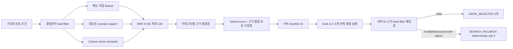

# YOBI 추천시스템 v2 구현 결과와 OCI 승인 게이트

## 현재 상태

- 구현 브랜치: `codex/recommendation-v2-hybrid`
- 기준 커밋: `035992ca8f1f449d814940833ed0fceb3e0465ea`
- 격리 clone: `/Users/kimjunggil/Documents/YOBI/mvp-recommendation-v2`
- 원본 checkout: `/Users/kimjunggil/Documents/YOBI/mvp` — 변경하지 않음
- OCI/Oracle 쓰기: **아직 0회**
- 실제 Grok 호출: **아직 0회**
- 현재 게이트: **사용자의 명시적 OCI 쓰기·1+5 호출 승인 대기**

이 문서의 품질 라벨은 원문 근거에서 생성한 자동 사전 라벨(`SILVER_NOT_RELEASE_APPROVAL`)이다. 대표 30건을 사람이 검토하고 승인하기 전에는 holdout 수치를 운영 출시 품질로 확정하지 않는다.

## 재현 입력

| 입력 | SHA-256 | 용도 |
|---|---|---|
| `yogiyo_selected_200.catalog.zip` | `251ef65b4bbec84d9fa28e26775e0abed2ea94a11f76ea4bb18bd2bed6d2c79a` | 카탈로그 원본 |
| `sqlite-mirror-v7-expanded.db` | `6a50de94eff89b4268320b94d90a5a3f5977645119b962ce6604ec8a4b5efd39` | 15,085-menu 품질 평가 |

로컬 기본 600-menu DB는 단위·브라우저 E2E 픽스처로만 사용했다. 입력 상세와 읽기 전용 live 기준점은 `baseline_manifest.json`에 고정했다.

## 구현 구조



같은 카테고리 값은 OR, 서로 다른 카테고리는 AND다. semantic-only 메뉴는 최종 후보가 될 수 없다. 다양화는 점수 차이 0.05 안에서만 작동하며, 더 강한 메뉴 직접 근거를 concept-only 근거로 교체하지 못한다.

## migration 013과 예상 Oracle 추가량

`013_menu_preference_features_and_hybrid_rank.sql`은 additive migration이다. `001`–`012`, 기존 1-menu/1-concept 매핑, 기존 support 테이블은 수정하거나 삭제하지 않았다.

| 변경 | 내용 | 15,085-menu staged 예상치 |
|---|---|---:|
| `menu_preference_feature` | `SUPPORTED/CONTRADICTED/REVIEW_REQUIRED`, strength, confidence, specificity, extractor, provenance | 61,369행 |
| `menu_preference_feature_evidence` | 메뉴명·설명·섹션·옵션·Wiki excerpt와 source ref | 112,750행 |
| `menu_concept_membership` | PRIMARY/COMPONENT/SECONDARY 다중 concept | 4,760행 |
| family/request/snapshot | `feature_manifest_sha256` 고정 | 기존 행 보존, 컬럼만 추가 |
| 인덱스 | feature lookup/menu/evidence, concept membership lookup | 4개 추가 |

특성 provenance는 `YOGIYO_PUBLIC_WEB` 38,541개, `SYNTHETIC_WIKI` 22,828개다. scope는 `MENU_DIRECT` 18,908개, `CONCEPT_GENERAL` 22,828개, `OPTION_AVAILABILITY` 16,854개, `SECTION_CONTEXT` 2,779개다. 옵션·섹션은 `REVIEW_REQUIRED`로만 저장되어 최종 근거를 단독으로 충족하지 않는다.

- feature extractor: `yobi-menu-preference-feature-v4`
- feature manifest: `21518714d6549e0602f312535fcf1960d3bad0e2ef7631b6e35298add255ea98`
- ranking policy: `yobi-hybrid-rank-v2`
- ranking policy SHA-256: `d557ecf2735e2cfa8e350eefa37e3686db7165c170f4d2965ee14e6bb7c688bf`
- support rows: 1,368
- support manifest: `ec2c9483d1586d044e1429040a93d2312553b179adb6e774f1069b7a953018d7`
- 직접 반증: 2건

`heat/wheat`, savory `fish cake`, `espresso/스프`, `cupcake`, `pork-cutlet`을 부정 회귀로 고정했다. NFKC·casefold·토큰 경계를 적용하고 메뉴 직접 반증이 일반 concept 상속보다 항상 우선한다.

동일한 15,085-menu 입력을 `PYTHONHASHSEED=1`과 `2`로 각각 다시 컴파일한 읽기 전용 plan은 위 count, support/feature/ranking SHA와 family ID가 모두 일치했고 두 실행 모두 `transaction_committed=false`였다.

## 서버 랭킹과 Grok 계약

초기·grid-search 기준 가중치는 다음과 같다.

| 항목 | 가중치 |
|---|---:|
| mean explicit support | 0.35 |
| minimum category support | 0.20 |
| semantic | 0.25 |
| direct-evidence ratio | 0.15 |
| Bayesian review prior | 0.05 |

grid는 0.05 단위이며 `explicit+minimum >= 0.55`, `semantic <= 0.25`, `review prior <= 0.05`를 강제한다. 평가 정의상 부정 질의는 Precision/NDCG를 희석하지 않고 별도의 false-positive rate로만 계산한다.

구조화 추천은 `xai.grok-4.3`, output 4,096 tokens, concurrency 2, timeout 120초, streaming off, retry 0, native structured output off(raw JSON validator 유지)로 고정했다. 일반 대화의 `xai.grok-4.3 → openai.gpt-oss-120b` fallback은 유지하지만 구조화 추천은 GPT-OSS로 재호출하지 않는다.

Grok은 서버 shortlist 15개 안에서 고유 메뉴 3개를 고르고 순서를 정한다. 서버는 후보 포함 여부, 가능한 경우 3개 매장, 모든 선택 카테고리의 evidence ID 소유권, 가격·매운맛·halal·vegan 조건을 재검증한다. 오류 시 그 요청만 deterministic top-3 `SEARCH_FALLBACK`으로 끝난다.

관련 제품 제약은 [OCI Grok 4.3 문서](https://docs.oracle.com/en-us/iaas/Content/generative-ai/xai-grok-4-3.htm), [Oracle Hybrid Vector Index 제한](https://docs.oracle.com/en/database/oracle/oracle-database/26/vecse/guidelines-and-restrictions-hybrid-vector-indexes.html), [OpenAI 모델 카탈로그](https://developers.openai.com/api/docs/models/all)를 기준으로 확인했다. 외부 Cohere vector를 유지하므로 새 Hybrid Vector Index는 만들지 않는다.

## 200-query 자동 사전 라벨 결과

평가 suite는 `yobi-recommendation-golden-v2-2026-08-18-r4`이며 manifest SHA-256은 `15af1158ae5f928d919ad3c03d147b91d2d1453cda43be8c35503ba81eab4f1c`다.

| 지표 | 기존 baseline holdout | v2 holdout | 출시 기준 |
|---|---:|---:|---:|
| hard-constraint violation | 0 | 0 | 0 |
| Precision@3 | 0.278788 | **1.000000** | ≥ 0.85 |
| NDCG@3 | 0.186085 | **1.000000** | ≥ 0.80 |
| Recall@20 | 0.091760 | **0.922076** | ≥ 0.90 |
| positive 3-result coverage | 100% | **100%** | ≥ 95% |
| negative false-positive | 60% | **0%** | ≤ 5% |
| 한·영 top-20 집합 동등성 | 해당 없음 | **100%** | 관측치 |

구성은 활성 옵션 50개×한·영 2건=100, cross-category 60, `NO_MATCH`·반증 20, 한·영 동등성 20이며 140 tune/60 frozen holdout이다. 일반 concept 근거는 계획상 허용되는 감점 근거이므로 relevance 2, 강한 all-direct 근거는 relevance 3으로 라벨한다.

0.05 제한 grid의 승자는 초기값과 동일한 `0.35/0.20/0.25/0.15/0.05`다. tune에서는 Precision@3 `0.994667`, NDCG@3 `1.0`, Recall@20 `0.939737`, positive coverage `98.4%`, negative false-positive `0%`를 기록했다. 최종 정책 SHA-256은 `ed921a0a6a7e3af190186cf8032b0a192331e22c23c2bb189d089bf533829a05`다.

이 수치는 배포 승인이 아닌 자동 근거 사전 라벨이다. [대표 30건 검토표](REPRESENTATIVE_30_REVIEW.md)와 `evaluation/representative_30.json.gz`의 원문 excerpt를 사람이 확인해야 한다. 전체 평가 산출물은 `evaluation/`에 고정했으며, gzip을 해제한 상세 판정 SHA-256은 `e51bdf12263904d060f2df669f00db4dd4515d55ac4e633aa600a9fded6c6d5c`, 대표 30건 SHA-256은 `f6514c88de0f4cec995af6b3516321ea2f99efd90e8fd43d08deaa43eb31222d`다.

## 로컬 성능과 회귀

| 검증 | 결과 |
|---|---|
| SQLite query plan/index | PASS — eligible 4,204 menus / 192 merchants, limit 100, 37 operators, 9 index accesses, 필수 검사 8/8 |
| warm preview 100회/시나리오 P95 | PASS — 73.881ms ≤ 500ms |
| warm retrieval 100회/시나리오 P95 | PASS — 914.907ms ≤ 2,000ms |
| warm NO_MATCH 100회 P95 | PASS — 18.249ms ≤ 2,000ms |
| process-cold retrieval 20회 P95 | PASS — 2,016.692ms ≤ 3,000ms |
| 전체 backend Pytest | PASS — 현재 581 tests 전부 통과(4개 독립 DB shard + 수정 영향 파일 재검증), 기존 deprecation warning 2종만 유지 |
| Ruff / MyPy | PASS / PASS (91 source files) |
| frontend Vitest / lint / build | PASS 47 tests / PASS / PASS (기존 634.31 kB chunk 경고만 유지) |
| mobile·desktop·RTL Playwright | PASS — 24 passed / 36 project-matrix skips, iPhone 13·Pixel 7·desktop 1366/1920 및 Arabic RTL 시나리오 |

성능 측정은 실제 provider를 호출하지 않는 15,085-menu repository 경로다. 평가 실행 중의 개별 latency는 정식 percentile 근거로 사용하지 않는다. 전체 raw 결과는 `performance_15085.json`(SHA-256 `716b62218fbe3519a66c1d940037c5158f88df82cefbe04b8103a96a00dad07a`)에 보존했다.

## 실제 OCI 1+5 호출과 배포 안전장치

승인 후 배포 스크립트의 순서는 다음과 같다.

1. Oracle migration 013 적용 및 새 knowledge/recommendation family를 `READY`로 stage한다.
2. staged query plan/count/manifest를 검증한다.
3. app·family active pointer 변경 **전** `SPICY+FRIED+CHICKEN` Grok probe를 정확히 1회 실행한다. 실패하면 기존 active pointer를 유지한다.
4. probe 통과 후 zero-post-activation-provider 모드로 새 app/family를 `PROVISIONAL` 활성화한다.
5. 고정 5개 public API 요청을 retry 없이 각각 한 번 실행하고 immutable JSON+SHA-256, 실제 dispatch count, median/max를 기록한다.
6. 5개가 전부 통과하면 provider 호출이 없는 finalizer로 FINAL marker를 쓴다.
7. 하나라도 실패하면 새 Grok 릴리스를 활성 `PROVISIONAL`로 유지하고 자동 롤백하지 않는다.

수동 롤백 명령은 OCI VM에서 다음과 같다.

```bash
sudo -n /opt/yobi/current/deploy/rollback.sh
```

## 승인 요청 범위

승인은 다음 작업에만 적용된다.

- Oracle migration 013의 additive DDL
- 새 knowledge/recommendation family 행과 feature/evidence/membership 행 추가
- staged Grok probe 정확히 1회
- 새 app/family의 `PROVISIONAL` 활성화
- 고정 postdeploy 품질 요청 정확히 5회
- 성공 시 zero-call finalizer, 실패 시 active `PROVISIONAL` 유지

기존 family·카탈로그·추천 기록은 삭제하지 않는다. 원본 브랜치 merge, UI 재설계, 알레르기 필터, 실제 결제·요기요 연동, dedicated cluster는 이 승인 범위에 포함되지 않는다.
